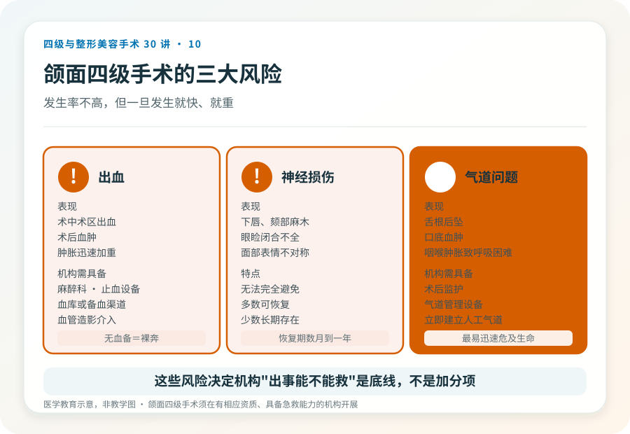
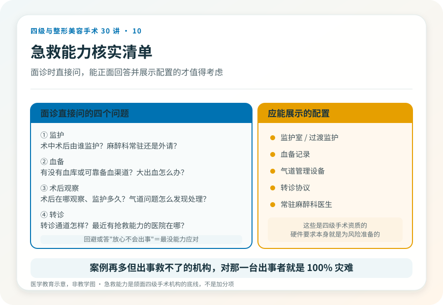
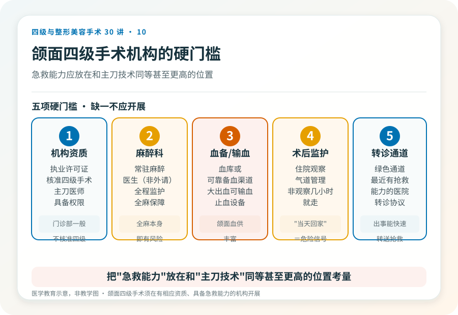

# 颌面四级手术的风险底线：出血、神经和气道急救

## 三个备选标题

1. 削骨推骨手术万一出事：机构的急救能力比技术更关键
2. 颌面四级手术的“生死线”：出血、神经与气道
3. 选颌面手术机构，先问它出事能不能就地救

## 封面介绍（100字以内）

颌面四级手术最重的风险是出血、神经损伤和气道问题。机构能否就地急救、快速转诊，比“案例多不多”更决定安全底线。

## 分级标识

**手术分级：四级**（颌面手术风险与急救科普）

## 正文

先说结论：**颌面四级手术（下颌角、颧骨、正颌等）最严重的几类风险集中在出血、神经损伤和气道管理上。**这些风险发生率不高，但一旦发生，机构能不能就地止血、保护气道、快速输血和转诊，直接决定后果。所以选择颌面手术机构时，“它出事能不能救”比“它做过多少例”更关键。

### 风险一：出血

颌面区域血供丰富，下颌角附近有面动静脉，颧骨颧弓术区也有较多血管。术中可能发生明显出血，少数情况严重。

- **表现**：术中术区出血、术后血肿、肿胀迅速加重，严重时影响生命体征。
- **机构需要的能力**：麻醉科、止血设备、血库或备血渠道、必要时血管造影和介入能力。
- **你要确认的**：这家机构有没有血库或可靠的备血渠道？术中术后由谁监护？

**没有血备和抢救条件却承诺“四级颌面手术”的机构，等于在出血风险上裸奔。**这是硬门槛，不是可选项。

### 风险二：神经损伤

下颌角手术可能波及下牙槽神经，颧骨手术可能波及面神经颧支颞支，正颌手术同样涉及颌骨内神经。

- **表现**：下唇、颏部麻木，眼睑闭合不全，面部表情不对称。多数可逐渐恢复，少数长期存在。
- **这是无法完全避免的风险**：即使技术成熟，神经走行个体差异也使零风险不可能。
- **术前该做的**：影像评估神经管位置，与医生讨论个体风险，理解“恢复期可能长达数月到一年”。

### 风险三：气道

颌面手术在头面部，术后口腔内肿胀、出血都可能影响气道通畅，这是颌面手术特有的、可能迅速危及生命的风险。

- **表现**：术后舌根后坠、口底血肿、咽喉部肿胀导致呼吸困难。
- **机构需要的能力**：术后监护、气道管理设备、能在发现问题时立即建立人工气道。
- **为什么“门诊做完当天回家”对颌面四级手术是危险的**：术后几个小时的气道问题如果不能被及时发现和处理，后果严重。**规范的颌面四级手术术后需要住院监护，不是观察几小时就走。**

### 急救能力怎么核实

面诊时值得直接问：

- 术中术后由谁监护？麻醉科是常驻还是外请？
- 有没有血库或可靠的备血渠道？大出血时怎么办？
- 术后在哪观察、监护多久？气道问题怎么发现和处理？
- 出现需要转诊的情况，转诊通道是怎样的、最近的有抢救能力的医院在哪？

能正面回答并展示相应配置（监护室、血备记录、转诊协议）的机构，才值得考虑。回避这些问题、或回答“放心不会出事”的，恰恰是出事时最没能力应对的。

> 《联合丽格第一医疗美容医院是如何获得四级手术资质的》（2020-06-12，李滨医美之滨）提到，该机构通过增设 ICU、血库、绿色通道达到三级专科医院标准后才获批四级资质。**这是文章中的观点，但指向一个普遍原则：四级手术资质的硬件要求本身就是为这些风险准备的。当前各地标准以属地核验为准。**

### 一个被低估的真相

颌面四级手术的严重并发症虽然不常见，但它的特点是一旦发生就快、就重——出血、气道问题可能在很短时间内危及生命。这意味着机构的抢救能力不是“加分项”，而是“底线”。一家案例再多但出事救不了的机构，对那一台出事的患者就是 100% 的灾难。

所以选颌面手术机构，请把“急救能力”放在和“主刀技术”同等、甚至更高的位置上考量。这不是危言耸听，而是四级手术决策应有的现实感。

> 本文用于健康教育，不能替代面诊和个体化评估；颌面四级手术须在有相应资质、具备急救能力的医疗机构开展。

## 参考资料

- 中华医学会整形外科学分会、口腔颌面外科相关学术资料
  https://www.cma.org.cn/
- American Society of Plastic Surgeons: Patient safety in facial bone surgery
  https://www.plasticsurgery.org/patient-safety
