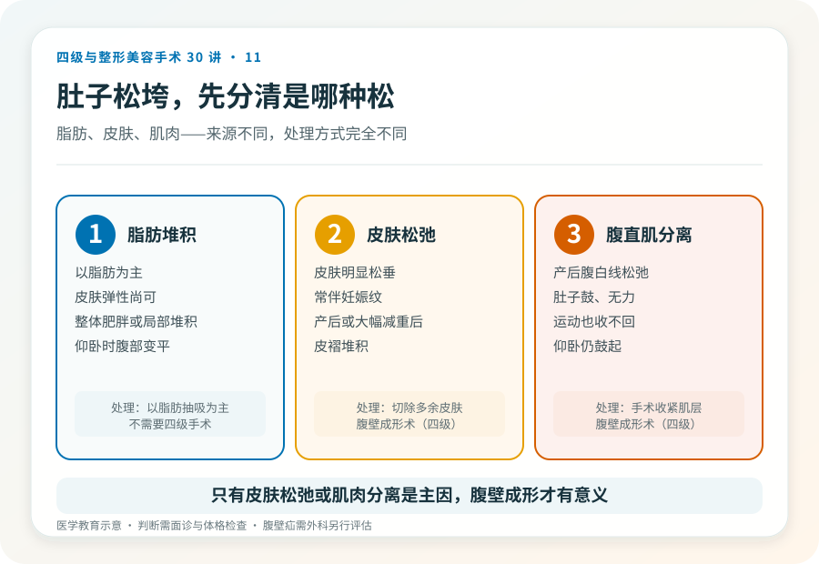
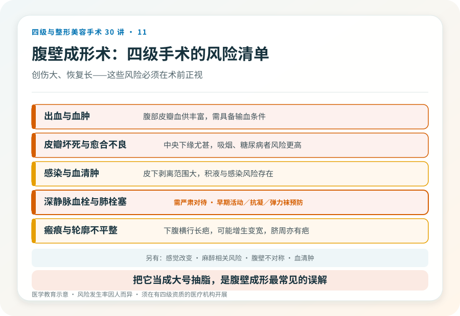
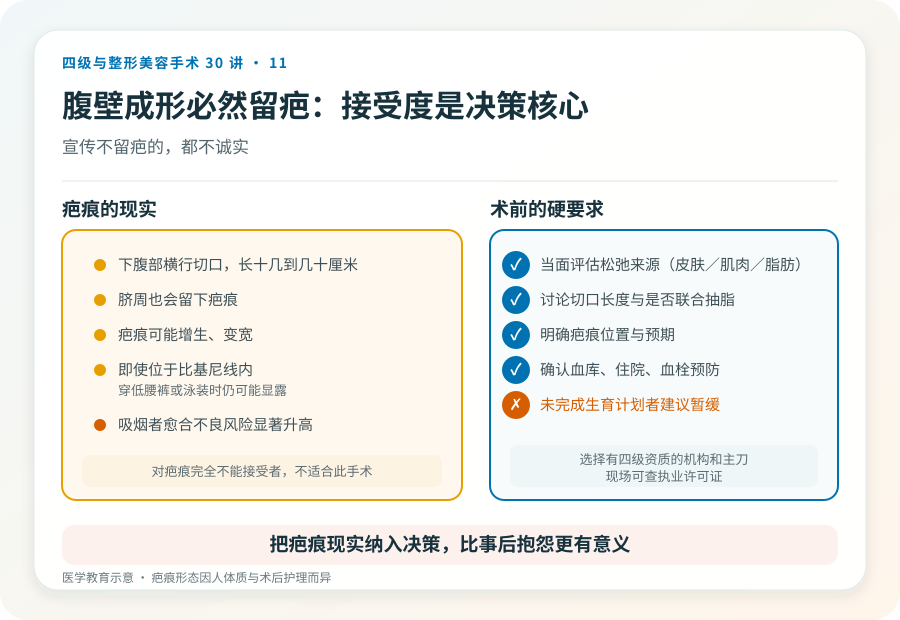

# 产后肚子松垮抽不回去：腹壁成形术该懂的事

## 三个备选标题

1. 腹直肌分离、皮松、妊娠纹：腹壁成形术解决的是什么
2. “抽脂就能收紧肚子”是个误会：腹壁成形是四级手术
3. 产后腹部松弛到什么程度才值得动手术

## 封面介绍（100字以内）

腹壁成形术是四级手术，针对产后或减重后腹壁皮肤松弛、腹直肌分离。它切除多余皮肤、收紧肌肉，创伤大、留疤、恢复长，不是抽脂能替代的。

## 分级标识

**手术分级：四级**

## 正文

先说结论：**腹壁成形术（俗称“腹部拉皮”“切肚皮”）是四级手术，针对的是腹壁皮肤严重松弛、腹直肌分离和妊娠纹堆积，常见于多次生育或大幅减重后。**它通过切除多余皮肤、收紧腹直肌来重塑腹部，创伤大、留下较长疤痕、恢复期长。把它理解成“大号抽脂”是常见误解——抽脂解决脂肪，腹壁成形解决皮肤和肌肉。

### 先分清腹部问题的来源

“肚子松垮”可能是：

- **皮下脂肪堆积**：以脂肪为主，皮肤弹性尚可。处理以脂肪抽吸为主。
- **皮肤松弛**：皮肤明显松弛、下垂，常伴妊娠纹。需要切除多余皮肤。
- **腹直肌分离（腹白线松弛）**：产后腹直肌向两侧分开，肚子鼓、无力，仰卧起坐类运动也收不回。需要手术收紧肌层。
- **腹壁疝**：腹腔内容物经腹壁缺损突出，需要外科修复。

很多人是混合型。**只有皮肤松弛或肌肉分离是主要问题时，腹壁成形才有意义；如果只是脂肪多、皮肤紧，抽脂更合适，不需要四级手术。**判断需要面诊和体格检查。

### 手术大致怎么做

腹壁成形术通常在全身麻醉或椎管内麻醉下进行。常见做法是做下腹部横行切口（常位于比基尼线内），掀起皮瓣至上腹，收紧分离的腹直肌，切除多余皮肤，重新定位脐部。是否联合抽脂、切口长度（迷你型到全腹型）取决于松弛程度。术后需住院，留置引流。

### 几个必须正视的风险

- **出血与血肿**：腹部皮瓣血供丰富，术中和术后可能出血，需具备输血条件。
- **皮瓣坏死与伤口愈合不良**：尤其中央和下缘，吸烟、糖尿病者风险更高。皮瓣部分坏死可能需要长期换药或再次手术。
- **感染与血清肿**：皮下剥离范围大，积液、感染风险存在。
- **瘢痕**：会留下下腹部横行疤痕，长度从十几到几十厘米，可能增生或变宽，且脐周也会有疤痕。
- **腹壁不对称、轮廓不平整**。
- **深静脉血栓与肺栓塞**：腹部大手术后卧床，血栓风险升高，是需严肃对待的并发症，规范的预防（早期活动、抗凝、弹力袜）很重要。
- **感觉改变**：腹部皮肤感觉可能改变。
- **麻醉相关风险**。

### 哪些人不适合做

- 还打算再生育者：再次妊娠会抵消腹直肌收紧的效果，建议生育计划完成后再做。
- 仍在大幅度减重过程中、体重未稳定者。
- 吸烟者：皮瓣坏死和愈合不良风险显著升高，术前需戒烟。
- 未控制的糖尿病、凝血异常、严重心肺疾病。
- 对疤痕完全不能接受者（这个手术必然留疤）。

### 决策前的硬要求

面诊腹壁成形，至少做到：选择有四级手术资质的机构和主刀；当面评估松弛来源（皮肤/肌肉/脂肪）；讨论切口长度、是否联合抽脂、疤痕位置和预期；确认机构的麻醉、血库、住院和血栓预防措施。**对疤痕的接受度是决策的核心之一——如果你不能接受下腹部一条长疤，这个手术可能不适合你。**

### 关于“疤痕”的诚实

腹壁成形术必然留下可见疤痕，即使位于比基尼线内，也会在穿低腰裤或泳装时可能显露。疤痕还可能增生、变宽。任何宣传“腹壁成形不留疤”的都不诚实。把疤痕的现实纳入决策，比事后抱怨更有意义。

> 本文用于健康教育，不能替代面诊和个体化评估；腹壁成形术须在有相应资质的医疗机构由具备权限的医师开展。

## 参考资料

- American Society of Plastic Surgeons: Tummy tuck (abdominoplasty)
  https://www.plasticsurgery.org/cosmetic-procedures/tummy-tuck
- 中华医学会整形外科学分会：体形雕塑相关学术资料
  https://www.cma.org.cn/
