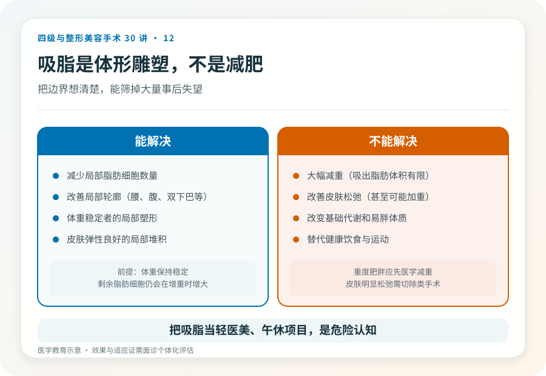
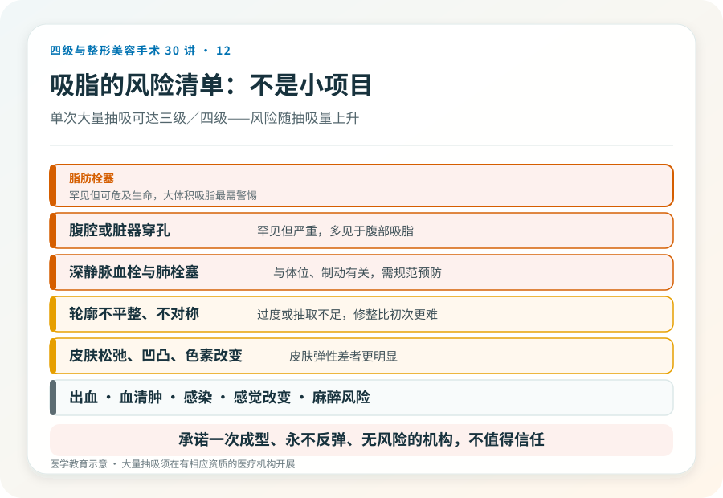

# 抽脂不是减肥：脂肪抽吸塑形的真实边界

## 三个备选标题

1. “抽脂就能瘦十斤”是个误会：吸脂塑形解决的是什么
2. 抽脂是几级手术？看部位、看麻醉、看抽吸量
3. 脂肪抽吸的风险和效果：决定之前先看清这几件事

## 封面介绍（100字以内）

脂肪抽吸是体形雕塑手段，不是减肥方法。它能改善局部脂肪堆积，但效果受皮肤弹性限制，风险随部位和抽吸量上升，部分情况属较高手术级别。

## 分级标识

**手术分级：视部位、麻醉和抽吸量而定，单次大量抽吸或联合手术可达三级/四级，以机构核准为准**

## 正文

先说结论：**脂肪抽吸（吸脂）是体形雕塑手段，不是减肥方法。**它针对的是体重相对稳定、但局部脂肪堆积难以通过饮食运动改善的人。能改善的是局部轮廓，不是整体体重，也解决不了皮肤松弛。而且它不是“小项目”——抽吸部位、麻醉方式和抽吸量决定了手术级别，单次大量抽吸或联合手术可能达到三级甚至四级。

### 抽脂适合什么样的人

理想的吸脂对象是：

- 体重在合理范围或轻度超标，整体不肥胖。
- 有明确的局部脂肪堆积（如腹部、腰部、大腿、双下巴等），饮食运动改善有限。
- 皮肤弹性良好，没有明显松弛——皮肤弹性差者吸脂后可能松垂。
- 身体健康，能耐受麻醉。

**不适合的人**：把吸脂当减肥（重度肥胖应先医学减重）、皮肤明显松弛（需要切除类手术）、凝血异常、对效果抱有“一次塑形终身不变”期待者。

### 它能解决什么、不能解决什么

- **能**：减少局部脂肪细胞数量，改善局部轮廓。
- **不能**：大幅减重（吸出的脂肪体积有限，体重变化不大）；改善皮肤松弛（甚至可能加重）；改变基础代谢和易胖体质；替代健康饮食运动。
- **效果持久的前提**是体重保持稳定——剩余脂肪细胞仍会在体重增加时增大。

### 手术大致怎么做

吸脂通常通过小切口插入吸脂管，连接负压吸出脂肪。麻醉方式包括局部肿胀麻醉、椎管内麻醉或全身麻醉，取决于部位和范围。抽出的脂肪经过处理也可用于自体脂肪移植（填充到面部或身体其他部位）。**单次抽吸量越大，风险越高**——大量抽吸（如数千毫升以上）属于较高手术级别，需要相应的麻醉、监护和急救条件。

### 几个必须正视的风险

- **脂肪栓塞**：罕见但严重，可危及生命，是大体积吸脂最需要警惕的并发症。
- **出血与血肿、血清肿**。
- **感染**。
- **轮廓不平整、不对称、过度抽取或抽取不足**：可能需要修整，而修整比初次更难。
- **皮肤松弛、凹凸不平、色素改变**：皮肤弹性差者更明显。
- **感觉改变**：术区皮肤感觉可能暂时或长期改变。
- **深静脉血栓与肺栓塞**：与体位、制动有关，规范预防很重要。
- **麻醉相关风险**。
- **穿孔风险**：腹腔或脏器穿孔罕见但严重，多见于腹部吸脂。

**特别提醒：把吸脂当作“轻医美”“午休项目”是危险认知。**它是有出血、栓塞、感染风险的外科手术，必须在有资质的医疗机构、由有资质的医生、在合适的麻醉和监护下进行。

### “非手术减脂”和吸脂不是一回事

冷冻溶脂、射频、超声等非侵入或微创手段，适合脂肪量少、要求无恢复期的人，效果温和、需要多次。它们和外科吸脂的适应证、效果和风险不在一个层面，不能互相替代。选择前先明确自己的问题量和承受力。

### 决策前的硬要求

面诊吸脂，至少做到：选择有相应资质的机构和主刀；当面评估脂肪量、皮肤弹性和局部解剖；讨论麻醉方式、预计抽吸量、切口位置和疤痕；确认机构的监护、急救和血栓预防措施；理解效果边界和可能的修整。**承诺“一次成型、永不反弹、无风险”的机构，不值得信任。**

> 本文用于健康教育，不能替代面诊和个体化评估；大量抽吸或联合手术属较高手术级别，须在有相应资质的医疗机构开展。

## 参考资料

- American Society of Plastic Surgeons: Liposuction
  https://www.plasticsurgery.org/cosmetic-procedures/liposuction
- U.S. FDA: Liposuction devices and patient safety
  https://www.fda.gov/
