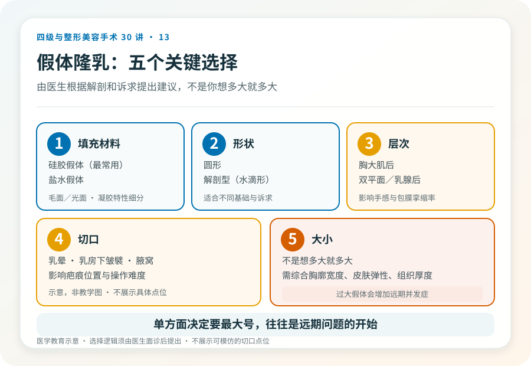
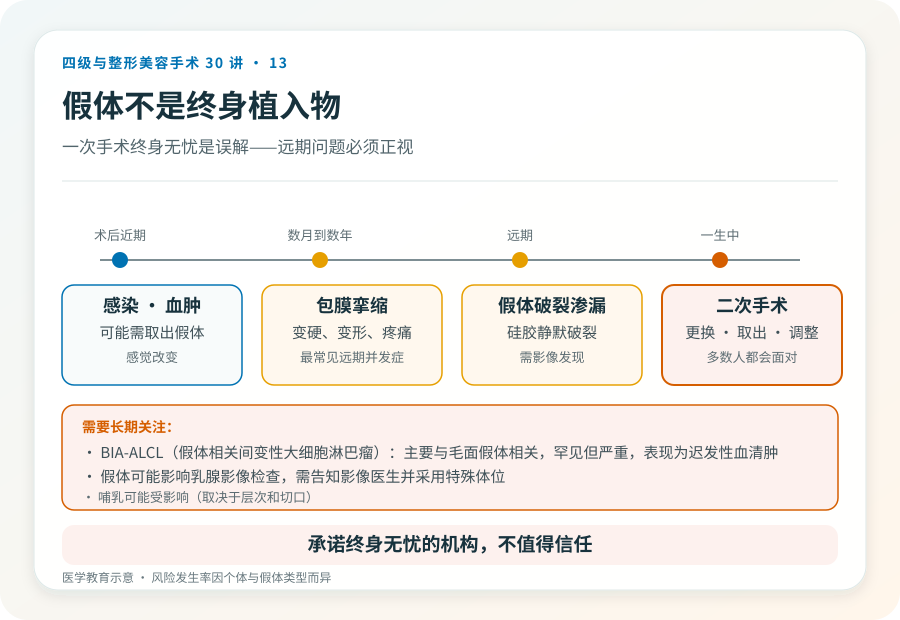
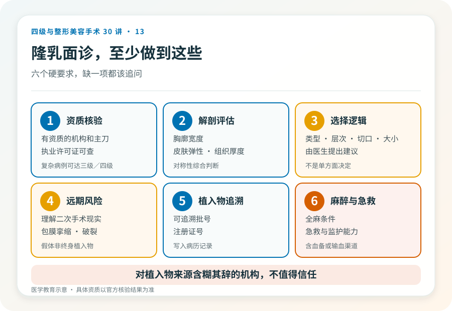

# 隆乳手术：假体植入是几级手术，风险和决策清单

## 三个备选标题

1. 隆乳不是“塞个假体”那么简单：四级手术的风险清单
2. 假体隆乳：层次、切口、植入物，决定前先看清
3. “做完一劳永逸”是误会：隆乳假体的远期问题

## 封面介绍（100字以内）

假体隆乳是较高手术级别的乳房整形，涉及全身麻醉、植入物和重要解剖结构。它效果明确，但远期可能面临包膜挛缩、假体问题和需要二次手术。

## 分级标识

**手术分级：通常二级，复杂病例（如联合下垂矫正、修复、再造）可达三级/四级，以机构核准为准**

## 正文

先说结论：**假体隆乳术是通过植入硅胶或盐水假体增大乳房体积的手术，通常属二级，复杂病例（联合乳房下垂矫正、修复或再造）可达三级甚至四级。**它涉及全身麻醉、胸大肌或乳腺后层次的操作，以及重要血管神经。效果明确，但“一次手术终身无忧”是误解——假体作为植入物，远期可能面临包膜挛缩、假体问题和需要二次手术。

### 先想清楚为什么做

隆乳的合理诉求是：乳房发育不良、产后萎缩、双侧明显不对称、或乳房切除后的再造。不合理诉求是：为了挽留关系、为了迎合某种审美压力、或对效果抱有“换个人生”的期待。**术前的动机和预期是否合理，直接影响满意度。**

### 假体的几个关键选择

- **填充材料**：硅胶假体（最常用，手感较自然）和盐水假体。两者各有特点，硅胶假体近年有毛面/光面、不同凝胶特性的细分。
- **形状**：圆形和解剖型（水滴形），适合不同的乳房基础和诉求。
- **层次**：胸大肌后、双平面或乳腺后。层次影响手感、假体显形和包膜挛缩率。
- **切口**：乳晕、乳房下皱襞、腋窝。切口影响疤痕位置和操作难度。
- **大小**：不是“想多大就多大”，要根据胸廓宽度、皮肤弹性、组织厚度和对称性综合决定。过大假体会增加远期并发症。

这些选择应由医生根据你的解剖和诉求提出建议，而不是由你单方面决定“要最大号”。

### 几个必须正视的风险

- **包膜挛缩**：身体在假体周围形成包膜，过度收缩会使乳房变硬、变形、疼痛，是隆乳最常见的远期并发症，可能需要再次手术处理。
- **假体破裂或渗漏**：硅胶假体破裂可能无明显症状（静默破裂），需要影像发现；盐水假体破裂则迅速瘪陷。
- **感染**：可能需要取出假体。
- **出血与血肿**。
- **假体移位、旋转、不对称**：解剖型假体旋转可致形态异常。
- **感觉改变**：乳头乳晕感觉可能暂时或长期改变。
- **假体相关间变性大细胞淋巴瘤（BIA-ALCL）**：主要与毛面假体相关，罕见但严重，表现为迟发性血清肿，需长期关注。
- **乳房影像干扰**：假体可能影响乳腺影像检查，需要特殊体位。
- **远期需要二次手术**：假体不是终身植入物，多数人一生中会面临更换或取出。

### 几个需要直面的现实

- **假体不是终身植入物**。无论宣传如何，假体都有使用寿命，多数人需要面对二次手术——更换、取出或调整。
- **“看不出做过”是有条件的**。假体显形（尤其是瘦、组织薄的人）、轮廓不自然、动态不自然都可能发生，“完全看不出”不能保证。
- **哺乳和影像**。假体可能影响哺乳（取决于层次和切口），也可能影响乳腺癌筛查的影像，需要告知影像医生。

### 哪些人不适合做

- 乳房发育未完成的年轻人。
- 存在未控制的乳腺疾病或感染。
- 凝血异常、未控制的自身免疫病、严重心肺疾病。
- 对“终身无需再处理”抱有不切实际期待者。
- 因 BIA-ALCL 担忧而不愿接受毛面假体相关风险者（需与医生讨论替代方案）。

### 决策前的硬要求

面诊隆乳，至少做到：选择有资质的机构和主刀；当面评估胸廓、皮肤弹性、组织厚度和对称性；讨论假体类型、层次、切口、大小的选择逻辑；理解远期风险和二次手术的现实；确认植入物有可追溯的批号和注册证并写入记录；确认机构的麻醉和急救条件。**对植入物来源含糊其辞、承诺“终身无忧”的机构，不值得信任。**

> 本文用于健康教育，不能替代面诊和个体化评估；隆乳术须在有相应资质的医疗机构由具备权限的医师开展。

## 参考资料

- U.S. FDA: Breast implants
  https://www.fda.gov/medical-devices/breast-implants
- American Society of Plastic Surgeons: Breast augmentation
  https://www.plasticsurgery.org/cosmetic-procedures/breast-augmentation
