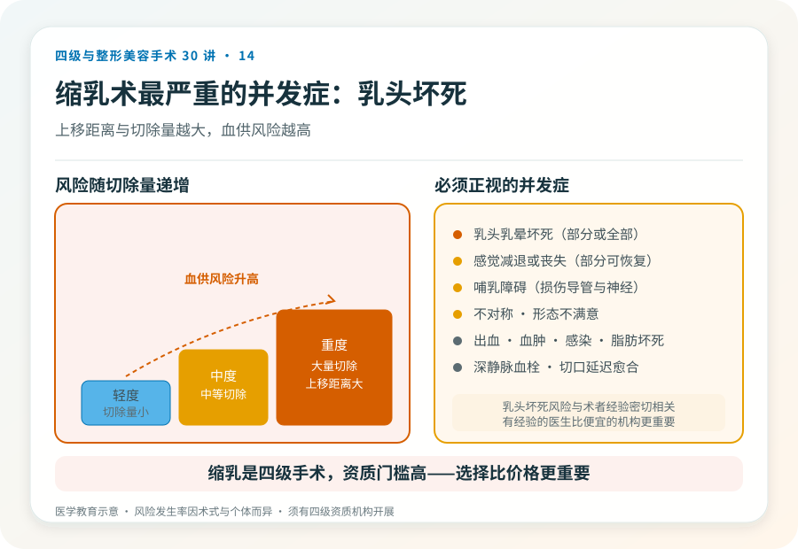

# 乳房过大不只是“美观问题”：乳房缩小术是四级手术

## 三个备选标题

1. 大胸带来的肩颈痛、运动难：乳房缩小术解决什么
2. 乳房缩小术是四级手术：疤痕、感觉和哺乳的现实
3. “缩胸”决策清单：功能改善和外观的权衡

## 封面介绍（100字以内）

乳房缩小术是四级手术，针对乳房过度肥大引起的肩颈痛、皮肤糜烂、运动受限等问题。它改善功能，但留疤、可能影响感觉和哺乳。

## 分级标识

**手术分级：四级**

## 正文

先说结论：**乳房缩小术（缩乳术）是四级手术，针对乳房过度肥大引起的躯体症状和外观困扰。**它不仅是为了“好看”——很多患者是因肩颈痛、背部痛、乳房下皱襞皮肤糜烂、运动受限、姿势异常而寻求手术，是功能改善为主的决策。手术涉及大量组织切除、乳头乳晕复合体的重新定位，创伤大、留疤明显、可能影响感觉和哺乳。

### 它解决的功能问题常被低估

乳房过度肥大（巨乳症）带来的不仅是外观：

- **颈肩背痛**：长期负重引起的慢性疼痛。
- **皮肤问题**：乳房下皱襞潮湿、糜烂、湿疹、反复感染。
- **姿势异常**：驼背、肩部勒痕。
- **运动受限**：影响日常生活和运动。
- **心理负担**：他人目光、自卑、社交回避。

这些是真实的健康问题，不是“矫情”。所以乳房缩小术在很多时候是功能性手术，医保或商业保险在某些情况下可能覆盖（**具体以属地政策和保险条款为准，需另行核验**）。

### 手术大致怎么做

乳房缩小术通常在全身麻醉下进行。基本原理是切除多余的皮肤、脂肪和腺体组织，将乳头乳晕复合体上移到新位置，重塑乳房形态。常见术式根据切口形态分为倒 T 型（锚状）、垂直疤痕（棒棒糖型）等，切除量越大、下垂越重，切口越长。手术通常需要住院。

### 几个必须正视的风险

- **乳头乳晕坏死**：这是乳房缩小术最严重的并发症之一。乳头乳晕复合体上移距离越大、切除量越大，血供风险越高，严重时部分或全部坏死。
- **感觉改变或丧失**：乳头乳晕感觉可能减退或丧失，部分可恢复，部分长期存在。
- **哺乳障碍**：手术可能损伤乳腺导管和神经，影响日后哺乳。有生育计划者需与医生讨论保留哺乳功能的术式。
- **不对称、形态不满意**：左右切除量、愈合差异可致不对称。
- **瘢痕**：会留下明显疤痕（倒 T 型或垂直），可能增生、变宽，是决策的核心考量之一。
- **出血、血肿、感染、脂肪坏死**。
- **深静脉血栓与肺栓塞**：与体位和制动有关。
- **伤口延迟愈合**：尤以切口交汇处（T 字交点）。
- **日后可能需要修整**：形态调整或疤痕修整。

### 哪些人适合、哪些不适合

适合：

- 乳房过度肥大引起明确躯体症状，保守治疗无效。
- 体重相对稳定（重度肥胖建议先减重）。
- 生育哺乳计划已完成或愿意接受哺乳影响。
- 能接受疤痕和恢复期。

不适合：

- 体重仍在大幅波动、重度肥胖未干预。
- 有明确近期哺乳计划且不能接受影响。
- 对疤痕完全不能接受。
- 凝血异常、未控制的慢性病、不能耐受全身麻醉。

### 关于疤痕的诚实

乳房缩小术必然留疤，且疤痕较长、位于明显部位。这是它和隆乳最大的不同之一——隆乳疤痕相对隐蔽，缩乳疤痕更明显。任何宣传“缩乳不留疤”或“无痕缩乳”的都不诚实。**对疤痕的接受度，是决策能否进行的核心前提。**

### 决策前的硬要求

面诊乳房缩小，至少做到：选择有四级手术资质的机构和主刀（这是四级手术，资质门槛高）；当面评估肥大程度、下垂程度、症状和诉求；讨论术式、切口、切除量、乳头血供风险评估；理解疤痕、感觉和哺乳的现实；确认机构的麻醉、血库和急救条件。**乳房缩小术的乳头坏死风险与术者经验密切相关，选择有经验的医生比选择便宜的机构更重要。**

> 本文用于健康教育，不能替代面诊和个体化评估；乳房缩小术须在有相应资质的医疗机构由具备权限的医师开展。

## 参考资料

- American Society of Plastic Surgeons: Breast reduction
  https://www.plasticsurgery.org/cosmetic-procedures/breast-reduction
- 中华医学会整形外科学分会：乳房整形相关学术资料
  https://www.cma.org.cn/
