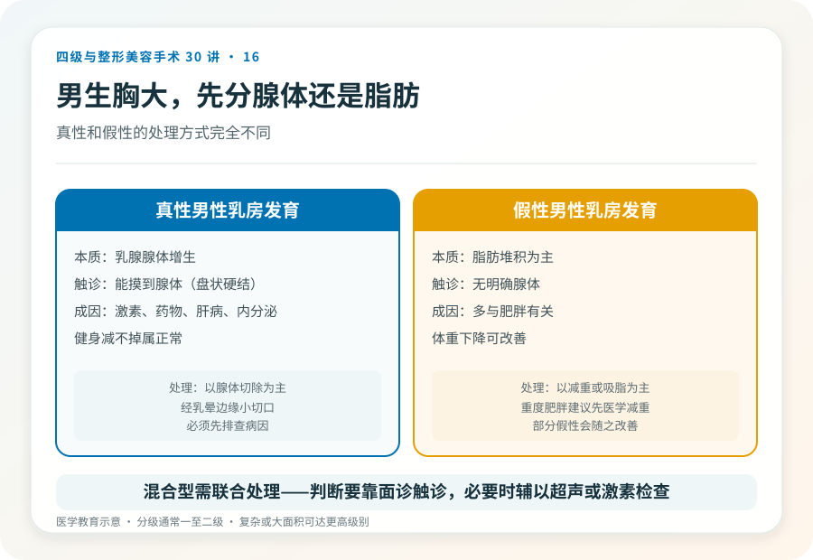
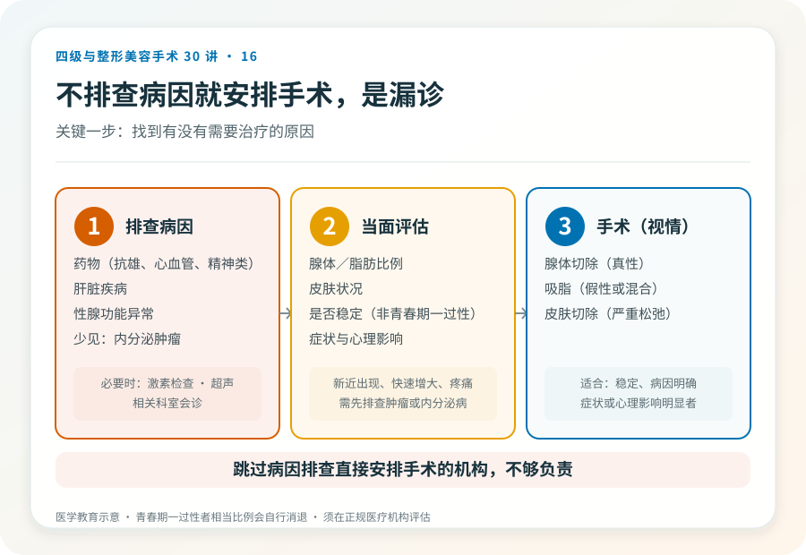

# 男性乳房发育：手术怎么选，先分腺体还是脂肪

## 三个备选标题

1. 男生胸大是“乳腺”还是“脂肪”？手术方式完全不同
2. 男性乳房发育手术：腺体切除和吸脂，决策清单
3. “健身减不掉的胸”可能是真性乳腺增生：怎么处理

## 封面介绍（100字以内）

男性乳房发育分为真性（腺体增生）和假性（脂肪堆积），处理方式不同。手术涉及腺体切除、吸脂，可能有感觉改变和不对称风险。

## 分级标识

**手术分级：通常一至二级，复杂或大面积可达更高级别，以机构核准为准**

## 正文

先说结论：**男性乳房发育（gynecomastia）分为真性（乳腺腺体增生）和假性（脂肪堆积为主），两者的处理方式不同。**真性以腺体切除为主，假性以吸脂或减重为主，混合型则联合处理。手术虽不属于最高级别，但仍有感觉改变、不对称、疤痕等风险，且需要先排查是否有需要治疗的内分泌或药物原因。

### 先分清真性和假性

- **真性男性乳房发育**：乳腺腺体增生，触诊能摸到腺体组织（盘状硬结），可能与激素、药物、肝脏疾病、内分泌肿瘤等有关。处理以腺体切除为主，但**必须先排查可逆性或病理性原因**。
- **假性**：脂肪堆积为主，触诊无明确腺体，多与肥胖有关。处理以减重或吸脂为主。
- **混合型**：腺体和脂肪都有，需联合处理。

判断需要面诊触诊，必要时做乳腺超声或激素检查。**关键一步是排查男性乳房发育背后有没有需要治疗的原因**——某些药物（如部分抗雄激素药、心血管药、精神类药物）、肝脏疾病、性腺功能异常、甚至少见情况下内分泌肿瘤，都可能引起乳腺增生。不排查病因就直接手术，可能漏掉重要问题。

### 手术大致怎么做

- **腺体切除**：经乳晕边缘小切口切除增生的腺体组织。适合真性腺体增生。
- **吸脂**：吸取皮下脂肪，常与腺体切除联合，用于混合型或改善轮廓。
- **皮肤切除**：严重下垂或皮肤松弛者可能需要切除多余皮肤，留下更明显疤痕。

手术通常可在局麻或局麻加镇静下完成，复杂者用全麻。多数为门诊或短期观察。

### 几个必须正视的风险

- **不对称、切除不足或过度**：可能需要修整。
- **轮廓不平整**：尤其吸脂部位。
- **感觉改变**：乳头乳晕或胸前感觉可能暂时或长期改变。
- **血肿、血清肿、感染**。
- **瘢痕**：乳晕切口一般较隐蔽，但皮肤切除者疤痕明显。
- **复发**：如果病因未解决（如继续用药、激素异常），腺体可能再增生。
- **乳头乳晕问题**：严重者可能坏死（罕见）。
- **凹陷或轮廓异常**：过度切除腺体可能导致乳头凹陷。

### 几个需要警惕的认知

- **“健身减不掉的胸一定是病”**：不一定。健身减的是脂肪，真性腺体增生靠健身减不掉是正常的，但需要先排查病因再决定手术。
- **“手术是唯一办法”**：青春期一过性男性乳房发育相当一部分会自行消退；某些药物或疾病引起的，去除病因后可能改善。手术适合稳定、病因明确、症状或心理影响明显者。
- **“男生做胸手术很丢人”**：这是常见且可治疗的状况，不必羞耻。但决策应基于医学评估，而不是情绪。

### 哪些情况建议先观察或非手术

- 青春期男性，病程短，可能自行消退，建议观察。
- 新近出现、快速增大或伴疼痛、分泌物，需先排查肿瘤或内分泌疾病。
- 仍在服用可能引起乳腺增生的药物者，先与开药医生讨论能否调整。
- 重度肥胖者，建议先医学减重，部分假性会随之改善。

### 决策前的硬要求

面诊男性乳房发育，至少做到：选择有资质的机构和主刀；先排查病因（必要时激素检查、超声、相关科室会诊）；当面评估腺体/脂肪比例和皮肤状况；讨论术式、切口、是否联合吸脂；理解风险和复发可能。**跳过病因排查直接安排手术的机构，不够负责。**

> 本文用于健康教育，不能替代面诊和个体化评估；男性乳房发育手术须在有相应资质的医疗机构由具备权限的医师开展。

## 参考资料

- American Society of Plastic Surgeons: Male breast reduction
  https://www.plasticsurgery.org/cosmetic-procedures/male-breast-reduction
- 中华医学会内分泌学分会：男性乳房发育相关诊疗共识（以现行版本为准）
  https://www.cma.org.cn/
