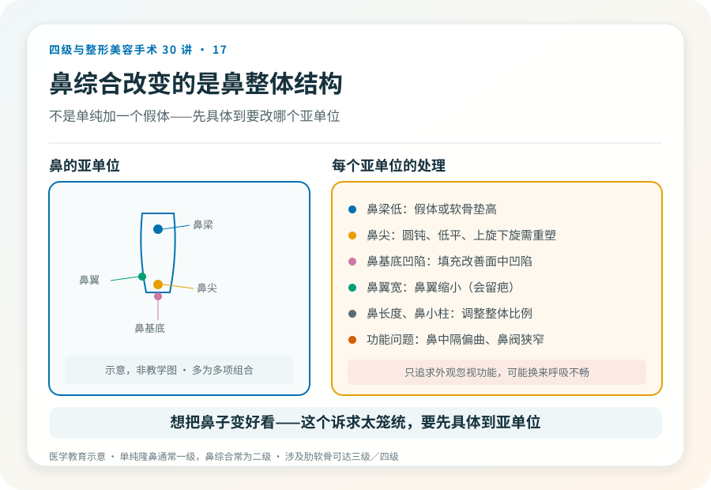
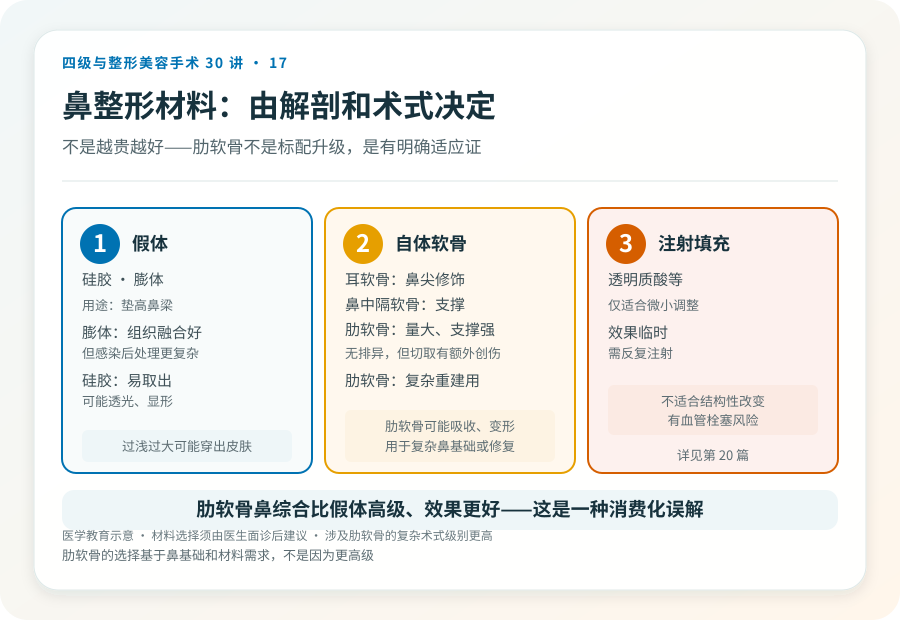
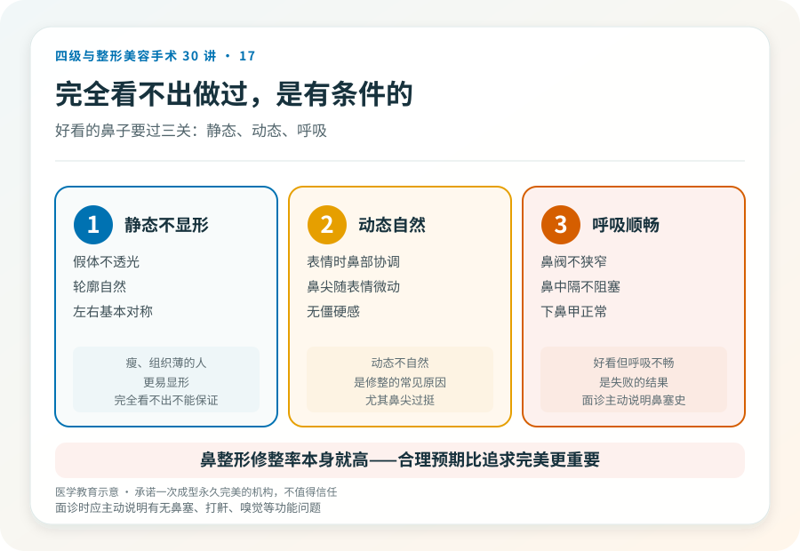

# 鼻综合不是“垫高”：鼻整形术式和风险一次说清

## 三个备选标题

1. 鼻综合和单纯隆鼻差在哪：先看你的鼻基础
2. 鼻整形用假体还是自体软骨？决策清单和风险
3. “垫个鼻梁”之外：鼻综合改变的是鼻整体结构

## 封面介绍（100字以内）

鼻综合整形针对鼻尖、鼻梁、鼻基底等多个亚单位综合调整，常用假体加自体软骨。它比单纯隆鼻复杂，风险包括感染、不对称和呼吸影响。

## 分级标识

**手术分级：单纯隆鼻通常一级，鼻综合常为二级，涉及肋软骨或复杂重建可达三级/四级，以机构核准为准**

## 正文

先说结论：**鼻综合整形针对鼻的多个亚单位（鼻梁、鼻尖、鼻基底、鼻翼等）综合调整，区别于只垫高鼻梁的单纯隆鼻。**它常用假体加自体软骨（耳软骨、鼻中隔软骨、肋软骨），术式复杂度高于单纯隆鼻。涉及肋软骨切取或复杂重建时级别更高。风险包括感染、不对称、呼吸影响、假体问题和远期修整。

### 先想清楚要改什么

“想把鼻子变好看”过于笼统。鼻整形前应具体到：

- **鼻梁低**：需要垫高，假体或软骨。
- **鼻尖形态**：鼻尖圆钝、低平、上旋或下旋，需要鼻尖重塑，多用自体软骨。
- **鼻基底凹陷**：面中部凹陷、法令纹深，可填充鼻基底。
- **鼻翼宽**：鼻翼缩小（会留切口疤痕）。
- **鼻长度、鼻小柱**：调整鼻的整体比例。
- **功能问题**：鼻中隔偏曲、鼻阀狭窄等影响呼吸，需要功能性手术。

很多人是多项组合，这就是“鼻综合”——**它改变的是鼻整体结构，不是单纯加一个假体。**

### 材料的选择逻辑

- **假体**：硅胶、膨体。用于垫高鼻梁。膨体与组织融合较好但感染后处理更复杂，硅胶易取出但可能有透光、显形问题。
- **自体软骨**：耳软骨（鼻尖修饰）、鼻中隔软骨（支撑）、肋软骨（量大、支撑力强，用于复杂重建）。自体软骨无排异，但切取有额外创伤，肋软骨有吸收、变形风险。
- **注射填充**：透明质酸等，适合微小调整，效果临时，且有血管栓塞风险（见第 27 篇），不适合结构性改变。

材料选择由鼻基础、诉求和医生建议共同决定，不是“越贵越好”。**肋软骨鼻综合属于较复杂术式，级别和风险都更高。**

### 几个必须正视的风险

- **感染**：尤以假体感染为重，可能需要取出假体。膨体感染处理更复杂。
- **假体显形、透光、移位、穿出**：假体过浅、过大或张力过高时可能穿出皮肤，是严重并发症。
- **不对称、形态不满意**：左右差异、鼻尖形态不佳可能需要修整。
- **呼吸影响**：鼻整形可能改变鼻腔通气，功能性鼻整形需兼顾外观和功能。
- **疤痕**：鼻翼缩小、开放切口会留疤，多数隐蔽但可能增生。
- **软骨吸收、变形**：自体软骨（尤其肋软骨）可能吸收或弯曲变形。
- **感觉改变**：鼻尖、上唇感觉可能改变。
- **远期修整**：鼻整形是修整率较高的项目之一，相当比例的人日后会面临调整。

### 一个被低估的问题：呼吸

鼻整形不只关乎外观，还可能影响呼吸。鼻中隔偏曲、鼻阀狭窄、下鼻甲肥大等问题如果同时存在，需要功能性处理。**只追求外观而忽视功能的鼻整形，可能换来好看但呼吸不畅的鼻子。**面诊时应主动说明有无鼻塞、打鼾、嗅觉问题。

### 哪些人不适合做

- 鼻部发育未完成者（通常建议 18 岁后）。
- 鼻部活动性感染、痤疮严重期。
- 对效果抱有“完美对称”“一次成型”期待者。
- 凝血异常、未控制的慢性病。
- 反复鼻整形、局部组织条件差者（修复难度和风险更高）。

### 决策前的硬要求

面诊鼻整形，至少做到：选择有资质的机构和主刀；当面评估鼻的各亚单位和整体面部比例；讨论材料、术式、切口和预期；说明有无呼吸等功能问题；理解风险和远期修整可能。**承诺“一次成型永久完美”“无风险”的机构，不值得信任。鼻整形的修整率本身就高，对此有合理预期比追求完美更重要。**

> 本文用于健康教育，不能替代面诊和个体化评估；鼻综合及涉及肋软骨的复杂手术须在有相应资质的医疗机构由具备权限的医师开展。

## 参考资料

- American Society of Plastic Surgeons: Rhinoplasty
  https://www.plasticsurgery.org/cosmetic-procedures/rhinoplasty
- 中华医学会整形外科学分会：鼻整形相关学术资料
  https://www.cma.org.cn/
