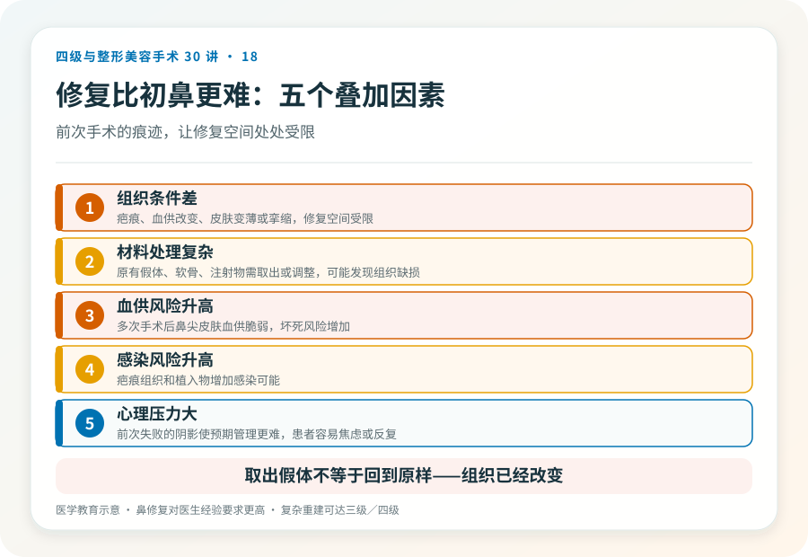
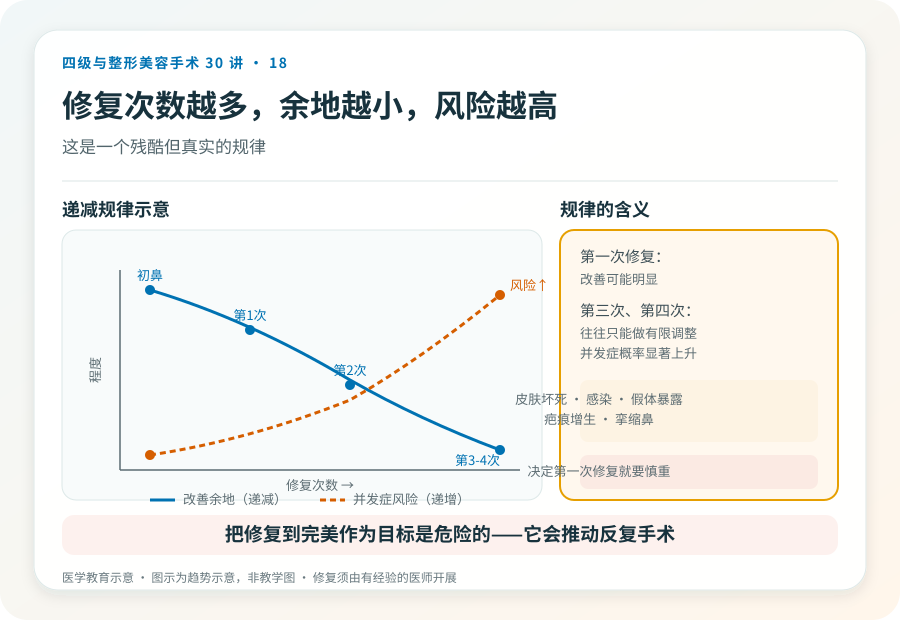
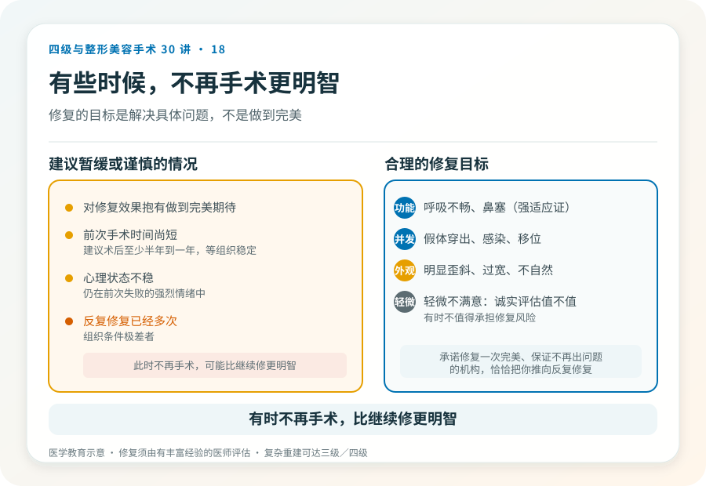

# 鼻修复比初鼻更难：二次鼻整形的决策

## 三个备选标题

1. 第一次隆鼻不满意，修复手术该懂的事
2. 鼻修复为什么更贵更难：组织、材料和心理的叠加
3. 反复修鼻子的代价：修复次数越多，难度和风险越高

## 封面介绍（100字以内）

鼻修复手术针对初次鼻整形后的形态、功能或并发症问题。它比初鼻更难，组织条件差、材料处理复杂、风险更高，修复次数越多难度越大。

## 分级标识

**手术分级：鼻修复常为二级，复杂重建（多次修复、组织缺损）可达三级/四级，以机构核准为准**

## 正文

先说结论：**鼻修复手术针对初次鼻整形后出现的不满意、并发症或功能问题，比初次鼻整形更难。**组织已经经历过手术、可能有疤痕和血供改变，假体或软骨的处理也更复杂，加上心理预期被前次失败影响，决策需要更审慎。**一个普遍规律是：鼻整形修复次数越多，难度和风险越高，能改善的余地越小。**

### 为什么修复比初鼻难

- **组织条件差**：前次手术留下的疤痕、血供改变、皮肤变薄或挛缩，使修复空间受限。
- **材料处理复杂**：原有的假体、软骨、注射物需要取出或调整，取出本身可能有创伤，且可能发现组织缺损。
- **血供风险升高**：多次手术后鼻尖皮肤血供变脆弱，再次手术的坏死风险增加。
- **感染风险升高**：疤痕组织和植入物增加感染可能。
- **心理压力大**：前次失败的阴影使预期管理更难，患者容易焦虑或反复。

### 先想清楚修复的目标

修复不等于“做到完美”，而是解决具体问题：

- **功能问题**：呼吸不畅、鼻塞（这是修复的强适应证，比外观更重要）。
- **并发症**：假体穿出、感染、移位、明显不对称。
- **明显的外观问题**：鼻尖歪斜、鼻梁过宽、形态明显不自然。
- **轻微的不满意**：要诚实评估值不值得再动——**有时“不满意”的程度，不值得承担修复的风险。**

修复前应该明确：最想解决的是什么？这个问题修复后能改善多少？修复本身会带来什么新风险？**把“修复到完美”作为目标是危险的，因为它会推动反复手术。**

### 几个必须正视的风险（在初鼻风险之上叠加）

- **皮肤坏死**：多次手术使血供脆弱，鼻尖皮肤坏死风险升高，是严重并发症。
- **感染、假体暴露**。
- **疤痕增生、挛缩鼻**：反复手术可能加重疤痕挛缩，鼻尖上缩、鼻孔外露。
- **不对称、形态改善有限**。
- **呼吸功能恶化**。
- **材料不足或组织缺损**：可能需要更多自体组织（如肋软骨、筋膜）重建。
- **心理反复**：修复后仍不满意，进入“越修越糟”循环。

### 取出假体不等于“回到原样”

很多人以为“把假体取出来就回到没做之前的样子”。实际上，经历过手术和假体的鼻部组织已经改变——可能有疤痕、挛缩、皮肤变薄，取出后鼻形态可能比术前更差，有时需要同期或分期用自体组织重建。**取出和重建常常是连在一起的两步，不是一个简单的“还原”操作。**

### 修复次数的递减规律

鼻修复的一个残酷现实是：每一次修复，能改善的余地通常缩小，而风险升高。第一次修复可能改善明显，但第三次、第四次修复往往只能做有限调整，且并发症概率显著上升。**所以在决定第一次修复时，就要慎重选择医生和方案，避免轻率进入反复修复循环。**

### 哪些情况建议谨慎或暂缓

- 对修复效果抱有“做到完美”期待者。
- 前次手术时间尚短（通常建议术后至少半年到一年，等组织稳定再评估修复）。
- 心理状态不稳，仍在前次失败的强烈情绪中。
- 反复修复已经多次、组织条件极差者——此时“不再手术”可能比“继续修”更明智。

### 决策前的硬要求

面诊鼻修复，至少做到：选择有丰富修复经验的机构和主刀（修复对医生经验要求更高）；当面评估组织条件、原有材料、功能和外观问题；讨论取出、重建方案和分期可能；理解修复的有限性和递减规律；确认机构的麻醉和急救条件。**承诺“修复一次完美”“保证不再出问题”的机构，恰恰是把你推向反复修复循环的因素之一。**

> 本文用于健康教育，不能替代面诊和个体化评估；鼻修复手术须在有相应资质的医疗机构由具备权限、有修复经验的医师开展。

## 参考资料

- American Society of Plastic Surgeons: Revision rhinoplasty information
  https://www.plasticsurgery.org/
- 中华医学会整形外科学分会：鼻整形修复相关学术资料
  https://www.cma.org.cn/
