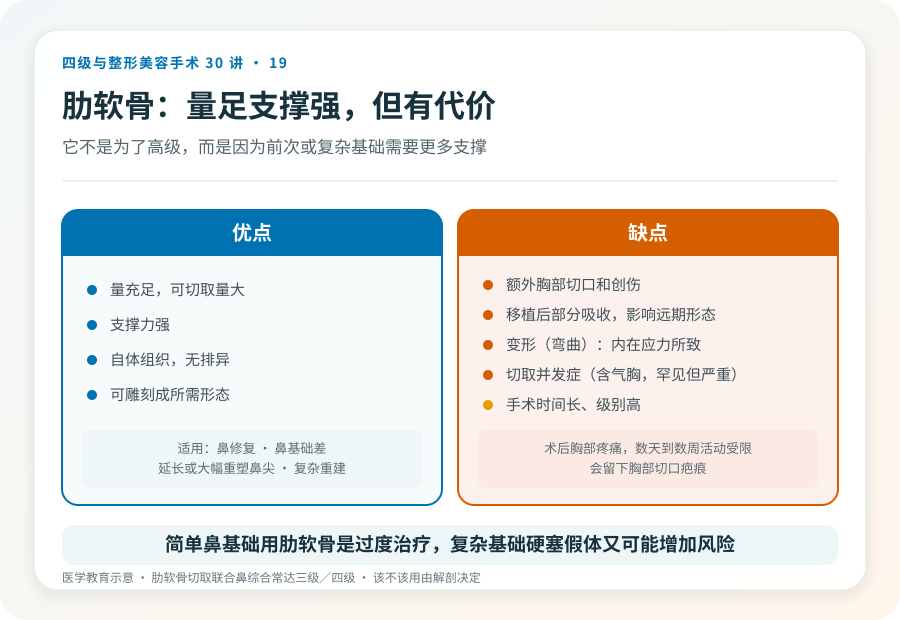
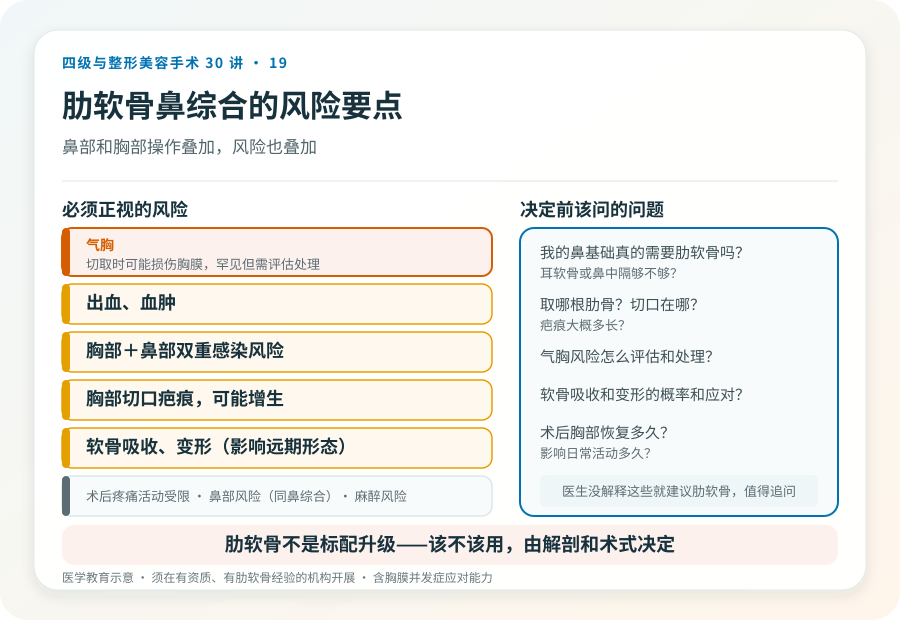

# 鼻整形用肋软骨：多一处切口和它带来的风险

## 三个备选标题

1. 鼻整形为什么要取肋软骨？代价和收益说清楚
2. 取肋骨做鼻子：切口、吸收、变形，决策前先了解
3. 肋软骨鼻综合是几级手术？比你想的复杂

## 封面介绍（100字以内）

肋软骨因支撑力强、量大，用于复杂鼻整形和修复。但取肋增加胸部切口和风险，软骨可能吸收或变形，属较高级别手术。

## 分级标识

**手术分级：肋软骨切取联合鼻综合/修复常达三级或四级，以机构核准为准**

## 正文

先说结论：**肋软骨因支撑力强、可切取量大，常用于复杂鼻整形和鼻修复。**但它意味着鼻部手术之外多一处胸部切口和取骨风险，且肋软骨可能吸收或变形，整体属于较高级别手术。把它理解成“高级版隆鼻”会低估它的代价——它不是为了“高级”，而是因为前次手术或复杂基础需要更多支撑材料。

### 什么情况下需要肋软骨

肋软骨通常用于：

- **鼻修复**：前次手术失败、组织缺损、需要强力支撑重建。
- **鼻基础差**：鼻中隔发育弱、鼻尖支撑不足，耳软骨和鼻中隔软骨量不够。
- **延长或大幅重塑鼻尖**：需要大量支撑材料。
- **先天性或外伤后鼻畸形**：复杂重建。

如果只是单纯垫高鼻梁、鼻尖基础尚可，通常不需要肋软骨——耳软骨或鼻中隔软骨即可。**需要肋软骨，往往意味着鼻部条件复杂或前次有失败。**

### 肋软骨的优缺点

**优点**：量充足、支撑力强、自体无排异、可雕刻成所需形态。

**缺点**：

- **额外切口和创伤**：胸部切口（通常第六或第七肋），会留疤，术后胸部疼痛影响活动。
- **吸收**：移植后部分吸收，可能影响远期形态，医生通常在雕刻时预留余量。
- **变形（弯曲）**：肋软骨有内在应力，雕刻后可能弯曲变形，影响鼻形态，是肋软骨鼻整形的特有挑战。
- **切取并发症**：气胸（罕见但严重，需胸膜评估）、胸膜损伤、出血、胸部瘢痕增生、慢性疼痛。
- **手术时间长、级别高**：联合鼻部和胸部操作，复杂度上升。

### 几个必须正视的风险

- **气胸**：切取肋软骨时可能损伤胸膜，罕见但需术中评估和必要时处理，是为什么需要正规麻醉和监护的原因之一。
- **出血、血肿**。
- **感染**：胸部切口和鼻部切口的双重感染风险。
- **胸部疤痕**：会留下胸部切口疤痕，可能增生。
- **软骨吸收、变形**：影响远期鼻形态，可能需要修整。
- **鼻部风险**：与鼻综合相同（感染、不对称、皮肤血供等）。
- **术后疼痛和活动受限**：胸部取骨后数天到数周活动受限。
- **麻醉相关风险**：通常全身麻醉。

### 决定用肋软骨前该问的

- 我的鼻基础真的需要肋软骨吗？耳软骨或鼻中隔够不够？
- 取哪根肋骨？切口在哪？疤痕大概多长？
- 气胸风险怎么评估和处理？
- 软骨吸收和变形的概率和应对？
- 术后胸部恢复多久？影响日常活动多久？

如果医生没有解释这些就建议肋软骨，值得追问。肋软骨不是“标配升级”，而是有明确适应证的复杂术式。

### 一个常见误解

“肋软骨鼻综合比假体高级、效果更好。”这是一种消费化误解。肋软骨的选择是基于鼻基础和材料需求，不是因为“更高级”。**简单鼻基础用肋软骨，是过度治疗；复杂基础不用肋软骨而硬塞假体，又可能增加风险。**该不该用，由解剖和术式决定。

### 决策前的硬要求

面诊肋软骨鼻综合，至少做到：选择有资质、有肋软骨经验的机构和主刀；当面评估鼻基础和所需支撑；讨论取骨部位、切口、气胸风险评估；理解吸收、变形和修整可能；确认机构的麻醉和急救条件（含胸膜相关并发症的应对能力）。**肋软骨鼻综合是较高级别手术，资质门槛和医生经验都更重要。**

> 本文用于健康教育，不能替代面诊和个体化评估；肋软骨切取联合鼻综合/修复属较高级别手术，须在有相应资质的医疗机构由具备权限、有经验的医师开展。

## 参考资料

- American Society of Plastic Surgeons: Rhinoplasty & cartilage grafting
  https://www.plasticsurgery.org/
- 中华医学会整形外科学分会：鼻整形与软骨移植相关学术资料
  https://www.cma.org.cn/
