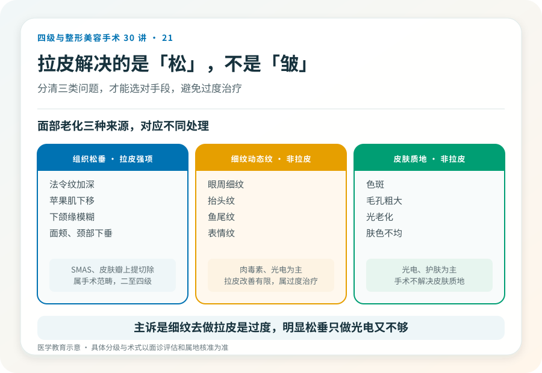
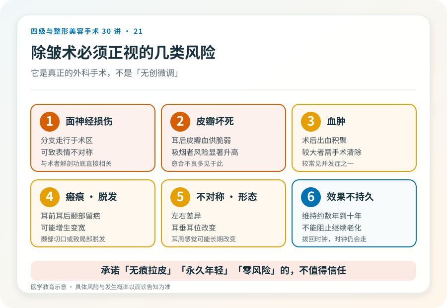
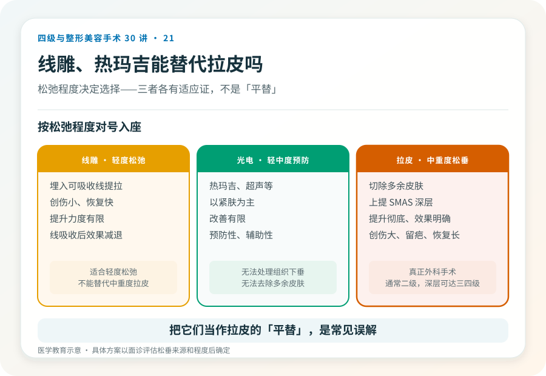

# 面部除皱术（拉皮）：和线雕、热玛吉不是一回事

## 三个备选标题

1. 拉皮手术解决的是“松”，不是“皱”：决策清单
2. 面部除皱术是几级手术？切口、风险和恢复一次说清
3. 线雕热玛吉能替代拉皮吗？看松弛程度再决定

## 封面介绍（100字以内）

面部除皱术（拉皮）通过切除多余皮肤、上提深层组织改善中重度松弛。它是手术，创伤大、留疤、恢复长，解决的是组织松垂，不是细纹。

## 分级标识

**手术分级：通常二级，涉及 SMAS 或广泛分离的深层除皱可达三级/四级，以机构核准为准**

## 正文

先说结论：**面部除皱术（俗称“拉皮”）通过切除多余皮肤、上提包括 SMAS 筋膜在内的深层组织，改善面部中重度松弛下垂。**它是真正的外科手术，创伤大、留下较长切口疤痕、恢复期长。它解决的是“松”（组织下垂），不是“皱”（细纹、动态纹）。把它和线雕、热玛吉等量齐观是常见误解——它们的适应证、效果和风险完全不在一个层面。

### 先分清“松”和“皱”

很多人把除皱术理解为“去掉皱纹”，这是不准确的。

- **组织松垂**：法令纹加深、苹果肌下移、下颌缘模糊、面颊和颈部的皮肤下垂。这是除皱术针对的对象。
- **细纹和动态纹**：眼周细纹、抬头纹、鱼尾纹。这些更依赖光电、注射（肉毒素）等，不是拉皮的强项。
- **皮肤质地问题**：色斑、毛孔、光老化。以光电和护肤为主。

除皱术擅长的是松垂，对细纹和皮肤质地改善有限。**如果你的主要问题是细纹，去做拉皮是过度治疗；如果明显松垂却只做光电，又达不到。**

### 手术大致怎么做

除皱术通常在全身麻醉或局麻加镇静下进行。基本原理是：

- 做切口（常用颞部发际内、耳前、耳后，绕至乳突区）。
- 掀起皮肤瓣。
- 上提并固定深层（SMAS 筋膜层或骨膜下层次）。
- 切除多余皮肤，重新贴合切口。

根据分离范围分为迷你型（短疤）、标准型和深层（SMAS 折叠或切除、骨膜下）等。分离越深、范围越大，提升越彻底，但手术级别、风险和恢复期也越高。**是否需要做颈部（颈阔肌成形），取决于有没有颈部松垂和颈阔肌条带。**

### 几个必须正视的风险

- **面神经损伤**：面神经分支走行于术区，损伤可致面部表情不对称、暂时或长期。这是除皱术最需要警惕的风险之一，与术者解剖功底直接相关。
- **皮瓣坏死与伤口愈合不良**：皮瓣远端（耳后、耳后皮肤）血供脆弱，吸烟者风险显著升高。
- **血肿**：术后出血形成血肿，较大者需处理，是除皱术较常见的并发症。
- **感染**。
- **瘢痕**：耳前、耳后、颞部疤痕，多数隐蔽但可能增生、变宽，脱发区可能出现毛发缺失。
- **不对称、形态不满意**。
- **感觉改变**：耳周、面部感觉可能改变，部分长期。
- **耳垂变形、耳位改变**。
- **脱发**：颞部切口可能引起局部脱发。
- **效果不持久**：拉皮不能阻止继续老化，效果通常维持数年到十年左右，因人而异。
- **麻醉相关风险**。

### 线雕、热玛吉能替代吗

- **线雕**：通过埋入可吸收线提拉，创伤小、恢复快，但提升力度有限、效果临时（线吸收后效果减退）。适合轻度松弛或不接受手术者，不能替代中重度松弛的拉皮。
- **光电（热玛吉、超声等）**：以紧肤为主，改善有限，适合轻中度、预防性。无法处理明显组织下垂和多余皮肤。

**把它们当作“拉皮的平替”是误解。**它们各有适应证，松弛程度决定了选择——轻度可考虑非手术，中重度则手术更有效。

### 哪些人不适合做

- 皮肤条件差、严重光老化但无明显松垂者（手术效果有限）。
- 吸烟者（皮瓣坏死风险高，术前需戒烟）。
- 凝血异常、未控制的慢性病、不能耐受麻醉者。
- 对疤痕完全不能接受者。
- 对效果抱有“年轻 20 岁”“永久不老”期待者。

### 决策前的硬要求

面诊除皱术，至少做到：选择有资质、有面部年轻化经验的机构和主刀；当面评估松垂来源（皮肤/SMAS/脂肪/骨骼吸收）；讨论切口范围、层次、是否联合颈部或其他项目；理解面神经风险、疤痕和恢复期；确认机构的麻醉和急救条件。**承诺“无痕拉皮”“永久年轻”“零风险”的机构，不值得信任。**

### 关于“维持多久”的诚实

除皱术不能阻止继续老化。术后效果通常维持数年到十年左右，因个人老化速度、体重波动、日晒和吸烟等而异。把它当成“一次性永葆青春”会带来不切实际的期待。合理的认知是：它把时钟拨回，但时钟会继续走。

> 本文用于健康教育，不能替代面诊和个体化评估；深层除皱术须在有相应资质的医疗机构由具备权限的医师开展。

## 参考资料

- American Society of Plastic Surgeons: Facelift
  https://www.plasticsurgery.org/cosmetic-procedures/facelift
- 中华医学会整形外科学分会：面部年轻化相关学术资料
  https://www.cma.org.cn/
