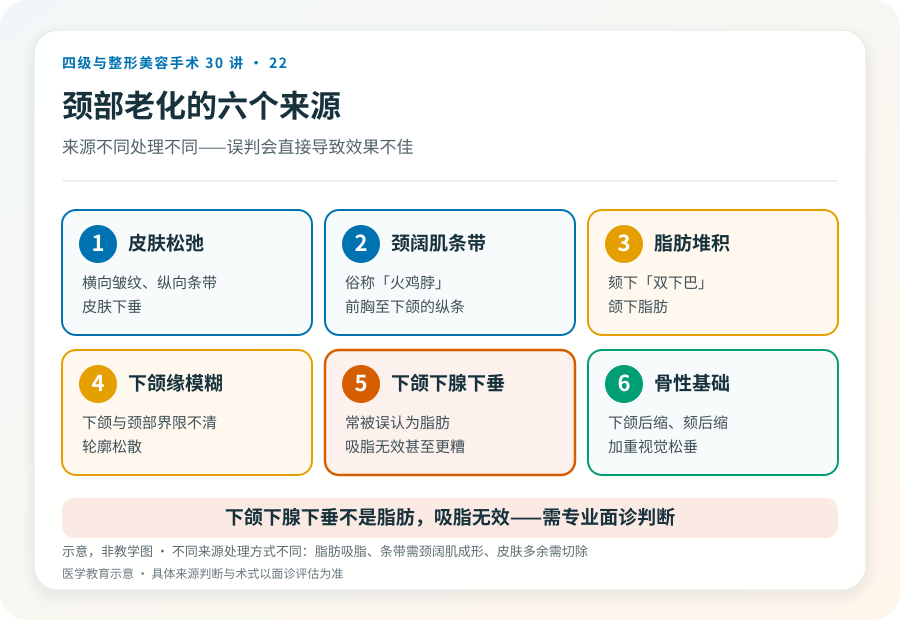
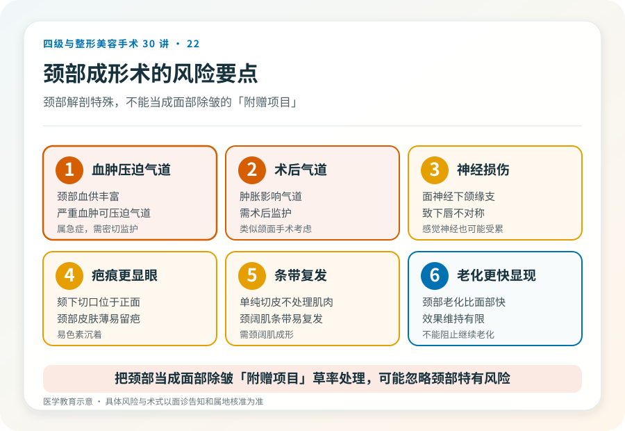

# 颈部松垂和颈阔肌条带：颈部成形术的决策

## 三个备选标题

1. 脖子上的“两条筋”和双下巴：颈部成形术解决什么
2. 颈部拉皮比面部拉皮更复杂？看松垂来源
3. 颈部年轻化：吸脂、切除和颈阔肌成形怎么选

## 封面介绍（100字以内）

颈部成形术针对颈部松垂、颈阔肌条带和脂肪堆积，常与面部除皱联合。术式包括吸脂、颈阔肌成形和皮肤切除，疤痕和风险需正视。

## 分级标识

**手术分级：通常二级，广泛分离或联合面部除皱可达三级/四级，以机构核准为准**

## 正文

先说结论：**颈部成形术针对颈部老化表现——皮肤松垂、颈阔肌条带（俗称“火鸡脖”）、脂肪堆积（双下巴）和下颌缘模糊。**它常与面部除皱联合，术式包括颈部吸脂、颈阔肌成形（收紧或折叠）和多余皮肤切除。颈部手术的疤痕和并发症需正视，且颈部解剖特殊，与面部除皱不完全等同。

### 先看清颈部老化的来源

颈部老化常是多种因素叠加：

- **皮肤松弛**：横向皱纹、纵向条带、皮肤下垂。
- **颈阔肌条带**：颈阔肌随年龄松弛，形成从前胸到下颌的纵向条带。
- **脂肪堆积**：颏下（双下巴）和颌下脂肪。
- **下颌缘模糊**：下颌与颈部界限不清。
- **下颌下腺下垂**：表现为下颌角下方的膨隆，常被误认为脂肪。
- **骨性基础**：下颌后缩、颏部后缩会加重颈部视觉松垂。

**不同来源处理方式不同**：脂肪以吸脂为主，颈阔肌条带需颈阔肌成形，皮肤多余需切除，下颌下腺下垂需要特殊处理（不是吸脂能解决）。判断需要面诊。

### 几种主要术式

- **颏下/颈部吸脂**：适合以脂肪为主、皮肤弹性好的年轻人，切口小、恢复快。
- **颈阔肌成形术**：经颏下切口收紧或折叠颈阔肌，改善条带和中线轮廓，常与吸脂联合。
- **颈部皮肤切除**：皮肤明显松弛时需要切除，可能留颏下或耳后疤痕。
- **联合面部除皱**：颈部松垂常与面部松弛并存，多数情况下联合处理更协调。

### 颈部手术比面部更棘手的几点

- **疤痕位置**：颏下切口位于颈部正面，虽然常在自然皱褶内，但比耳前耳后更显眼。
- **下颌下腺问题**：下颌下腺下垂常被误认为脂肪，吸脂无效甚至可能加重，需要专业判断。
- **颈阔肌条带的复发**：单纯切除皮肤不处理颈阔肌，条带可能复发。
- **颈部皮肤特性**：颈部皮肤薄、易留疤、易色素沉着。
- **效果维持**：颈部老化可能比面部更快显现。

### 几个必须正视的风险

- **出血与血肿**：颈部血供丰富，术后血肿需警惕，严重血肿可能压迫气道。
- **气道问题**：颈部术后肿胀可能影响气道，需术后监护（与颌面手术类似的考虑）。
- **感染、伤口愈合不良**。
- **瘢痕**：颏下、耳后疤痕，可能增生或色素沉着。
- **不对称、轮廓不平整**。
- **神经损伤**：颈部有面神经下颌缘支、感觉神经等，损伤可能致下唇不对称或感觉改变。
- **下颌下腺处理的相关问题**。
- **效果不持久**：颈部老化会继续。

### 哪些人不适合做

- 仅有细纹、无明显松垂或脂肪堆积者（手术过度）。
- 颏下“双下巴”主要是下颌下腺下垂而非脂肪者（吸脂无效）。
- 皮肤弹性差但不愿接受切除疤痕者。
- 凝血异常、未控制的慢性病、不能耐受麻醉者。
- 对颈部疤痕完全不能接受者。

### 决策前的硬要求

面诊颈部成形，至少做到：选择有资质、有颈部手术经验的机构和主刀；当面评估松垂、脂肪、颈阔肌条带、下颌下腺和骨性基础；讨论术式、切口、是否联合面部除皱；理解颈部疤痕、气道和神经风险；确认机构的麻醉、监护和急救条件。**把颈部当成面部除皱“附赠项目”草率处理的机构，可能忽略颈部特有的风险。**

### 关于“下颌下腺下垂”的特别提醒

有些人下颌角下方的膨隆不是脂肪，而是下颌下腺下垂或肥大。这种情况吸脂无效，甚至可能让腺体更突出，需要专业评估和不同的处理路径。**误判来源会直接导致效果不佳**——这也是为什么颈部成形需要经验丰富的医生面诊，而不是看一张自拍就定方案。

> 本文用于健康教育，不能替代面诊和个体化评估；颈部成形术须在有相应资质的医疗机构由具备权限的医师开展。

## 参考资料

- American Society of Plastic Surgeons: Neck lift
  https://www.plasticsurgery.org/cosmetic-procedures/neck-lift
- 中华医学会整形外科学分会：颈部年轻化相关学术资料
  https://www.cma.org.cn/
