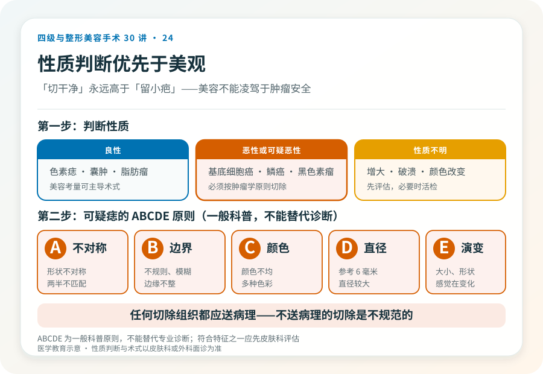
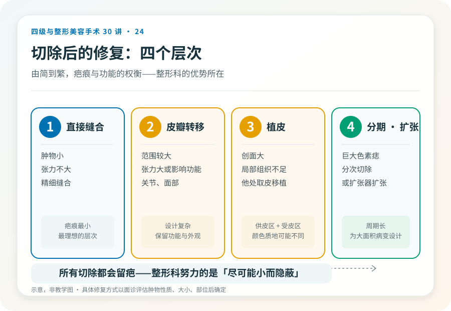

# 体表肿物切除不是“切掉就行”：整形修复的考量

## 三个备选标题

1. 黑痣、脂肪瘤、囊肿切除：为什么整形科讲究“缝合”
2. 体表肿物切除后的修复：疤痕比你想的重要
3. “切干净”和“留小疤”怎么权衡：体表肿物手术清单

## 封面介绍（100字以内）

体表肿物（色素痣、囊肿、脂肪瘤、皮肤肿瘤等）切除后，修复方式影响疤痕和功能。整形科强调精细缝合，但“美观”不能凌驾于“切净”之上。

## 分级标识

**手术分级：小型切除通常一级，较大或复杂修复（皮瓣、植皮）可达二级或更高，恶性肿瘤广泛切除可达更高级别，以机构核准为准**

## 正文

先说结论：**体表肿物（色素痣、皮脂腺囊肿、脂肪瘤、皮肤良恶性肿瘤等）的切除不只是“挖掉”，切除后的修复方式直接影响疤痕、功能和外观。**整形外科的优势在于精细缝合和修复技术（皮瓣、植皮），但有一条根本原则必须先讲清：**对于可疑或确诊恶性的肿物，“切净”永远高于“美观”，美容考量不能凌驾于肿瘤学安全之上。**

### 先判断性质，再谈术式

体表肿物切除前，最重要的是判断性质：

- **良性**：色素痣、皮脂腺囊肿、脂肪瘤、纤维瘤等，切除以改善外观或解决症状为主。
- **恶性或可疑恶性**：基底细胞癌、鳞状细胞癌、黑色素瘤等，必须按肿瘤学原则切除，切缘要足够，必要时配合病理和后续治疗。
- **性质不明**：快速增大、破溃、颜色改变、边界不规则、出血瘙痒的“痣”，应先评估性质，必要时活检，**不能直接按美容切除**。

**一个关键原则**：任何“看起来不对劲”的痣或肿物，应先由皮肤科或外科评估性质，而不是直接找美容机构“切掉”。性质判断错误可能延误恶性肿瘤的治疗。

### 切除和修复的几个层次

- **直接缝合**：肿物小、切除后张力不大，直接精细缝合。疤痕最小。
- **皮瓣转移**：切除范围较大、直接缝合张力大或影响功能（如关节、面部），用邻近皮瓣转移覆盖。设计复杂，疤痕更长但能保留功能和外观。
- **植皮**：创面大、无法用局部组织覆盖时，从其他部位取皮移植。会留下供皮区和受皮区两处痕迹，颜色质地可能与周围不同。
- **分期切除/扩张器**：巨大的色素痣等，可能分次切除或先用皮肤扩张器扩张周围皮肤再切除。

### 几个必须正视的风险

- **疤痕**：所有切除都会留疤，整形科努力的是让疤痕尽可能小、隐蔽、平整，但无法消除疤痕。疤痕体质、感染部位、张力大的部位疤痕更明显。
- **切除不净或复发**：尤以囊肿、某些肿瘤，残留可能复发。
- **肿物性质误判**：把恶性当良性切除，延误治疗——这是最严重的错误。
- **感染、出血、血肿**。
- **功能障碍**：关节、眼周、口周等部位切除范围大可能影响功能。
- **皮瓣或植皮问题**：坏死、不成活、色素改变、挛缩。
- **不对称、轮廓异常**（面部）。
- **病理结果与预期不符**：术后病理回报恶性，需要扩大切除或后续治疗。

### “美容切除”和“肿瘤切除”的边界

对于性质明确的小型良性肿物，美容考量可以主导术式选择。但对于：

- 性质不明、有恶性征象的肿物。
- 已确诊或高度怀疑恶性的肿物。
- 反复破溃、增大、颜色改变的“痣”。

**必须按肿瘤学原则处理——足够切缘、必要时病理、可能需要扩大切除或后续治疗。**在这种情况下一味追求“小切口”“不留疤”，可能因切缘不足导致复发或转移，是本末倒置。**正确顺序是先确诊性质，再决定术式，而不是直接按美容处理。**

### 哪些“痣”需要特别警惕

ABCDE 原则（**这是一般科普原则，不能替代专业诊断**）：

- **A（Asymmetry）**：不对称。
- **B（Border）**：边界不规则、模糊。
- **C（Color）**：颜色不均、有多种颜色。
- **D（Diameter）**：直径较大（一般以 6 毫米为参考）。
- **E（Evolving）**：大小、形状、颜色、感觉（瘙痒、出血）在变化。

符合以上特征之一的“痣”，应先由皮肤科评估，必要时皮肤镜或活检，而不是直接切除。

### 决策前的硬要求

面诊体表肿物切除，至少做到：选择有资质的机构和主刀；性质不明或有恶性征象者，先皮肤科或外科评估，必要时活检；讨论切除范围、修复方式（直接缝合/皮瓣/植皮）、疤痕预期；理解性质判断优先于美观的原则；确认机构具备病理送检能力（**任何切除组织都应送病理，不送病理的切除是不规范的**）。

### 一个常被忽略的细节：病理

规范的体表肿物切除，切下的组织应送病理检查。这不仅是为了确诊，也是为了在意外发现恶性时能及时扩大治疗。**承诺“切完就好、不用送病理”的机构，是不规范的。**

> 本文用于健康教育，不能替代面诊和个体化评估；体表肿物切除与修复须在有相应资质的医疗机构由具备权限的医师开展。

## 参考资料

- American Academy of Dermatology: Moles & skin cancer information
  https://www.aad.org/public/diseases/skin-cancer
- 中华医学会整形外科学分会、皮肤性病学分会：体表肿瘤相关诊疗共识（以现行版本为准）
  https://www.cma.org.cn/
