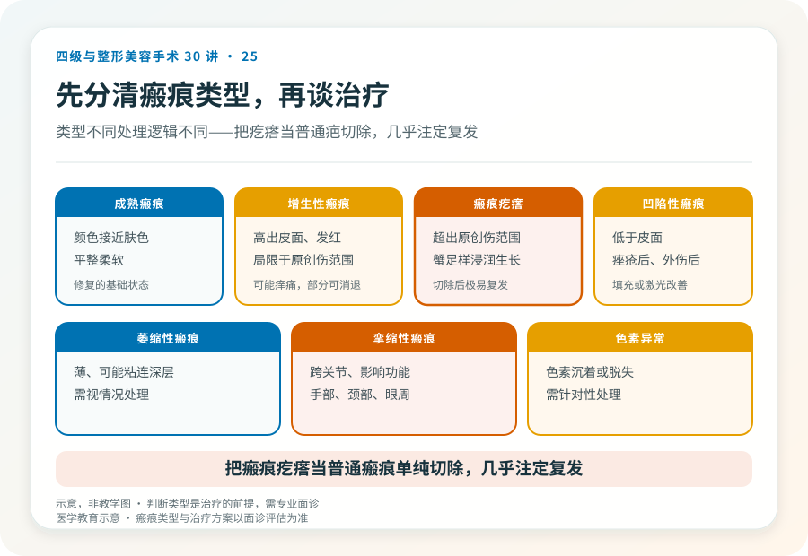
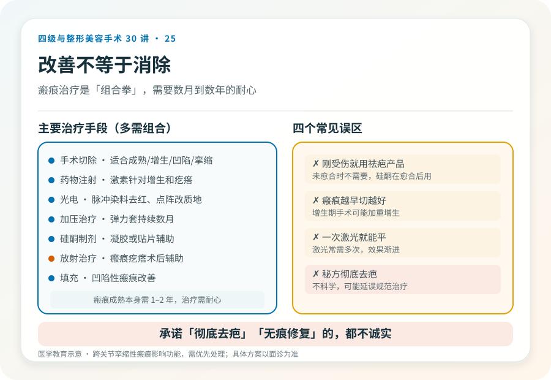

# 瘢痕修复不是“消除”：瘢痕综合治疗的现实

## 三个备选标题

1. 疤痕能“完全去掉”吗？先认清瘢痕修复的边界
2. 增生疤、凹陷疤、疤痕疙瘩：处理方式完全不同
3. 瘢痕治疗是一套组合拳：手术、注射、光电怎么配合

## 封面介绍（100字以内）

瘢痕无法被“消除”，只能改善。不同类型瘢痕（增生、凹陷、疙瘩）处理方式不同，常需手术、注射、光电等综合治疗，且需要时间。

## 分级标识

**手术分级：瘢痕切除通常一级或二级，复杂瘢痕修复（大面积、功能部位、皮瓣）可达更高级别，以机构核准为准**

## 正文

先说结论：**瘢痕无法被“完全消除”，所有治疗的目标都是“改善”——让它更平、更淡、更接近周围皮肤、更不影响功能。**不同类型瘢痕（增生性、凹陷性、瘢痕疙瘩、挛缩性）的处理方式完全不同，常需要手术、药物注射、光电、加压等多种手段综合，且需要数月到数年的时间。任何承诺“彻底去疤”“无痕修复”的都不诚实。

### 先分清瘢痕类型

- **成熟瘢痕**：颜色接近肤色或略白，平整柔软，是修复的基础状态。
- **增生性瘢痕**：高出皮面、发红、可能痒痛，但局限于原创伤范围。多在伤后数月内增生，部分可自行部分消退。
- **瘢痕疙瘩**：超出原创伤范围向周围浸润生长，呈蟹足样，痒痛明显，切除后极易复发，治疗困难，与体质相关。
- **凹陷性瘢痕**：低于皮面，常见于痤疮后、外伤后。
- **萎缩性瘢痕**：薄、可能与深层组织粘连。
- **挛缩性瘢痕**：跨关节或重要部位，收缩影响功能（如手部、颈部、眼周）。
- **瘢痕色素异常**：色素沉着或脱失。

**不同类型处理逻辑不同**：把瘢痕疙瘩当普通瘢痕单纯切除，几乎注定复发；把凹陷瘢痕当增生处理，也不会有效。判断类型是治疗的前提。

### 几种主要治疗手段

- **手术切除**：适合成熟、增生性、凹陷性或挛缩性瘢痕，切除后精细缝合或皮瓣修复。对瘢痕疙瘩单纯切除复发率极高，通常需配合术后放疗或药物。
- **药物注射**：糖皮质激素等局部注射，针对增生性瘢痕和瘢痕疙瘩，可使其变平变软，常需多次。
- **光电治疗**：脉冲染料激光改善瘢痕发红，点阵激光改善质地和平整度，针对不同情况。
- **加压治疗**：弹力套/贴片持续加压，预防和改善增生，需坚持数月。
- **硅酮制剂**：凝胶或贴片，辅助预防和改善。
- **放射治疗**：瘢痕疙瘩术后辅助，降低复发。
- **填充**：凹陷性瘢痕可用填充改善。
- **综合治疗**：多数瘢痕需要多种手段组合，分阶段进行。

### 几个必须正视的现实

- **瘢痕不能消除**：所有治疗都是改善，不是消除。宣传“彻底去疤”是不诚实。
- **治疗周期长**：瘢痕成熟本身需要 1–2 年，治疗常需数月到数年，需要耐心。
- **瘢痕疙瘩易复发**：尤其胸前、肩背、耳垂等好发部位，单纯切除几乎必复发，需要综合策略。
- **体质因素**：瘢痕体质者治疗效果受限，预防（避免不必要创伤、伤口精细护理）比治疗更重要。
- **部位差异**：胸前、肩背、下颌等张力大部位瘢痕更明显；眼周、关节等部位涉及功能。
- **儿童瘢痕**：儿童瘢痕随生长可能变化，某些治疗（如激光）选择更谨慎。

### 几个常见误区

- **“刚受伤就祛疤产品”**：伤口未愈合时不需要祛疤产品，应先保证愈合；硅酮制剂在愈合后使用。
- **“疤痕越早切越好”**：增生期（通常伤后半年内）手术刺激可能加重增生，多数建议等瘢痕稳定后再评估手术。
- **“一次激光就平”**：激光常需多次，效果渐进。
- **“私人秘方彻底去疤”**：不科学，可能延误规范治疗。

### 功能性瘢痕的优先级

跨关节的挛缩性瘢痕（影响手指、颈部、眼睑等功能）需要优先处理，因为它们影响活动、发育（儿童）或视力。这类修复常需要皮瓣或植皮，级别和复杂度更高，目标是恢复功能，外观是次要但仍重要的考量。

### 决策前的硬要求

面诊瘢痕修复，至少做到：选择有资质、有瘢痕治疗经验的机构和主刀；先判断瘢痕类型和阶段；讨论治疗方案（单一还是综合）、周期和预期；理解“改善”而非“消除”的边界；对瘢痕疙瘩尤其要讨论复发率和术后辅助策略。**承诺“一次根治”“彻底无痕”的机构，对瘢痕的生物学特性缺乏诚实。**

> 本文用于健康教育，不能替代面诊和个体化评估；瘢痕手术修复须在有相应资质的医疗机构由具备权限的医师开展。

## 参考资料

- American Academy of Dermatology: Scar treatment
  https://www.aad.org/public/everyday-care/injured-skin/treat-scars
- 中华医学会整形外科学分会、烧伤外科学分会：瘢痕防治相关共识（以现行版本为准）
  https://www.cma.org.cn/
