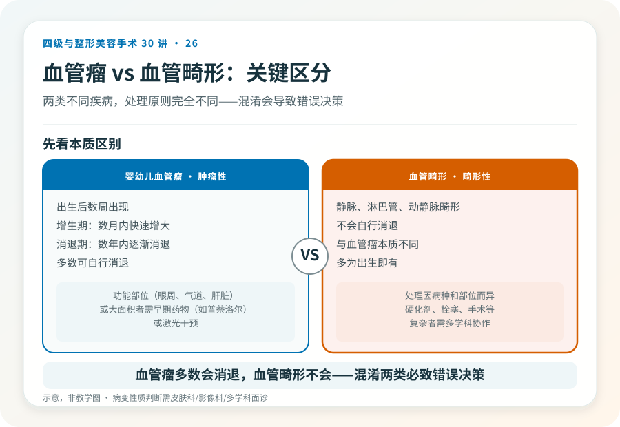
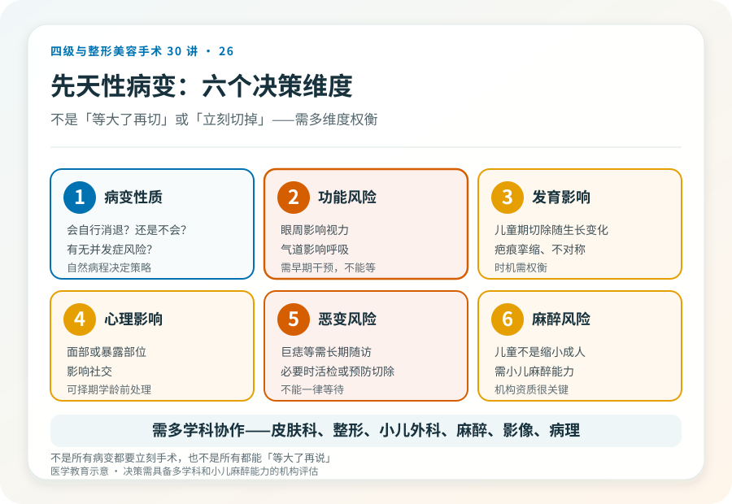

# 先天性体表病变：血管瘤、色素痣等的手术时机

## 三个备选标题

1. 孩子身上的血管瘤、色素痣，什么时候该手术
2. 先天性体表病变：观察、药物、手术怎么选
3. “等孩子大了再切”对吗？先天性病变的时机决策

## 封面介绍（100字以内）

先天性体表病变（血管瘤、巨痣等）的处理时机和方式因病种而异。有些需早期干预，有些可观察，决策涉及发育、心理和功能多重因素。

## 分级标识

**手术分级：视病变性质和范围而定，小型切除通常一级，巨痣、血管畸形等复杂修复可达更高级别，以机构核准为准**

## 正文

先说结论：**先天性体表病变（婴幼儿血管瘤、先天性色素痣、淋巴管畸形、血管畸形等）的处理时机和方式因病种差别很大。**有些需要早期药物或手术干预，有些以观察为主，决策涉及病变性质、生长发育、心理影响和功能风险。这往往需要皮肤科、整形外科、小儿外科、有时还有影像和病理的多学科协作，不是“等大了再切”或“立刻切掉”这么简单。

### 几类常见先天性体表病变

- **婴幼儿血管瘤**：出生后数周出现，经历增生期（数月内快速增大）和消退期（数年内逐渐消退）。多数可自行消退，但位于眼周、气道、肝脏或大面积者需要早期药物（如普萘洛尔）或激光干预，少数需要手术修复消退后的残余病变。
- **先天性色素痣**：出生即有。小型多数可观察或择期切除；巨大型先天性色素痣（GCN）恶变风险相对升高，处理复杂，可能需要分期切除或扩张器修复，且需长期随访监测恶变。
- **血管畸形（静脉、淋巴管、动静脉畸形）**：不会自行消退，与血管瘤不同。处理因病种和部位而异，可能涉及硬化剂、栓塞、手术等，复杂者需多学科。
- **淋巴管畸形（淋巴管瘤）**：常需硬化或手术，部位和体积决定难度。
- **其他**：皮脂腺痣、先天性皮肤缺损等，各有处理原则。

**关键区分**：婴幼儿血管瘤（肿瘤性，多数消退）和血管畸形（畸形性，不消退）是两类不同疾病，处理原则不同。混淆这两类会导致错误决策。

### 决策的几个考量维度

- **病变性质和自然病程**：是会自行消退的，还是不会的？有没有恶变或并发症风险？
- **功能风险**：位于眼周（影响视力）、气道（影响呼吸）、肝脏或重要结构者，需要早期干预。
- **生长发育影响**：儿童期切除可能随生长出现新问题（如疤痕挛缩、不对称），时机需权衡。
- **心理影响**：面部或暴露部位病变可能影响儿童心理和社交，某些情况下择期学龄前处理。
- **恶变风险**：巨痣等需要长期随访，必要时活检或预防性切除。
- **麻醉风险**：儿童手术涉及小儿麻醉，需要具备小儿麻醉能力的机构。

### 几个必须正视的现实

- **不是所有病变都要立刻手术**：婴幼儿血管瘤多数可自行消退，过度早期手术可能留下不必要的疤痕。
- **也不是所有都能“等大了再说”**：影响功能的（眼周遮挡视力、气道压迫）或快速增大的，需要及时干预，等待会造成不可逆后果。
- **儿童手术的麻醉要求**：儿童不是缩小的成人，小儿麻醉需要专门能力和设备，选择有小儿手术和麻醉经验的机构很重要。
- **疤痕和发育的长期影响**：儿童期手术的疤痕会随生长变化，需要长期视角。
- **心理评估**：面部或显眼病变的儿童，心理影响应纳入决策，必要时配合心理支持。

### 几个常见误区

- **“血管瘤等等自己会消，不用管”**：多数会消退，但位于功能部位或快速增长者需要干预，不能一律观察。
- **“血管瘤赶快切掉”**：增生期手术可能出血多、疤痕重，且可能正在自行消退，盲目手术过度治疗。
- **“孩子的痣都等长大再切”**：巨痣或可疑恶变者需要专业评估和长期随访，不是一律等待。
- **“哪里都能做儿童手术”**：儿童手术和麻醉有特殊要求，需要相应资质和经验。

### 多学科的意义

先天性体表病变的决策常常需要多个专科：皮肤科判断性质、整形外科设计修复、小儿外科和小儿麻醉保障安全、影像科评估深部范围、病理科确诊、有时需要眼科、耳鼻喉科等评估功能影响。**这提示选择具备多学科协作能力的机构，比单科门诊更能给出合理方案。**

### 决策前的硬要求

面诊先天性体表病变（尤其儿童），至少做到：选择有资质、有儿童病变处理经验的机构；明确病变性质（必要时影像、病理、多学科会诊）；讨论自然病程、功能风险、恶变风险和心理影响；理解时机选择（立刻/观察/择期）的依据；确认机构具备小儿麻醉和手术条件。**把儿童先天性病变当成简单美容问题处理的机构，可能忽略功能、发育和恶变风险。**

> 本文用于健康教育，不能替代面诊和个体化评估；先天性病变的处理须在有相应资质、具备多学科和小儿麻醉能力的医疗机构开展。

## 参考资料

- American Academy of Dermatology: Infantile hemangioma & birthmarks
  https://www.aad.org/public/diseases/a-z/infantile-hemangiomas-overview
- 中华医学会整形外科学分会、小儿外科学分会、皮肤性病学分会：相关诊疗共识（以现行版本为准）
  https://www.cma.org.cn/
