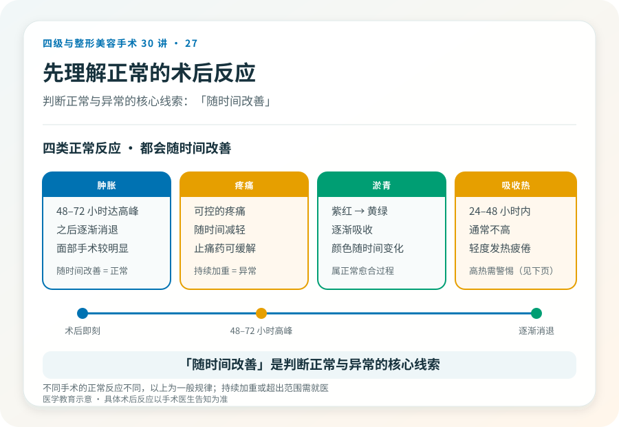
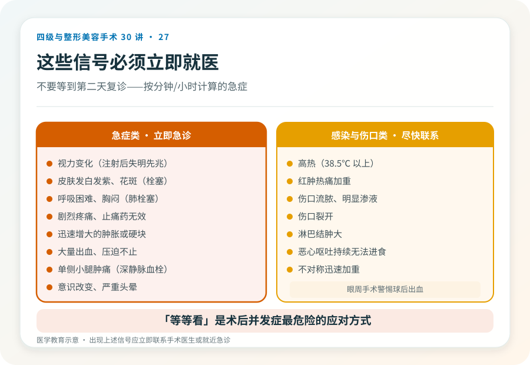
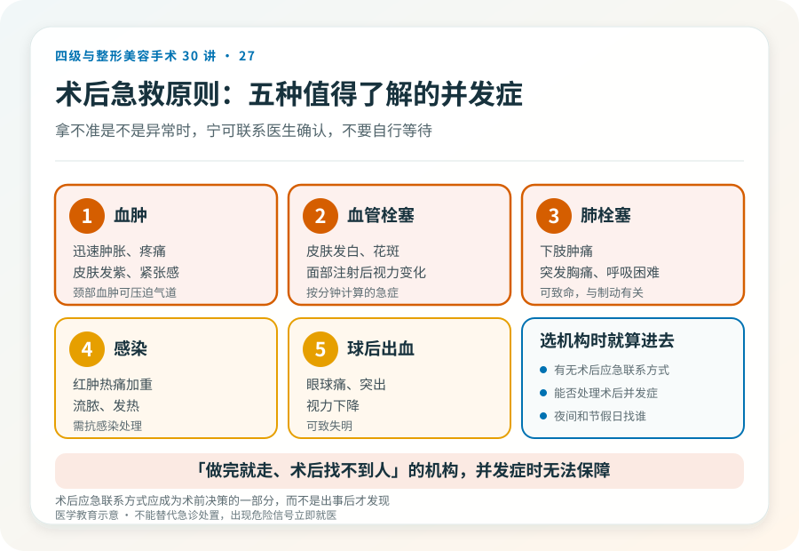

# 整形术后哪些情况要立即就医：并发症识别

## 三个备选标题

1. 术后这些信号不能“等等看”：并发症识别清单
2. 肿胀、疼痛、发热到什么程度要警惕？术后急救指南
3. 整形术后回家，哪些情况必须立刻联系医生

## 封面介绍（100字以内）

整形术后多数反应是正常的，但有些信号提示并发症，需要立即就医：剧烈疼痛、持续加重肿胀、发热、皮肤变色、视力变化、呼吸困难等。

## 分级标识

**手术分级：术后并发症识别科普（适用于各级手术）**

## 正文

先说结论：**整形术后多数肿胀、疼痛、淤青是正常愈合过程，但有些信号提示并发症，必须立即就医，不能“等等看”。**剧烈且持续加重的疼痛、迅速增大的肿胀、发热、皮肤发白发紫、视力变化、呼吸困难、伤口流脓或大量出血，都属于需要紧急处理的信号。了解正常反应和危险信号的边界，是术后安全的关键。

### 先理解正常的术后反应

不同手术的正常术后反应不同，但通常包括：

- **肿胀**：术后 48–72 小时达高峰，之后逐渐消退。面部手术肿胀可能明显。
- **疼痛**：可控的疼痛，随时间减轻，可通过止痛药缓解。
- **淤青**：随时间从紫红变黄绿，逐渐吸收。
- **轻度发热**：术后 24–48 小时内的吸收热通常不高。
- **轻度不适、疲倦**。

**这些通常随时间改善，不会持续加重。**“随时间改善”是判断正常与异常的核心线索。

### 必须立即就医的危险信号

以下信号提示可能的并发症，需要立即联系医生或急诊，**不要等到第二天复诊**：

- **剧烈疼痛**：止痛药无法缓解、持续加重的疼痛，尤其伴局部明显肿胀，提示血肿或血管问题。
- **皮肤颜色改变**：皮肤发白、发紫、花斑样变色、冰凉，提示血供问题；尤其注射或术后早期，可能为血管栓塞，需紧急处理。
- **视力变化**：眼周或鼻部注射后出现视力模糊、失明、眼痛、头痛，是血管栓塞最危险的信号，必须立即急诊。
- **迅速增大的肿胀或硬块**：提示活动性出血或血肿。
- **高热**：明显发热（通常 38.5℃ 以上）伴红肿热痛，提示感染。
- **伤口流脓、明显渗液、裂开**。
- **大量出血**：敷料持续渗血、压迫不止。
- **呼吸困难、胸闷**：提示肺栓塞、过敏反应或气道问题，是急症。
- **单侧肢体肿胀、小腿疼痛**：提示深静脉血栓。
- **恶心呕吐持续、无法进食饮水**。
- **意识改变、严重头晕**。
- **不对称迅速加重**（如一侧明显肿胀、眼球突出）：眼周手术尤其警惕球后出血。

### 几种值得专门了解的并发症

**血肿**：术后出血积聚形成。表现为迅速肿胀、疼痛、紧张感、皮肤发紫。较大血肿可能需要手术清除，颈部血肿还可能压迫气道，是急症。

**感染**：红肿热痛加重、流脓、发热、淋巴结肿大。需要抗感染处理，严重者可能需要取出植入物或引流。

**血管栓塞**（注射或术后）：皮肤发白、花斑、剧痛、组织缺血；面部注射后视力变化是失明先兆。**这是按分钟计算的急症。**

**深静脉血栓和肺栓塞**：下肢肿胀疼痛、突发胸痛、呼吸困难、咳血。与制动、手术范围有关，肺栓塞可致命。

**球后出血**（眼周手术）：眼球疼痛、突出、视力下降、明显不对称肿胀，可致失明，需紧急处理。

### 术后该做的事

- **保留医生/机构的紧急联系方式**，了解术后什么情况联系谁、夜间和周末找谁。
- **按医嘱复诊**，不擅自提前或推迟。
- **保留术前术后照片和病历**，便于后续判断。
- **避免剧烈活动、热敷、饮酒、阿司匹林类（未经医嘱）**，按医嘱护理伤口。
- **如实向医生报告症状**，不因担心“打扰”而隐瞒。

### “等等看”是最危险的应对

很多人术后出现异常信号时，倾向于“再观察一晚”“可能是正常的”。对于血管栓塞、血肿压迫气道、肺栓塞这类按时间计算的急症，“等等看”可能造成不可逆后果。**判断原则是：拿不准是不是异常、且症状明显或持续加重时，宁可联系医生确认，也不要自行等待。**好的医生和机构会认真对待术后反馈，而不是嫌你“大惊小怪”。

### 选机构时就把“术后应急”算进去

术后并发症可能在夜间、周末或回家后出现。**选择手术机构时，就应确认它有无术后应急联系方式、能不能处理术后并发症、夜间和节假日找谁。**一家“做完就走、术后找不到人”的机构，在并发症发生时无法提供保障。这应当成为术前决策的一部分，而不是出事后才发现的问题。

> 本文用于健康教育，不能替代急诊处置；术后出现上述危险信号应立即联系手术医生或就近急诊。

## 参考资料

- American Society of Plastic Surgeons: Patient safety & recovery
  https://www.plasticsurgery.org/patient-safety
- U.S. FDA: Dermal fillers—what to do if there is a problem
  https://www.fda.gov/medical-devices/aesthetic-cosmetic-devices/dermal-fillers-soft-tissue-fillers
