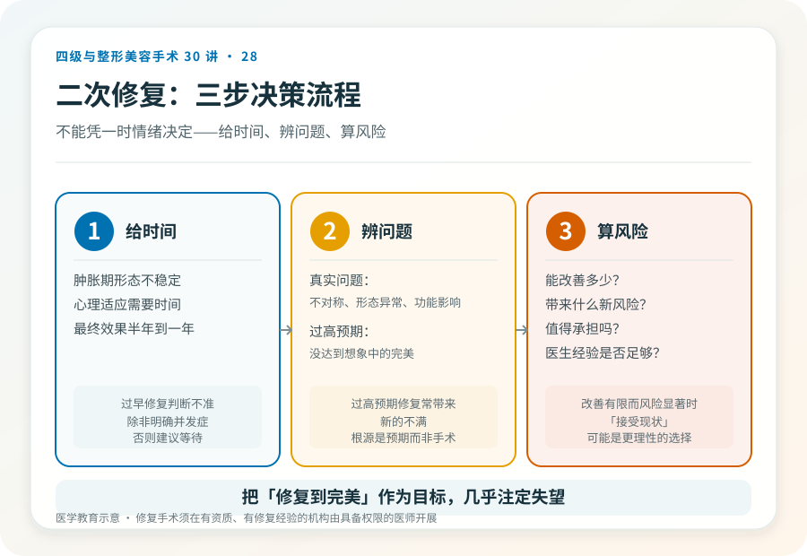
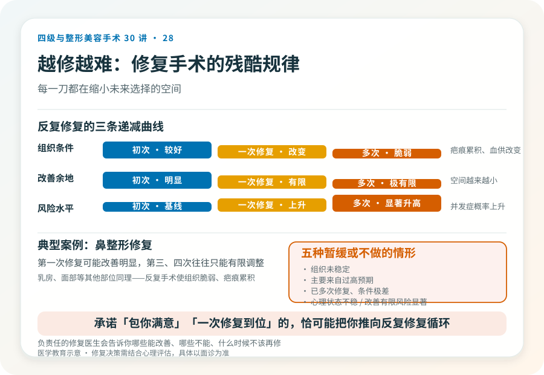

# 不满意就想“重做”：二次修复手术的决策

## 三个备选标题

1. 整形不满意，要不要立刻修复？等组织稳定是第一步
2. 二次修复手术：难度、风险和“值得吗”的权衡
3. 反复修复的陷阱：什么时候“不再手术”是更明智的选择

## 封面介绍（100字以内）

整形不满意后是否修复，需要先等组织稳定、评估真实问题，再权衡风险。反复修复会越来越难，有时“不再手术”比“继续修”更明智。

## 分级标识

**手术分级：修复手术常比初次级别更高，复杂修复可达三级/四级，以机构核准为准**

## 正文

先说结论：**整形不满意后是否做二次修复，不能凭一时情绪决定。**首先需要等组织稳定（通常术后半年到一年），其次要区分真实问题与过高预期，再次要权衡修复的风险和收益。一个普遍规律是：修复手术常比初次更难、级别更高，反复修复会越来越难、风险越来越大。**在某些情况下，“不再手术”反而是更明智的选择。**

### 第一步：给时间，不要急着修复

术后早期的“不满意”很多来自肿胀、不对称、心理落差，不等于真正的手术失败。

- **肿胀期**：术后数周到数月形态不稳定，过早判断会失真。
- **心理适应期**：对新外观的适应需要时间，初期落差感常见。
- **真实效果显现期**：多数手术的最终效果在术后半年到一年才稳定。

**所以修复决策的第一步是等待组织稳定。**过早修复不仅判断不准，还可能在未稳定的组织上叠加新的创伤，增加风险。除非出现明确的并发症（感染、假体问题、血供问题），否则通常建议等待。

### 第二步：区分真实问题和过高预期

组织稳定后仍不满意，要诚实区分：

- **真实问题**：明显不对称、形态异常、并发症遗留、功能影响。这类修复有明确目标。
- **过高预期**：把“没达到想象中的完美”当成失败。这类“问题”修复往往无法满足，因为根源是预期而非手术。

如果是后者，**修复可能带来新的不满——因为完美本就不存在。**这种情况更需要的是调整预期，而不是再动一刀。判断属于哪种，需要专业评估和自我诚实。

### 第三步：权衡修复的风险和收益

修复手术的风险通常高于初次：

- 组织已经经历过手术，疤痕、血供改变使修复空间受限。
- 修复难度上升，可能需要更复杂的术式（皮瓣、植骨、组织移植）。
- 修复后仍可能不满意，进入“越修越难”循环。

所以修复决策要问：

- 这个真实问题修复后能改善多少？
- 修复本身会带来什么新风险和疤痕？
- 改善的幅度是否值得承担这些风险？
- 修复医生的经验是否足够？

**如果改善幅度有限而风险显著，“接受现状”可能是更理性的选择。**

### “越修越糟”的现实

修复手术有一个残酷规律：每一次修复，组织条件更差、能改善的余地更小、风险更高。

- 鼻整形：第一次修复可能改善明显，第三次、第四次往往只能有限调整，且并发症概率显著上升（见第 18 篇）。
- 乳房、面部等其他部位同理：反复手术使组织脆弱、疤痕累积。

所以**在决定第一次修复时就要慎重**——选择经验丰富的修复医生、明确有限的修复目标、避免被“做到完美”的承诺驱动反复手术。一旦进入多次修复循环，每一刀都在缩小未来选择的空间。

### 哪些情况建议暂缓或不做修复

- 术后时间尚短，组织未稳定。
- 不满意主要来自过高预期，而非真实问题。
- 反复修复已经多次，组织条件极差，进一步改善余地有限。
- 心理状态不稳，仍在前次失败的强烈情绪中。
- 改善幅度有限而风险显著。

这些情况下，**调整预期、心理支持或接受现状，可能比再手术更有益。**

### 选择修复医生的特殊要求

修复对医生经验的要求高于初次：

- 需要有丰富修复经验，理解复杂组织条件。
- 能诚实说明修复的有限性，而不是承诺“一次完美”。
- 能与患者建立合理的预期管理，避免被推着做不必要手术。

**承诺“包你满意”“一次修复到位”的医生，恰恰可能是把患者推向反复修复循环的人。**真正负责任的修复医生会告诉你哪些能改善、哪些不能、什么时候不该再修。

### 心理因素的介入

整形不满意后的情绪——失落、愤怒、自责、焦虑——是真实的，需要被正视。但**带着强烈情绪做修复决策，后悔率高。**在决定修复前，给自己情绪平复的时间，必要时寻求心理支持，把决策建立在冷静评估而非情绪上，是对不可逆决定应有的耐心。

### 决策前的硬要求

考虑修复手术，至少做到：等组织稳定（通常半年到一年，并发症除外）；区分真实问题与过高预期；选择有丰富修复经验的机构和主刀；当面讨论修复目标、有限性和风险；理解“越修越难”的规律；必要时结合心理评估。**把“修复到完美”作为目标，几乎注定失望。**

> 本文用于健康教育，不能替代面诊和个体化评估；修复手术须在有相应资质、有修复经验的医疗机构由具备权限的医师开展。

## 参考资料

- American Society of Plastic Surgeons: Revision surgery & patient safety
  https://www.plasticsurgery.org/patient-safety
- 中华医学会整形外科学分会：修复重建相关学术资料
  https://www.cma.org.cn/
