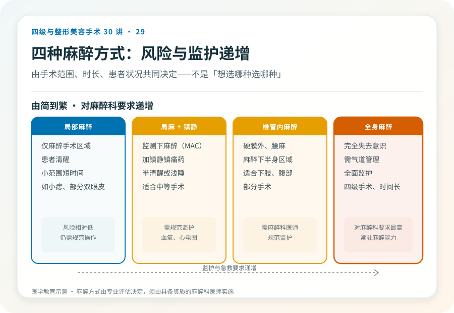
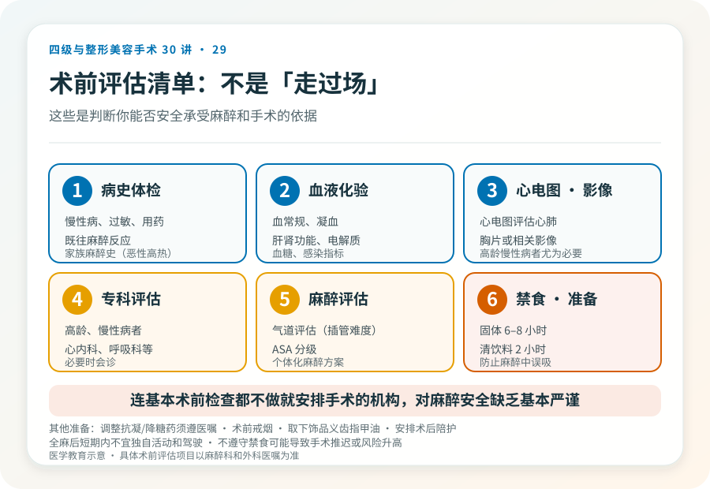
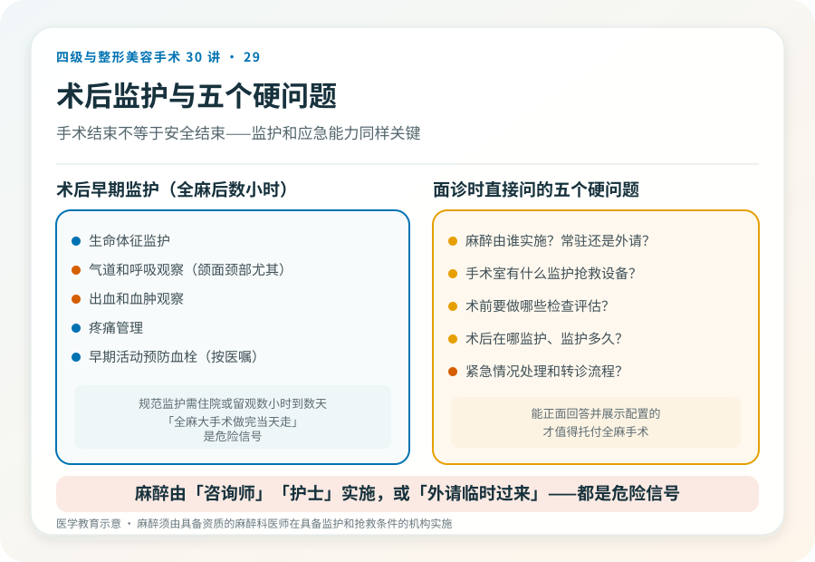

# 麻醉不是“睡一觉”：围术期安全怎么看

## 三个备选标题

1. 全麻、局麻、镇静怎么选？麻醉方式背后的安全逻辑
2. 整形手术的麻醉：谁来做、怎么监护、出事怎么办
3. 围术期安全清单：术前检查、禁食、术后监护该有的样子

## 封面介绍（100字以内）

麻醉是整形手术安全的核心环节。麻醉方式、麻醉科资质、术前评估、禁食和术后监护，共同决定围术期安全。不是“睡一觉”那么简单。

## 分级标识

**手术分级：围术期安全科普（适用于各级手术）**

## 正文

先说结论：**麻醉是整形手术（尤其全身麻醉下的四级手术）安全的核心环节，不是“睡一觉”那么简单。**麻醉方式的选择、是否由专业麻醉科医师实施、术前评估、禁食要求和术后监护，共同决定围术期安全。理解这些，能帮助你在面诊时判断机构的严谨程度，也能在术前做好正确准备。

### 几种常见麻醉方式

- **局部麻醉**：仅麻醉手术区域，患者清醒。适合小范围、短时间手术（如小痣切除、部分双眼皮）。风险相对低，但仍需规范操作。
- **局部麻醉 + 镇静（监测下麻醉，MAC）**：局麻基础上加镇静镇痛药，患者半清醒或浅睡。适合中等手术。
- **椎管内麻醉（硬膜外、腰麻）**：麻醉下半身某一区域，适合下肢、腹部部分手术。
- **全身麻醉**：患者完全失去意识，需气道管理和全面监护。适合四级手术、时间长或范围大的手术。

**麻醉方式由手术范围、时长、患者状况共同决定，不是“想选哪种选哪种”。**四级手术通常需要全身麻醉，对麻醉科、监护和急救能力要求最高。

### 麻醉由谁做很关键

规范要求麻醉由具备资质的麻醉科医师实施，并有规范的监护（心电图、血压、血氧、呼末二氧化碳等）和抢救设备。**值得警惕的情况：**

- 麻醉由“咨询师”“护士”或非麻醉科医师实施。
- 麻醉科医生是“外请”“临时过来”，机构无常驻麻醉能力。
- 手术室缺乏规范监护和抢救设备。
- 全身麻醉后没有规范苏醒和术后监护。

全身麻醉下的手术，麻醉科是和主刀同等重要的安全保障。**一家承诺全麻手术却没有常驻麻醉科能力的机构，在麻醉并发症发生时无法及时处理。**这是选择机构时必须核实的硬条件。

### 术前评估：为什么不是“走过场”

规范的全麻或较大手术前，术前评估通常包括：

- **病史和体检**：慢性病、过敏、用药、既往麻醉反应、家族麻醉史（尤其恶性高热）。
- **血液化验**：血常规、凝血、肝肾功能、电解质、血糖、感染指标等。
- **心电图、胸片或相关影像**：评估心肺。
- **专科评估**：高龄、有慢性病者可能需要心内科、呼吸科等会诊。
- **麻醉评估**：气道评估（插管难度）、ASA 分级等。

这些不是机构“凑费用”的项目，而是判断你能否安全承受麻醉和手术的依据。**一家连基本术前检查都不做就安排手术的机构，对麻醉安全缺乏基本严谨。**

### 禁食和术前准备

全身麻醉或深度镇静前通常要求禁食（固体食物通常 6–8 小时，清饮料 2 小时，具体以医嘱为准），是为了防止麻醉中误吸。其他准备包括：

- 停用或调整某些药物（如抗凝药、降糖药），必须在医生指导下，不能自行停药。
- 术前戒烟（降低围术期并发症）。
- 术晨取下饰品、隐形眼镜、义齿、指甲油。
- 安排术后陪护，全麻后短期内不宜独自活动和驾驶。

**不遵守禁食要求可能导致手术推迟或麻醉风险升高。**这是患者能直接参与的围术期安全措施。

### 术后监护

手术结束不等于安全结束。术后早期（尤其全麻后数小时）需要规范监护：

- 生命体征监护。
- 气道和呼吸观察（颌面、颈部手术尤其重要）。
- 出血和血肿观察。
- 疼痛管理。
- 早期活动预防血栓（按医嘱）。

**规范的术后监护需要住院或留观数小时到数天，取决于手术。**承诺全麻大手术“做完当天走、不留观”的机构，对术后早期风险缺乏应对。

### 几个围术期安全的硬问题

面诊时值得直接问：

- 麻醉由谁实施？是常驻麻醉科还是外请？
- 手术室有什么监护和抢救设备？
- 术前要做哪些检查和评估？
- 术后在哪监护、监护多久？夜间和周末谁负责？
- 出现麻醉或术后紧急情况，处理和转诊流程是什么？

能正面回答并展示相应配置的机构，才值得托付全麻手术。回避这些问题的，恰恰是出事时最危险的。

### 患者能做的围术期准备

- 如实告知病史、用药、过敏、既往麻醉反应和家族史。
- 严格按医嘱禁食和调整用药。
- 术前戒烟、避免饮酒。
- 安排可靠的术后陪护。
- 不隐瞒任何信息（包括非法注射史、保健品、避孕药等），这些直接影响麻醉和手术安全。

**隐瞒信息是出于对被评判的担心，但对麻醉科和外科团队而言，这些信息决定安全方案。诚实是围术期安全的前提。**

> 本文用于健康教育，不能替代面诊和个体化评估；麻醉须由具备资质的麻醉科医师在具备监护和抢救条件的医疗机构实施。

## 参考资料

- 中华医学会麻醉学分会：临床麻醉相关指南（以现行版本为准）
  https://www.cma.org.cn/
- American Society of Anesthesiologists: Patient information
  https://www.asahq.org/whensecondscount
