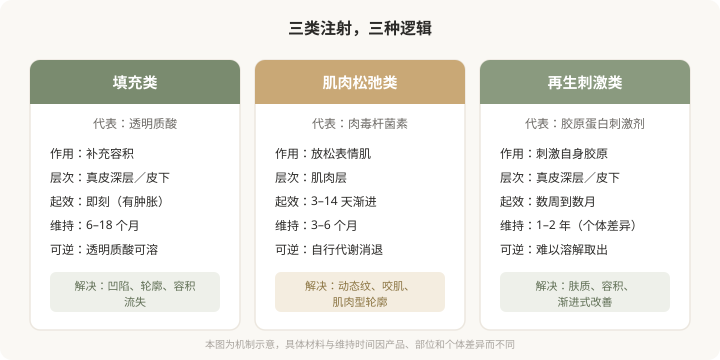
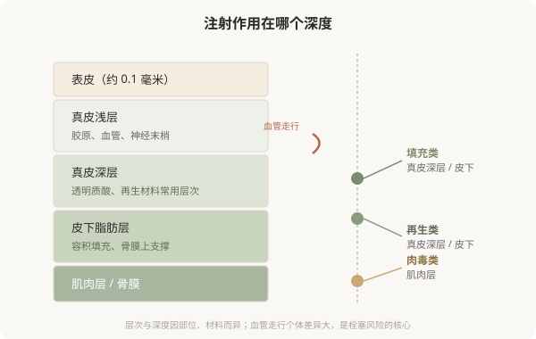

# 美容注射不只是“打一针”：先理解它在做什么

## 三个备选标题

1. 把注射叫“轻医美”是一种误会：它仍是医疗操作
2. 玻尿酸、肉毒、再生针，到底有什么不同
3. 决定打针之前，先看懂这张“注射地图”

## 封面介绍（100字以内）

美容注射分为填充、松弛肌肉、刺激再生三大逻辑。理解它们在皮肤里发生什么，比记住品牌名更重要——这决定你能不能安全地选择。

## 正文

先说结论：**美容注射不是“轻医美”那种可以随便对待的小事，它是真正意义上的医疗操作。**它的主流手段可以归为三类：用填充物补容积、用肉毒杆菌素放松肌肉、用再生材料刺激自身胶原。三类的作用层次、起效方式、风险和可逆性完全不同。把它们一概称作“打针”或“轻医美”，是理解注射的第一道障碍。

### 三种注射，三种逻辑

很多人把所有面部注射理解成“补点东西让脸饱满”。实际上，主流注射按作用机制可以分为三类，它们解决的问题、层次和风险各不相同。

下图是这三类注射的核心逻辑对比：

### 为什么不能笼统叫“轻医美”

“轻医美”这个词在传播上方便，但它制造了一个危险的错觉：注射是无创、低风险、可以随便尝试的。事实是：

- **注射需要精确的解剖知识**：面部血管密集，层次差几毫米可能从“安全”变成“栓塞”。
- **注射材料进入身体后并非都能取出**：透明质酸可以酶解，但再生类材料和不明注射物难以溶解。
- **注射的效果和并发症都依赖操作者**：同一种产品，不同人注射的结果可能完全不同。

把注射当“轻”，会让人低估它的医疗属性，在资质不明的场所接受操作，或在没理解材料的情况下反复注射。**理解注射是医疗操作，是安全的第一步。**

### 注射在皮肤里到底发生了什么

填充类材料注射到真皮深层或皮下，物理性地补充流失的容积；肉毒杆菌素注射到表情肌，阻断神经肌肉传导，让过度活跃的肌肉放松；再生类材料注射后，其载体或微球刺激身体产生胶原蛋白，效果渐进出现。

下图是面部皮肤层次与三类注射作用位置的简化示意：

### 一个核心认知：层次决定安全和效果

同一种材料，注射到不同层次，效果和风险可能完全不同。太浅可能透光、不平；太深可能无效；误入血管则可能栓塞。**这就是为什么注射对操作者的解剖功底要求极高——差几毫米，结果可能从改善变成灾难。**把注射理解为“像打疫苗一样推药”，是对它最危险的误解。

### 这一系列要回答的问题

接下来的 29 篇，会围绕三类注射展开：它们各自适合什么、怎么选材料和医生、不同部位怎么处理、风险怎么识别、出了问题怎么办。**一个贯穿全系列的原则是：注射的有效和安全，建立在理解而非冲动之上。**能区分填充、肉毒和再生的不同，是理解的第一步。

> 本文用于健康教育，不能替代面诊和个体化评估；注射属医疗美容操作，须在正规医疗机构由具备资质的医师开展。

## 参考资料

- American Society of Plastic Surgeons: Minimally invasive procedures
  https://www.plasticsurgery.org/cosmetic-procedures
- U.S. FDA: Dermal fillers and botulinum toxin information
  https://www.fda.gov/medical-devices/aesthetic-cosmetic-devices
