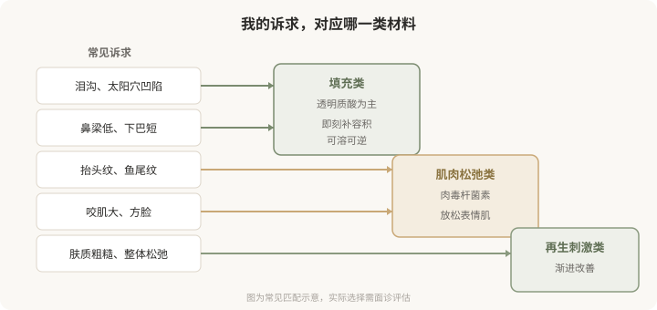
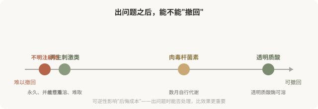

# 填充、松弛、再生：三类注射材料的核心区别

## 三个备选标题

1. 玻尿酸、肉毒、少女针：到底该怎么分
2. 一张图看懂三类注射材料的作用逻辑
3. 别再笼统叫“打针”：填充、松弛、再生完全不同

## 封面介绍（100字以内）

填充补容积、肉毒松肌肉、再生刺激胶原——三类注射材料的作用、层次、起效和可逆性差别很大。选错类别，比选错品牌更影响结果。

## 正文

先说结论：**市面上绝大多数美容注射材料，都可以归到三大类：填充类、肌肉松弛类、再生刺激类。**它们解决的问题、作用层次、起效方式和可逆性完全不同。很多人纠结“哪个品牌好”，却忽略了更根本的问题——这个材料属于哪一类，它适不适合我的诉求。**选错类别，比选错品牌更影响结果。**

### 三类材料，各自解决什么问题

把诉求和材料类别对应起来，是选择的第一步。

### 三类材料的本质区别

**填充类**的核心是“补”。它把一种物质注射到真皮或皮下，物理性地补充流失的容积或重塑轮廓。透明质酸是最主流的填充材料，因为它本身是皮肤的天然成分，且有可溶解的特性。填充类的效果是即刻的（注射完就能看到，虽然会有肿胀），维持时间中等，最大优势是透明质酸可逆。

**肌肉松弛类**的核心是“放松”。肉毒杆菌素通过阻断神经肌肉传导，让过度活跃的表情肌放松。它解决的是动态问题——因为肌肉反复收缩形成的纹路（动态纹）、因为肌肉肥大形成的轮廓（如咬肌）。效果不是即刻的，通常数天到两周渐进出现，维持数月，会自行代谢消退。

**再生刺激类**的核心是“诱导”。这类材料注射后，通过其成分（如微球）刺激身体自身产生胶原蛋白，效果在数周到数月渐进显现。它的卖点是“自身胶原”“更自然”“维持更久”，但代价是起效慢、效果不可完全预测、且一旦出现结节等问题难以溶解取出。

### 可逆性：一个被低估的维度

下图把三类材料按“可逆性”排列，这是选择时常被忽略却很关键的维度：

**这就是为什么“不明注射物”是最危险的选择**——它可能是硅油、骨水泥或来路不明的混合物，一旦注入几乎无法取净，并发症可能持续数年甚至终身。任何回避材料信息、价格异常低廉、操作场所非正规机构的注射，都要警惕是不明注射物。

### 起效时间也影响选择

- **想要即刻效果**（如近期有重要场合）：填充类更直接。
- **能接受渐进改善**：再生类或肉毒都可行。
- **不能接受“突然变化”**：避免即刻填充，或选择保守剂量。

把起效时间纳入考量，能避免“打完不满意又着急”的处境。

### 别被“品牌”绕晕

每一类材料里都有多个品牌，它们在工艺、交联度、微球大小、含麻药等细节上有差异。**但对消费者而言，更重要的不是记住品牌名，而是理解它属于哪一类、解决什么问题、可不可逆。**品牌选择应建立在类别确定之后，由医生根据你的情况和产品特性建议，而不是被营销话术推动。

### 一个贯穿全系列的判断框架

面对任何注射建议，先问三个问题：

1. **这是什么类别的材料？**（填充／松弛肌肉／再生刺激）
2. **它解决的是我的什么问题？**（容积／肌肉／肤质）
3. **出问题能不能撤回？**（可溶／自行代谢／难取）

回答清楚这三个问题，比纠结品牌、比价、看案例更能保护你。后续每一篇都会回到这个框架。

> 本文用于健康教育，不能替代面诊和个体化评估；注射属医疗美容操作，须在正规医疗机构由具备资质的医师开展。

## 参考资料

- American Society of Plastic Surgeons: Dermal fillers & botulinum toxin
  https://www.plasticsurgery.org/cosmetic-procedures
- U.S. FDA: Dermal fillers—what you should know
  https://www.fda.gov/medical-devices/aesthetic-cosmetic-devices/dermal-fillers-soft-tissue-fillers
