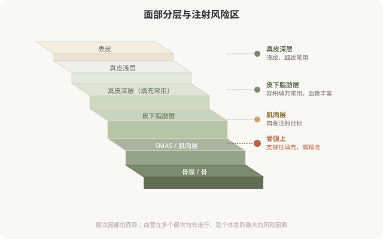

# 一张脸的解剖：注射安全的第一道防线

## 三个备选标题

1. 为什么面部注射差几毫米就出事：解剖层次先看懂
2. 血管、神经、脂肪垫：注射医生必须烂熟的那张“地图”
3. 别只想着“打哪里”，先理解面部是怎么分层结构的

## 封面介绍（100字以内）

面部注射的安全建立在解剖上：皮肤分层、血管走行、脂肪垫分布。理解这张“地图”，才能理解为什么注射对操作者要求极高，以及风险从何而来。

## 正文

先说结论：**面部注射的安全，根本上建立在解剖学上。**皮肤分多少层、每一层里有什么、血管和神经怎么走、脂肪垫如何分布——这些决定了哪一层可以注射、哪一层绝对不能碰、不同部位的风险等级为什么差很多。**理解面部解剖，不是要让你自己当医生，而是让你理解为什么注射对操作者要求极高，以及“血管栓塞”这种严重并发症从何而来。**

### 面部从外到内的层次

面部从皮肤表面向深部，大致可以分成以下几个层次。不同注射材料作用在不同深度：

### 血管：风险的核心

面部血管密集，而且有些血管与眼动脉、颅内血管有交通。**这就是血管栓塞这一最严重并发症的解剖基础**——如果填充材料被误注入血管，可能顺着血流到达眼部或脑部，造成皮肤坏死、失明甚至更严重后果。

几个关键认识：

- **血管走行有大致规律，但个体差异大**：鼻部、眉间、额头、泪沟、鼻唇沟是公认的高危区域，但每个人的血管位置都有差异。
- **层次决定是否安全**：有些层次相对少血管，有些层次血管密集。操作者的解剖功底，就是知道每个部位在哪个层次注射相对安全。
- **回抽不能完全排除栓塞**：注射前回抽看是否有血，是常规安全操作，但不是绝对保险——针头可能移动、血管可能被压扁。
- **少量、慢推、深部骨面支撑**是降低栓塞风险的重要原则，尤其在高危区域。

下图标注了面部公认的高危注射区域：

### 脂肪垫：为什么“补容积”是门学问

面部不是均匀的一团，而是由多个独立的脂肪垫（如颧脂肪垫、鼻唇沟脂肪垫、眶周脂肪等）分隔构成。随年龄增长，这些脂肪垫会萎缩、下移，造成面部凹陷和下垂感。

**“补容积”不是哪里凹就往哪里填**，而是要理解哪些脂肪垫萎缩了、填在哪个层次能起到支撑作用、填多少不会让脸变宽变假。这就是为什么同样的材料，有经验的医生填出来“自然”，没经验的填出来“假面”——差别在对解剖的理解。

### 神经：影响表情的另一个维度

面神经分支支配表情肌。虽然注射材料不像手术那样直接切断神经，但层次不当、剂量过大、位置不对，都可能影响表情——填充物压迫神经、肉毒扩散到非目标肌肉，都会造成表情不自然。**理解神经走行，是肉毒“打得自然不僵硬”的关键，也是填充避免影响表情的基础。**

### 这一切对你意味着什么

你不需要记住血管和神经的名字。但理解“面部是高度复杂的分层结构”，会带来几个实际的判断：

- **注射对操作者的解剖功底要求极高**——这决定了你为什么要选有资质的医生，而不是“便宜的老师”。
- **风险因部位差异巨大**——鼻部、眉间、额头是高危区，更需要谨慎和经验。
- **“自然”是建立在解剖理解上的**——乱填一气只会“假”，理解结构才能“自然”。
- **出现血管栓塞征象要立刻处理**——下一章会专门讲风险识别。

**解剖，是注射安全的底层逻辑。**把它当成“医生才需要懂的事”而忽略，等于放弃了作为知情消费者的判断力。

> 本文用于健康教育，不能替代面诊和个体化评估；面部注射须由熟悉解剖的具备资质医师在正规医疗机构开展。

## 参考资料

- American Society of Plastic Surgeons: Facial anatomy & injectable safety
  https://www.plasticsurgery.org/patient-safety
- 中华医学会整形外科学分会：面部解剖与注射安全相关共识（以现行版本为准）
  https://www.cma.org.cn/
