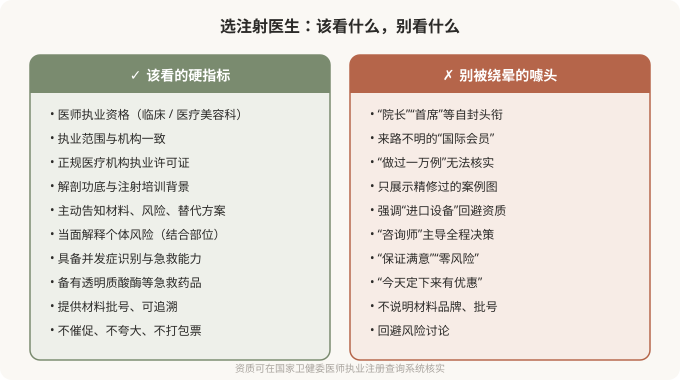

# 选注射医生，比选材料更重要

## 三个备选标题

1. 同一种玻尿酸，为什么有人打得自然有人打得假
2. 注射医生该怎么选：解剖功底大于案例数
3. 别被“咨询师”主导：你要见的是真正主刀的医生

## 封面介绍（100字以内）

注射的效果和风险主要取决于操作者，而非材料。选医生看资质、解剖功底和沟通态度，比纠结品牌更能决定结果。

## 正文

先说结论：**注射的效果和安全，主要取决于操作者，而不是材料。**同一种透明质酸、同一个品牌，在有经验的医生手里可以打得自然和谐，在不懂解剖的人手里可能造成栓塞、坏死或不自然。所以选注射医生，比纠结品牌、比价、看案例都更重要。把“用什么材料”放在“谁给我打”之前，是顺序颠倒。

### 为什么“谁打”比“打什么”重要

材料是工具，操作者决定工具如何使用。注射的核心技术含量在于：

- **解剖功底**：知道每个部位在哪个层次、哪个角度注射相对安全，知道血管走行如何规避。
- **剂量判断**：填多少合适、哪里需要支撑、哪里不该过度填充。
- **美学判断**：什么样的改善是自然的、符合个体特征的，而不是“哪里凹填哪里”。
- **并发症识别和处理**：一旦出现栓塞征象，能不能第一时间识别和处理，决定后果轻重。

**这些能力，是材料本身无法提供的。**最好的材料在不专业的人手里，照样能出事；普通材料在专业医生手里，也能打出不错的效果。

### 选医生该看的硬指标

下图列出了选择注射医生时，“该看”和“别被绕晕”的两个清单：

### 怎么核实资质

最直接的方式是查官方系统：

- **医师执业注册信息**：在国家卫生健康委的医师执业注册查询系统，输入医生姓名和所在机构，核对执业类别、执业范围是否与宣传一致。
- **机构执业许可证**：看现场公示的《医疗机构执业许可证》，核对诊疗科目是否包含医疗美容科或整形外科。
- **材料追溯**：正规注射材料有国家药监局注册证号，包装上有可追溯批号。注射前可要求查看外包装（当面拆封），并记录批号。

**这些核验几分钟就能完成，却能筛掉大量风险。**查不到、对不上、拒绝提供的，都是明确的危险信号。

### “咨询师”和医生的角色

很多机构的初诊由“咨询师”主导，医生只在注射时出现几分钟。对于注射这种需要个性化判断的操作，你应该和真正注射的医生有充分沟通：

- 你的诉求、病史、过敏、既往注射经历，应由医生本人了解。
- 风险、替代方案、预期效果，应由医生当面解释。
- 注射方案（材料、部位、剂量）应由医生制定，而不是由“咨询师”按套餐推荐。

**如果整个决策过程由非医疗人员主导，医生只是执行者，这家机构对你这台注射的严肃程度值得怀疑。**

### 几个值得问的问题

与其问“做过多少例”，不如问：

- 这个部位的主要血管风险在哪？您通常怎么规避？
- 如果出现栓塞征象，您和机构怎么处理？
- 机构备有透明质酸酶吗？（针对透明质酸注射）
- 我这个部位适合这个材料吗？有没有创伤更小的替代方案？
- 效果不满意或出现问题，复诊和修复路径是怎样的？

能正面、具体回答的医生，通常更值得托付。

### 一个常被忽略的维度：沟通态度

医生是否愿意花时间听你的诉求、是否如实告知风险、是否在不合适时劝你不要过度注射——这些比技术参数更能反映一个医生的可信度。**一个对所有诉求都点头、对所有风险都轻描淡写的医生，并不代表技术好，更可能意味着他对你这次注射的风险没有真正在意。**有时候，一个负责任的“不”，比一个轻率的“好”更有价值。

### 价格异常低，要警惕

正规注射材料本身有成本，正规医生有时间成本。**一个远低于市场合理水平的报价，必然在某个环节被压缩**——可能是假货/水货材料、可能是无资质操作者、可能是省略急救药品和流程。注射不是比价消费，把价格作为首要标准，等于把安全放在最后。

> 本文用于健康教育，不能替代面诊和个体化评估；注射属医疗美容操作，须在正规医疗机构由具备资质的医师开展。

## 参考资料

- 中华人民共和国国家卫生健康委员会：医师执业注册信息查询
  https://fuwu.nhc.gov.cn/
- American Society of Plastic Surgeons: Choosing a qualified provider
  https://www.plasticsurgery.org/patient-safety
