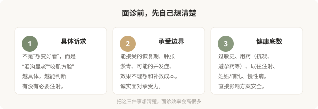

# 注射面诊清单：带着这 8 个问题去

## 三个备选标题

1. 注射面诊 15 分钟，这 8 个问题比报价更值得问
2. 别让面诊变成听套餐：注射前该谈清楚的事
3. 把面诊当问诊，而不是购物：注射决策清单

## 封面介绍（100字以内）

注射面诊的目的不是定套餐，而是评估适不适合打、打什么、风险能否承受。带着这份问题清单，让面诊成为真正的医学沟通。

## 正文

先说结论：**注射面诊最重要的功能，不是听报价和定套餐，而是判断你适不适合注射、适合什么、风险能否承受。**把面诊当成“术前问诊 + 风险沟通”，而不是“购物询价”，能筛掉大量后续麻烦。带着明确的问题去，比带着模糊的“想变好看”去，效率高得多。

### 面诊前，先理清三件事

### 面诊该问的 8 个问题

**1. 我这个问题，需要注射吗？有没有不注射的替代方案？**
很多问题并非只有注射一条路。护肤、光电、生活方式调整可能就够了。一个好的医生会先评估必要性，而不是上来就推荐注射。

**2. 如果注射，您建议哪一类材料、为什么？**
是填充、肌肉松弛还是再生刺激？为什么选这一类而不是另一类？理解材料类别的选择逻辑，比记住品牌有用。

**3. 这个材料在市场上的注册状态和常见风险是什么？**
正规医生会告诉你材料的注册证号、主要风险。回避风险讨论、只说“很安全”的，要警惕。

**4. 注射部位的主要血管风险在哪？您怎么规避？**
这个问题能直接区分专业和非专业医生。懂解剖的医生能讲出每个部位的危险区，不懂的只能含糊应对。

**5. 麻醉方式是什么？需要几次？维持多久？**
有些注射含麻药、有些需要表麻、有些痛感较强。次数和维持时间影响整体预算和时间投入。

**6. 术后短期会肿、淤青到什么程度？多久能见人？**
尤其近期有重要场合的人，要提前知道恢复期。

**7. 如果效果不满意或出现并发症，怎么处理？**
透明质酸可以酶解、肉毒会自行代谢、再生类难取——不同材料的“后悔路径”不同。医生应如实说明。

**8. 机构备有透明质酸酶等急救药品吗？出现栓塞征象怎么处理？**
这个问题针对填充类注射。**一个不备透明质酸酶的机构，对栓塞没有应急准备**——这是硬性门槛。

### 三个红旗信号

面诊中如果出现这些，要特别警惕：

- 医生回避风险讨论，只强调效果和“保证满意”。
- 你还没提具体诉求，就主动推荐“全套方案”并制造限时优惠。
- 对你的过敏史、用药、既往注射不询问、不记录，直接进入报价。

### 影像和评估不是“额外收费”

正规的注射评估会包括面部触诊、动态表情观察、必要时照片记录。对于复杂情况（如既往多次注射、不对称明显），医生可能会建议先做皮肤超声评估材料分布——这不是凑费用，而是制定方案的基础。**一家连基本评估都不做就安排注射的机构，对安全的态度值得怀疑。**

### 别在第一次面诊就交钱打针

合理的做法是面诊后带走书面方案、回家冷静思考、必要时再面诊第二位医生对比。**被“今天打有优惠”催促当场决定的，几乎都违背了注射应有的审慎。**虽然注射不像四级手术那样不可逆，但它仍是医疗操作，值得多花几天。

### 把面诊变成“双向选择”

好的面诊是双向的：医生也在评估你是不是合适的注射对象——你的预期是否合理、解剖是否适合、能不能配合术后管理。**如果一个医生对所有诉求都点头、对所有风险都轻描淡写，这并不代表他技术好，更可能意味着他对你这次注射的风险没有真正在意。**

> 本文用于健康教育，不能替代面诊和个体化评估；注射属医疗美容操作，须在正规医疗机构由具备资质的医师开展。

## 参考资料

- American Society of Plastic Surgeons: Injectable fillers—consultation
  https://www.plasticsurgery.org/cosmetic-procedures/injectable-fillers
- 中华医学会整形外科学分会：注射美容临床应用相关共识（以现行版本为准）
  https://www.cma.org.cn/
