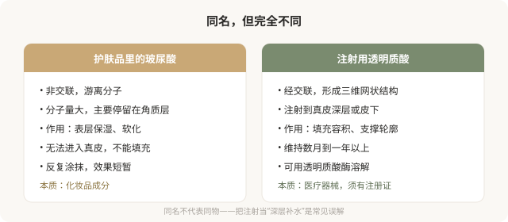
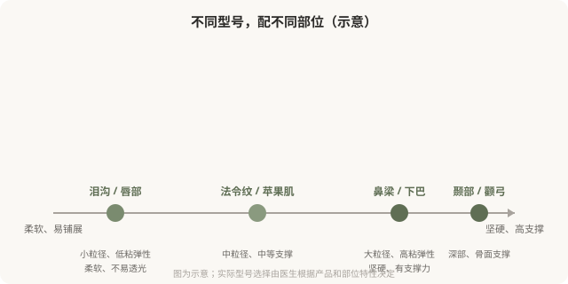

# 玻尿酸是什么：理解填充材料的底层逻辑

## 三个备选标题

1. 玻尿酸=补水？注射用的玻尿酸完全不是一回事
2. 交联、非交联、粒径：选玻尿酸前先懂的几个词
3. 为什么同是玻尿酸，有的硬有的软：材料学入门

## 封面介绍（100字以内）

注射用透明质酸和护肤品里的玻尿酸不是一回事。理解交联、粘弹性、粒径这些底层概念，才能理解为什么不同部位要用不同型号。

## 正文

先说结论：**注射用的透明质酸（俗称玻尿酸）和护肤品里的玻尿酸不是一回事。**护肤品里的玻尿酸主要起表层保湿作用，而注射用透明质酸经过化学交联处理，形成稳定的三维网状结构，能够停留在真皮或皮下起填充和支撑作用。理解“交联”“粘弹性”“粒径”这些底层概念，才能理解为什么不同部位需要不同型号的透明质酸，以及为什么“玻尿酸就是玻尿酸”是一种误解。

### 护肤品玻尿酸 vs 注射玻尿酸

### 交联：让玻尿酸“留得住”

天然的透明质酸在体内半衰期很短，几天就会被代谢掉。要让注射的透明质酸在皮肤里停留数月到一年以上，需要把它“交联”——通过交联剂把游离的透明质酸分子连接成稳定的三维网状结构。**交联度越高，材料越硬、维持越久、也越难溶解。**

不同产品采用不同的交联技术，这直接决定了材料的硬度、弹性、内聚性和维持时间。这就是为什么同样是透明质酸，有的产品适合填鼻梁（需要硬、有支撑力），有的适合填泪沟（需要柔软、不易透光）。

### 粘弹性和粒径：决定“打哪里”

理解几个核心维度：

- **粒径（颗粒大小）**：小粒径产品柔软、易铺展，适合浅层细纹和柔软部位（泪沟、唇）；大粒径产品有支撑力，适合需要塑形的部位（鼻梁、下巴）。
- **粘弹性（G'值）**：反映材料的硬度和回弹性。高粘弹性产品塑形力强、抗变形，适合鼻梁、下颌线；低粘弹性产品柔软自然，适合泪沟、唇。
- **内聚性**：材料内部相互粘结的特性，影响是否容易扩散、移位。

**“一种玻尿酸打全身”是不专业的表现。**好的医生会根据部位特性选择不同型号，甚至在一次治疗中组合使用多种产品。

### 含麻药的产品

部分透明质酸产品预混了利多卡因（局麻药），目的是减轻注射痛感。这是产品工艺的一种改进，不影响材料本身的填充特性。是否选择含麻药产品，可以根据痛感耐受、部位和医生建议决定——它不是“高端”的标志，只是舒适度的考量。

### 一个关键认知：透明质酸是可溶的

这是透明质酸相对于再生类材料和不明注射物最大的优势——**它可以用透明质酸酶溶解。**如果出现过度填充、移位、结节或疑似栓塞，透明质酸酶是重要的处理手段（虽然它不能解决所有问题，且本身有过敏风险）。

**但“可溶”不等于“零风险”**——栓塞一旦发生，溶解有严格时机要求；结节的形成和溶解也依赖医生经验。“反正能溶”不是降低审慎的理由。

### 别被术语绕晕

作为消费者，你不需要记住所有术语，但理解以下逻辑就能避免很多误区：

- 注射用透明质酸是交联的医疗器械，不是“深层补水”。
- 不同型号有不同的物理特性，对应不同部位。
- “硬”和“软”、“维持久”和“易溶”之间存在权衡，没有“全能产品”。
- 可溶性是透明质酸的核心优势，但不等于零风险。

**真正懂材料的医生，会根据你的部位和诉求选择合适的型号，而不是用一种产品打全身、用“最新款”“进口”等话术替代专业解释。**

> 本文用于健康教育，不能替代面诊和个体化评估；注射用透明质酸属医疗器械，须使用有国家药监局注册证的产品，在正规医疗机构由具备资质的医师注射。

## 参考资料

- U.S. FDA: Dermal fillers—soft tissue fillers
  https://www.fda.gov/medical-devices/aesthetic-cosmetic-devices/dermal-fillers-soft-tissue-fillers
- 国家药品监督管理局：医疗器械注册信息查询
  https://www.nmpa.gov.cn/
