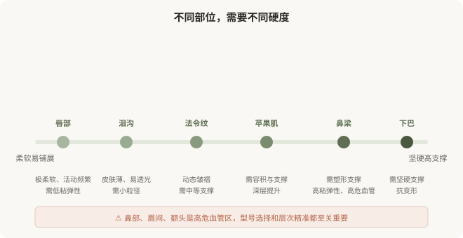

# 透明质酸怎么选：型号、部位和“自然”的关系

## 三个备选标题

1. 同一种玻尿酸打全身是危险的：型号和部位怎么匹配
2. 填泪沟和垫鼻梁能用一样吗：透明质酸选择逻辑
3. 想要“自然”，从选对型号开始

## 封面介绍（100字以内）

透明质酸的选择不只是品牌，更是型号与部位的匹配。柔软部位用软型、塑形部位用硬型，“自然”建立在医生对材料特性的理解之上。

## 正文

先说结论：**透明质酸的选择，核心不是品牌，而是型号与部位的匹配。**柔软的部位（泪沟、唇）需要柔软易铺展的材料，塑形的部位（鼻梁、下巴）需要坚硬有支撑力的材料，深部支撑（颞部、颧弓）需要能在骨面稳定的产品。**“一种产品打全身”既不专业也容易出问题——该软的地方打硬了会显假、透光，该支撑的地方打软了会塌、移位。**“自然”不是剂量少就行，而是材料选对、层次打对。

### 部位特性决定型号选择

下图把常见注射部位按“需要的材料硬度”排列：

### 选错型号会怎样

**太软的材料打到需要支撑的部位**：鼻梁用软型，可能撑不起来、变宽、移位，形成“宽鼻梁”；下巴用软型，可能随时间变形。

**太硬的材料打到柔软部位**：泪沟用硬型，可能透光、出现丁达尔效应（蓝色反光）、触感硬、不自然；唇部用硬型，可能僵硬、活动受限。

**层次不对**：太浅会透光、不平；太深可能无效或增加血管风险。

**这些“不自然”的根源，常常不是剂量，而是型号和层次选择错误。**这就是为什么“自然”不是简单的“少打一点”——它是材料学、解剖学和美学综合判断的结果。

### “自然”的三个维度

### 一次治疗中可能用多种型号

一次全面部年轻化，医生可能在不同部位使用 2–3 种不同型号：硬型做支撑（如颧弓、下巴）、中型做容积（如苹果肌、法令纹）、软型做细节（如泪沟、唇、浅纹）。**这种“组合用药”恰恰是专业判断的体现**，而不是“想多卖几支”。反过来，如果一家机构对所有部位都用同一种产品，要追问其专业性。

### 维持时间也是权衡维度

- **硬型、交联度高**：通常维持更久，但触感偏硬、不易铺展。
- **软型、交联度低**：触感自然，但维持时间相对短。

没有“又软又持久又便宜”的完美产品。理解权衡，才能避免被“维持两年”“永久填充”等话术误导。

### 别被“新品”“进口”带偏

市场上不断有新产品出现，宣传话术也不断更新。**但对你而言，更重要的不是“最新”，而是“合适”。**一个上市多年、特性明确、医生用熟了的产品，往往比“刚上市的最新款”更适合你。新产品不等于更好——它的长期表现需要时间验证。让医生根据你的情况建议，而不是被“新品”的话术推动。

### 一个判断框架

面对透明质酸选择，可以问医生：

- 我这个部位，您建议用哪种型号、为什么？
- 这种型号的硬度、维持时间和常见风险？
- 如果效果不理想，能溶吗？溶的过程要注意什么？

**能讲清材料特性和部位匹配的医生，比只报品牌和价格的医生，更值得托付。**

> 本文用于健康教育，不能替代面诊和个体化评估；注射用透明质酸属医疗器械，须使用有国家药监局注册证的产品，在正规医疗机构由具备资质的医师注射。

## 参考资料

- American Society of Plastic Surgeons: Dermal fillers
  https://www.plasticsurgery.org/cosmetic-procedures/dermal-fillers
- U.S. FDA: Dermal fillers—soft tissue fillers
  https://www.fda.gov/medical-devices/aesthetic-cosmetic-devices/dermal-fillers-soft-tissue-fillers
