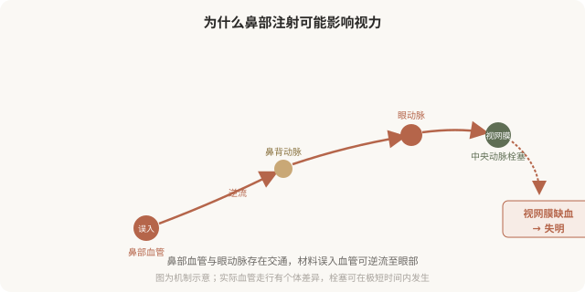
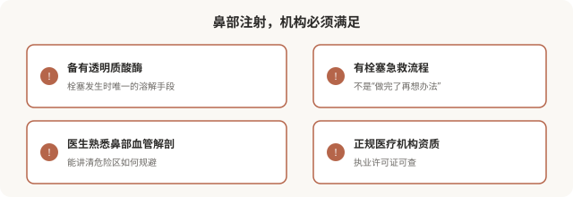

# 鼻部注射的血管风险：为什么“一针隆鼻”是最危险的注射之一

## 三个备选标题

1. 鼻子打玻尿酸可能失明：这不是吓唬你
2. “一针隆鼻”被低估的风险：鼻部血管解剖
3. 鼻部注射可以做，但要明白它在风险榜上的位置

## 封面介绍（100字以内）

鼻部是面部血管最危险的注射区域之一，材料误入血管可致皮肤坏死甚至失明。鼻部注射能做，但必须由熟悉解剖的医生在高安全标准下进行。

## 正文

先说结论：**鼻部是面部注射风险最高的区域之一，材料误入血管可能造成皮肤坏死、失明甚至更严重后果。**这不是危言耸听——鼻部的血管与眼动脉有交通，填充物一旦进入血管并逆流，可能堵塞视网膜动脉导致失明，而这种失明多数不可逆。鼻部注射能做，但必须由熟悉解剖的医生，在高安全标准、具备急救能力的机构进行。把它当“轻医美”“午休项目”对待，是对风险的严重误判。

### 鼻部血管为什么这么危险

面部的血管系统有一个特殊之处：鼻部、眉间、额头的静脉和动脉与眼动脉系统存在交通。当填充材料在压力下被推入这些血管，栓子可能顺着血流逆行进入眼动脉，进而堵塞视网膜中央动脉。**视网膜对缺血极度敏感，超过约 90 分钟未恢复供血，损伤往往不可逆。**这就是鼻部注射失明的解剖学基础。

除了失明，鼻部注射的其他严重风险还包括：

- **鼻部皮肤坏死**：栓塞鼻部局部血管，皮肤变白、变紫、溃烂，可能留下永久疤痕。
- **中枢神经系统栓塞**：极罕见但可能致命。

### 降低风险的关键措施

风险无法降到零，但专业操作可以显著降低：

- **熟悉解剖**：医生必须清楚鼻部危险血管的位置和走行。
- **深层、骨面注射**：在相对安全的层次操作。
- **少量、慢推**：避免高压推注把材料挤入血管。
- **注射前回抽**：虽不能完全排除栓塞，但是常规安全操作。
- **使用钝针**：在某些情况下可降低刺破血管的概率（但不是绝对保险）。
- **备有透明质酸酶**：一旦出现栓塞征象，能立即处理。
- **患者知情**：你必须知道这是高危操作，并理解风险。

### 鼻部注射该不该做

这个问题的答案因人而异：

- **可以做的情形**：鼻基础尚可、诉求是轻度塑形（如鼻根轻度低平）、由有经验的医生在正规机构操作、并充分知情。
- **要谨慎或避免的情形**：鼻基础需要结构性改变（明显塌陷、短鼻）、既往鼻部手术或注射史（血管走行可能改变）、对风险完全不能接受、在不具备急救条件的机构。

**对于需要结构性改变的鼻部问题，手术（自体软骨等）往往比反复注射更安全、更合理。**把鼻部注射当作手术的“轻量替代”，在效果和风险上都可能不划算。

### 出现这些征象要立即处理

鼻部注射后如果出现以下情况，必须立即联系医生或急诊，**按分钟计算**：

- 鼻部或周围皮肤迅速发白、发紫、出现网状花斑。
- 剧烈疼痛，与正常注射后反应不符。
- 视力模糊、视野缺损、失明、眼痛、头痛。
- 皮肤颜色迅速改变、冰凉。

**这些是血管栓塞的征象，必须立即处理。**透明质酸注射的栓塞，及时使用透明质酸酶可能挽救，但时机非常关键。等待、观察、自行按摩都是危险的应对。

### 选择鼻部注射机构的硬门槛

**任何一项缺失，都不应该接受鼻部注射。**“工作室”“上门注射”“熟人介绍打一针”——这些场所既无资质也无急救能力，对鼻部这种高危区域是绝对禁忌。

### 一个被低估的真相

鼻部注射的严重并发症发生率不高，但它的特点是一旦发生就快、就重、可能不可逆。**这意味着“概率低”对那个出事的人没有意义。**所以鼻部注射的决策标准，应该比“打法令纹”严格得多——不是不能做，而是只有在医生、机构、材料、知情都到位时才做。

> 本文用于健康教育，不能替代面诊和个体化评估；鼻部注射属高风险操作，须由熟悉解剖的具备资质医师在备有急救能力的正规医疗机构开展。

## 参考资料

- American Society of Plastic Surgeons: Injectable safety & vascular occlusion
  https://www.plasticsurgery.org/patient-safety
- 中华医学会整形外科学分会：注射并发症防治相关共识（以现行版本为准）
  https://www.cma.org.cn/
