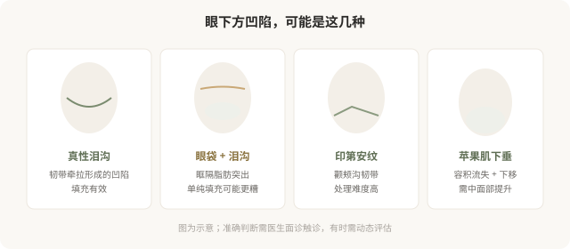

# 泪沟和苹果肌：眼周注射的精细学问

## 三个备选标题

1. 泪沟显老是真，但“填一填”没那么简单
2. 泪沟、苹果肌、印第安纹：眼周注射要分清
3. 眼周是面部最娇贵的注射区，别打假了

## 封面介绍（100字以内）

泪沟和苹果肌注射能改善疲态，但眼周皮肤薄、血管密集，是精细操作区域。分清是真泪沟还是其他问题，比直接填更重要。

## 正文

先说结论：**泪沟和苹果肌注射能改善眼周的疲惫感，但眼周是面部最精细、最不宽容的注射区域。**皮肤薄、血管密集、稍有差池就会出现透光、结节、不平整甚至血管问题。而且“眼下方凹陷”未必都是泪沟——可能是苹果肌下垂、印第安纹、眶隔脂肪突出等不同原因，处理方式完全不同。**分清是真泪沟还是其他问题，比直接填更重要。**

### “眼下方凹陷”先分清是什么

### 真性泪沟

真性泪沟是眼眶下缘内侧的凹陷，与眼眶内侧的泪沟韧带牵拉有关。它的特点是沿眼眶下缘走行的条状凹陷，在光线侧面照射时更明显。**透明质酸填充对真性泪沟效果较好**——但要点是：用柔软的小粒径产品、注射在恰当层次（通常是骨膜上深层为主）、剂量克制。

泪沟注射的常见问题：

- **透光（丁达尔效应）**：材料太浅或皮肤太薄，出现蓝色反光。
- **不平整、结节**：层次和剂量问题。
- **水肿**：泪沟区域容易因材料吸水出现反复肿胀，尤其低粘弹性产品。
- **血管风险**：眼周血管丰富，栓塞性并发症虽罕见但严重（与鼻部同属眼周高危区）。

### 眼袋 + 泪沟

如果“眼下方鼓”主要是眼袋（眶隔脂肪突出）造成的，**单纯填泪沟可能让鼓更明显**——填充物叠加在脂肪突出下方，反而加重臃肿感。这种情况需要先判断眼袋的处理方式（手术去除或针对性方案），而不是想当然地填泪沟。

### 印第安纹

印第安纹是颧颊部位的斜行沟壑，与颧弓皮肤支持韧带有关。它比泪沟难处理，单纯填充效果有限、风险较高，需要医生有经验判断是否适合填充、用何种方式。

### 苹果肌与中面部

很多人把“面中部扁平、法令纹深”归因于局部问题，实际上常是**苹果肌（颧脂肪垫）容积流失和下移**的结果。处理思路是在中面部深层做支撑性填充，把下垂的脂肪垫“托起来”，法令纹和疲态才能改善——而不是只在法令纹表面填一道。

**这就是“哪里凹填哪里”和“理解结构再处理”的区别**——前者容易打出假面、移动、不协调，后者更接近真正的年轻化。

### 眼周注射的几个原则

- **剂量克制**：眼周皮肤薄，过度填充会立刻显假。宁可分次补，不要一次到位。
- **柔软材料**：用低粘弹性、小粒径产品，避免透光和触感硬。
- **深层为主**：骨膜上深层支撑相对安全，浅层细节修饰要非常少量。
- **熟悉眼周血管**：眼周血管丰富且与眼动脉系统交通，是高危区域之一。
- **备有透明质酸酶**：填充类眼周注射，机构必须备有酶解能力。

### 眼周注射的“自然”门槛

眼周是面部最不宽容的区域——稍有过度就会显假、显肿。**所以眼周注射对医生的美学判断和材料控制要求极高。**一个合格的医生会在眼周格外克制，甚至主动劝你“先打一半，两周后看效果再补”，而不是一次填足。这种克制不是技术不行，恰恰是懂得这个区域的难度。

### 决策前的硬要求

面诊泪沟或苹果肌注射，至少做到：选择有眼周注射经验的医生；当面分清是真泪沟、眼袋、印第安纹还是苹果肌问题；讨论材料选择、层次、剂量；理解透光、结节、水肿等风险；确认机构备有透明质酸酶。**“眼袋填泪沟”式的错误判断，会让结果适得其反——分清问题是第一步。**

> 本文用于健康教育，不能替代面诊和个体化评估；眼周注射属精细且风险较高的操作，须由熟悉解剖的具备资质医师在正规医疗机构开展。

## 参考资料

- American Society of Plastic Surgeons: Under-eye & midface fillers
  https://www.plasticsurgery.org/cosmetic-procedures/dermal-fillers
- 中华医学会整形外科学分会：眼周注射相关共识（以现行版本为准）
  https://www.cma.org.cn/
