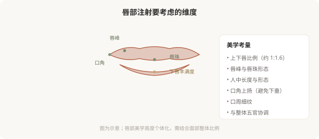

# 唇部塑形：性感不是唯一的诉求，自然才是

## 三个备选标题

1. 丰唇不是越大越好：唇部注射的美学与风险
2. 唇形、唇珠、人中：唇部注射要改的是什么
3. “嘟嘟唇”为什么显假：唇部注射的常见误区

## 封面介绍（100字以内）

唇部注射可以改善唇形、比例和衰老迹象，但唇部活动频繁、血管丰富，过度填充会僵硬不自然。清晰的目标和克制的剂量比“饱满”更重要。

## 正文

先说结论：**唇部注射不只是“变大变饱满”，而是对唇形、比例、唇珠、人中、口周衰老迹象的综合调整。**唇部是面部活动最频繁的区域之一，血管丰富，过度填充会立即出现僵硬、移位、不自然。所以唇部注射的核心不是“打多少”，而是“打哪里、为什么打”——清晰的目标和克制的剂量，比一味追求饱满更重要。

### 先想清楚为什么丰唇

唇部注射的合理诉求包括：

- **唇形重塑**：唇峰、唇珠形态不佳，希望改善轮廓。
- **比例调整**：上下唇比例、唇的纵向比例不协调。
- **衰老改善**：随年龄唇部变薄、口周出现细纹、唇红缘模糊。
- **轻度不对称**：先天或外伤后的不对称。

不合理诉求是：盲目追求夸张饱满（“网红唇”）、把丰唇当作提升自信的根本手段、对效果抱有不切实际的期待。**唇部是表情器官，过度填充会直接损害它的功能——笑容、说话、进食都会受影响。**

### 唇部注射的美学维度

### 过度填充为什么“显假”

“嘟嘟唇”“香肠嘴”的根源通常是：

- **剂量过大**：超出唇部组织容量，材料堆积、外凸。
- **型号不对**：硬型材料打唇，触感僵硬、活动受限。
- **层次不当**：太浅容易不平、显颗粒；太深可能无效或移位。
- **忽略比例**：只追求“大”，破坏上下唇比例和与五官的协调。
- **反复叠加**：上次还没消退就补打，材料层次和量都失控。

**唇部“自然”的门槛比其他部位更高**——因为它在动态中、在视线焦点上，稍有过度就会被察觉。

### 唇部注射的风险

- **肿胀与淤青**：唇部血管丰富，注射后肿胀明显，通常数天消退。
- **唇疱疹复发**：有单纯疱疹病史者，注射可能诱发复发，需预防性用药。
- **结节与不平整**：层次和剂量问题。
- **血管栓塞**：唇部和口周血管丰富，栓塞虽罕见但严重（口周是相对高危区）。
- **过敏反应**。
- **感染**。
- **不对称、过度填充**：可能需要溶解修整。
- **反复肿胀**：材料吸水特性导致的间歇性肿胀。

### 唇部注射的几个原则

- **剂量克制**：唇部对过度填充零容忍。一次少量、必要时两周后补。
- **柔软材料**：用专门的唇部产品（柔软、低粘弹性、可铺展）。
- **保护功能**：唇是表情和功能器官，不能为形态牺牲活动。
- **预防疱疹**：有病史者提前用抗病毒药。
- **熟悉唇部血管**：上下唇动脉走行需了解。

### “唇珠”和“人中”的处理

唇珠（上唇中央的突起）和中面部协调有关，过度强调唇珠会显得不自然。人中（鼻底到上唇的沟槽）随年龄变平，但人中缩短手术和注射的适应证不同——**把“人中长”误当成唇的问题处理，方向就错了**。这些都需要医生判断，而不是照着网红模板打。

### 决策前的硬要求

面诊唇部注射，至少做到：选择有唇部注射经验的医生；当面讨论你想改善的具体维度（唇形／比例／衰老）；理解剂量克制和材料选择；讨论口周整体协调（口角、人中、细纹）；告知疱疹病史和过敏史；理解肿胀期和修整可能。**“越大越好看”是唇部注射最常见的误区——真正的美唇是协调、自然、有活力的。**

> 本文用于健康教育，不能替代面诊和个体化评估；唇部注射须在正规医疗机构由具备资质的医师开展。

## 参考资料

- American Society of Plastic Surgeons: Lip augmentation
  https://www.plasticsurgery.org/cosmetic-procedures/lip-augmentation
- 中华医学会整形外科学分会：唇部注射相关共识（以现行版本为准）
  https://www.cma.org.cn/
