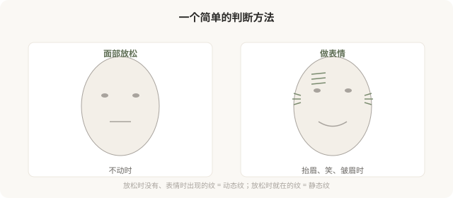
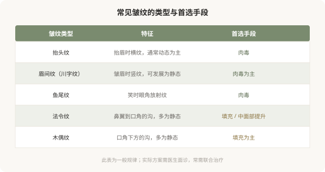

# 动态纹和静态纹：肉毒和填充各管哪一段

## 三个备选标题

1. 抬头纹、鱼尾纹、法令纹：不是一种纹，处理方式完全不同
2. 动的纹用肉毒，静的纹用填充：先分清再说治
3. 你的皱纹该打什么：动态纹和静态纹的分界线

## 封面介绍（100字以内）

皱纹分为动态纹（表情时出现）和静态纹（不动时就在）。肉毒管动态纹，填充管静态纹和容积，分清类型是选择治疗的前提。

## 正文

先说结论：**皱纹不是一种东西，处理方式也完全不同。**动态纹是表情肌收缩时出现的纹路，肉毒杆菌素是主要手段；静态纹是不做表情时就在的纹路，往往伴随容积流失和皮肤老化，填充、光电或联合方案更合适。**很多人“打肉毒除皱没效果”，根源是纹路类型判断错了——把静态纹当成动态纹处理。**分清你的纹属于哪一种，是选择治疗的第一步。

### 先做“表情测试”

判断动态纹和静态纹，最简单的方法是照镜子做表情测试：

- **放松时没有、做表情时出现**：动态纹，肉毒主要解决。
- **放松时就在**：静态纹，往往需要填充或其他手段。
- **两者都有**：动态纹长期不处理，可能逐渐“刻”成静态纹——这是为什么医生有时建议早期处理动态纹。

### 常见纹路分类

### 为什么法令纹不该打肉毒

法令纹（鼻唇沟）多数情况下是静态纹，成因包括中面部脂肪垫下移、容积流失、皮肤松弛。**这些都不是肌肉问题，所以肉毒（放松肌肉）对法令纹多数无效。**处理法令纹的核心是中面部支撑和局部填充，而不是放松某块肌肉。

把肉毒用于法令纹，要么无效，要么可能因为放松了不该放松的肌肉，影响表情。**这就是为什么“分清纹路类型”比“听说哪个部位能打”更重要。**

### 动态纹长期不处理的后果

动态纹如果不处理，随年龄和反复折叠，可能逐渐“刻”进皮肤，变成静态纹——那时再单纯打肉毒效果就有限了。**这是为什么有些医生会建议对动态纹早期干预**——不是为了“过度治疗”，而是预防动态纹固化成静态纹。

但这不等于所有人都该尽早打肉毒。是否需要，取决于纹路深度、年龄、表情习惯和个人意愿。

### 联合治疗的逻辑

很多面部老化是多种问题叠加：动态纹 + 静态纹 + 容积流失 + 皮肤松弛。单一手段往往不够，需要联合：

- 肉毒处理动态纹。
- 填充处理静态纹和容积流失。
- 光电处理肤质和松弛。
- 有时联合手术（如严重松弛）。

**联合不是“什么都打”，而是针对不同问题用不同手段。**一个能讲清“你这个纹是哪种、为什么用这个手段”的医生，比一个“全部给你打一遍”的医生更值得信任。

### 决策前的判断

面诊除皱，先和医生一起判断：

- 我的纹是动态还是静态？
- 有没有伴随容积流失或松弛？
- 这个部位该用什么手段？
- 有没有更小代价的替代方案？

**理解纹路类型，是避免“打错针”的第一步。**

> 本文用于健康教育，不能替代面诊和个体化评估；肉毒与填充注射须在正规医疗机构由具备资质的医师开展。

## 参考资料

- American Academy of Dermatology: Wrinkle treatments
  https://www.aad.org/public/everyday-care/aging-skin/wrinkles
- American Society of Plastic Surgeons: Facial rejuvenation
  https://www.plasticsurgery.org/cosmetic-procedures
