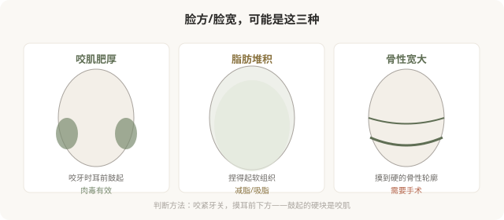

# 咬肌肥厚和“瘦脸针”：先分清是不是肌肉问题

## 三个备选标题

1. “瘦脸针”不是万能瘦脸：先分清咬肌还是脂肪还是骨
2. 咬紧牙关鼓起来的是它：咬肌肥厚的肉毒处理
3. 方脸想变小，先看是肌肉、脂肪还是骨骼

## 封面介绍（100字以内）

下面部宽大有咬肌、脂肪、骨骼三种来源。肉毒只对咬肌肥厚有效，对脂肪和骨性无效。分清来源，才能选对方法。

## 正文

先说结论：**“瘦脸针”（肉毒杆菌素注射咬肌）只对咬肌肥厚有效，对脂肪堆积和骨性宽大完全无效。**下面部宽大有三种常见来源——咬肌、皮下脂肪、下颌骨，处理方式完全不同。不分清来源就打“瘦脸针”，要么无效，要么出现咬合力下降、笑容不自然等副作用。**“瘦脸针”这个名字本身就容易误导——它不是“让脸瘦”的针，而是“放松咬肌”的针。**

### 先分清你的脸宽是哪种

### 一个简单的自测

**咬紧牙关，用手指摸耳前下方（下颌角区域）**：

- 摸到明显鼓起、变硬的肌肉块 → 咬肌肥厚，肉毒可能有效。
- 摸到的是柔软、可捏起的脂肪 → 脂肪问题，肉毒无效。
- 摸到的是硬的骨骼轮廓 → 骨性问题，肉毒无效。

很多人是混合型。**只有在咬肌肥厚是下面部宽大主要因素时，肉毒才有意义。**判断需要医生面诊触诊，不是看自拍。

### 肉毒瘦咬肌怎么起作用

肉毒注射到咬肌后，阻断神经肌肉传导，咬肌放松、活动减少、体积逐渐缩小。**效果不是即刻的**——通常注射后 2–4 周开始显现，1–3 个月达高峰，维持约 3–6 个月，之后肌肉功能逐渐恢复。

这意味着：

- 它不是“立刻小脸”。
- 需要反复注射维持（通常每年 2–3 次）。
- 效果因人而异，取决于咬肌肥厚程度和个体反应。

### 副作用：被低估的部分

肉毒瘦咬肌不是“零代价”。咬肌的功能是咀嚼，放松它会有功能影响：

- **咬合力下降**：吃硬物（坚果、牛肉）费力，这是预期的、几乎必然的影响。
- **颧骨下方凹陷**：咬肌萎缩后，部分人出现面颊凹陷，显老、显憔悴——尤其是本就瘦的人。
- **笑容不自然**：肉毒扩散到笑肌，可能影响笑容。
- **局部酸痛或无力**。
- **不对称**：左右萎缩速度和程度差异。

**颧骨下方凹陷是肉毒瘦咬肌最需要警惕的副作用之一。**它可能让你“脸小了但显老了”，这恰恰与年轻化的初衷相反。这就是为什么瘦咬肌要克制剂量、有时需要联合填充处理凹陷——而不是“打越多越瘦越好看”。

### 哪些人不适合瘦咬肌

- 主要问题是脂肪或骨骼，而非咬肌。
- 本身面颊凹陷、瘦削——容易出现凹陷副作用。
- 咀嚼功能要求高（如特定饮食习惯）。
- 对“咬合力下降”完全不能接受。
- 期望“一次永久”或“立刻见效”。

### “瘦脸针”这个名字的误导

“瘦脸针”是营销话术，暗示它能让任何脸变瘦。实际上它只针对咬肌肥厚这一种情况。**把“瘦脸针”当成瘦脸的通用手段，会让人在不适合的情况下反复注射，承担副作用却没有效果。**理解它“放松咬肌”的本质，比记住“瘦脸针”这个名字更重要。

### 决策前的硬要求

面诊瘦咬肌，至少做到：选择有经验的医生；当面触诊确认咬肌是否是主要问题；讨论剂量、预期效果和副作用（尤其颧骨下方凹陷）；理解需要反复维持；如有面部协调问题（凹陷、不对称）的预案。**承诺“打一针就变小脸、无副作用”的机构，对它的代价不够诚实。**

> 本文用于健康教育，不能替代面诊和个体化评估；咬肌注射须在正规医疗机构由具备资质的医师开展。

## 参考资料

- American Society of Plastic Surgeons: Botulinum toxin for masseter
  https://www.plasticsurgery.org/cosmetic-procedures/botulinum-toxin
- 中华医学会整形外科学分会：咬肌注射相关共识（以现行版本为准）
  https://www.cma.org.cn/
