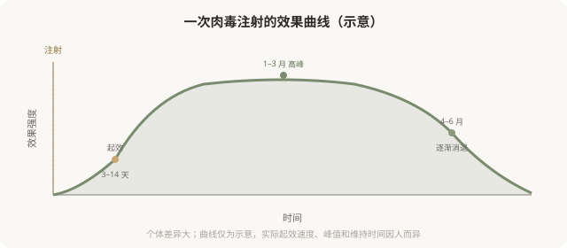

# 肉毒的起效与维持：为什么它需要反复打

## 三个备选标题

1. 肉毒不是“打一次管一年”：理解它的起效和消退曲线
2. 为什么肉毒 3–6 个月就没效了：神经肌肉接头的重建
3. 肉毒要不要“按时补打”：维持策略和耐药风险

## 封面介绍（100字以内）

肉毒效果渐进起效、数月后自行消退，是因为身体会重建神经肌肉接头。这决定了它需要反复维持，也带来了耐药等考量。

## 正文

先说结论：**肉毒杆菌素的效果不是永久的——它渐进起效（3–14 天）、维持有限（3–6 个月）、之后自行消退，是因为身体会逐渐重建神经肌肉接头，恢复肌肉功能。**这决定了肉毒是一种“需要反复维持”的治疗，也带来了一些长期使用的考量（如耐药风险）。理解这条起效与消退曲线，能帮你建立合理的预期和维持策略，避免“打完没几天怎么就没了”的困惑，也避免不必要的高频补打。

### 肉毒的效果时间线

### 为什么是这条曲线

肉毒阻断的是神经肌肉接头处乙酰胆碱的释放。注射后，神经末梢需要时间摄取肉毒并发挥作用，所以**起效不是即刻的**——通常 3–7 天开始感觉到，1–2 周效果明显。

但神经肌肉接头会重建——神经末梢会发出新的侧支，形成新的接头，逐渐绕过被阻断的部分恢复传导。**这就是为什么肉毒效果会在 3–6 个月后逐渐消退。**这是身体的自然修复机制，不是“药效变差”，也不是“产生依赖”。

### 维持策略

因为效果会消退，要维持就需要反复注射：

- **常规频率**：通常每年 2–4 次，间隔约 3–4 个月，具体因部位和个人反应而异。
- **不要过度频繁**：在效果未完全消退前就补打，可能增加耐药风险。
- **个体化**：有些人维持长，有些人短，需要根据自己效果记录调整。

### 耐药风险

极少数反复注射肉毒的人，会产生中和抗体，导致后续注射效果减退或失效。**这是为什么不要过度频繁、过量注射的重要原因之一。**降低耐药风险的原则：

- 不要在效果还很明显时就补打。
- 使用最低有效剂量。
- 选择正规产品（不同产品工艺有差异）。
- 如果发现效果明显减弱，告知医生，可能需要评估耐药或调整方案。

### “打一次管一年”是误解

任何承诺“肉毒维持一年”“一次永久”的，都不符合肉毒的作用机制。它的特性决定了维持有限、需要反复。**把“需要反复”理解成“被套牢”是不准确的——它只是说明这种治疗需要持续投入才能维持效果，就像护肤或健身需要坚持一样。**接受这个特性，再决定是否选择，比幻想“一劳永逸”更现实。

### 为什么有些人“没效果”

- **剂量不足**：个体差异大，标准剂量对某些人不够。
- **注射部位不准**：没打到目标肌肉。
- **耐药**：既往反复注射产生了抗体。
- **产品问题**：非正规产品、储存不当。
- **判断错误**：把不适合肉毒的问题（静态纹、容积）当成肉毒适应证。

**“没效果”不是肉毒本身无效，多数是剂量、部位或适应证问题。**规范的医生会根据首次效果调整后续方案。

### 一个实用建议：记录效果

从第一次注射开始，记录：注射日期、部位、剂量、几天起效、效果如何、何时开始消退。这份记录能帮助医生优化后续方案，也能帮你判断自己的维持节奏。**肉毒治疗是“试错—调整—稳定”的过程，不是打一次就定型。**

### 决策前的认知

理解肉毒是渐进起效、维持有限、需要反复的治疗：

- 不要期望即刻效果或永久效果。
- 接受需要反复维持的现实，把它纳入长期投入的考量。
- 不要过度频繁补打（耐药风险）。
- 与医生一起根据效果调整方案。

**合理的预期，比追求“最强效果”更能让肉毒发挥它的价值。**

> 本文用于健康教育，不能替代面诊和个体化评估；肉毒注射须使用正规产品，在正规医疗机构由具备资质的医师开展。

## 参考资料

- American Society of Plastic Surgeons: Botulinum toxin recovery & maintenance
  https://www.plasticsurgery.org/cosmetic-procedures/botulinum-toxin
- U.S. FDA: Botulinum toxin product labeling
  https://www.fda.gov/drugs/postmarket-drug-safety-information-patients-and-providers/botulinum-toxin-products
