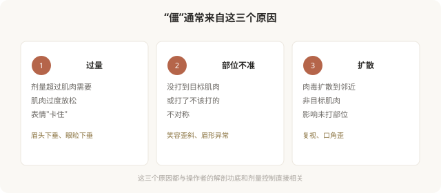

# 打完肉毒“僵”了：如何避免表情不自然

## 三个备选标题

1. “面具脸”是怎么打出来的：肉毒僵硬的原因
2. 自然不是“少打点”那么简单：剂量、部位和扩散
3. 肉毒打得自然的三个关键

## 封面介绍（100字以内）

肉毒后表情僵硬、不自然，常源于过量、部位不准或扩散到非目标肌肉。“自然”建立在精准的剂量、部位和个体化判断上，不是简单地“少打”。

## 正文

先说结论：**肉毒后出现“面具脸”、笑容僵硬、不对称等不自然，常见根源是过量、注射部位不准或扩散到了非目标肌肉。**“自然”不是简单地“少打一点”就能实现——它建立在精准的剂量控制、准确的解剖定位和个体化的美学判断上。一个打肉毒“自然”的医生，靠的是对每块表情肌的理解，而不是“打折剂量”。

### 为什么会“僵”

### 常见的“不自然”表现

- **额头僵硬、抬不起眉**：额肌被过度放松，无法抬眉，表情呆板。
- **眉头下垂、眼睑下垂**：额部或眼周注射过量或扩散，影响提眉肌和提上睑肌。
- **笑容不自然、嘴角歪**：鱼尾纹或咬肌注射扩散到笑肌。
- **“惊讶眉”（眉峰异常上扬）**：额肌部分放松、部分未放松，形成不协调的眉形。
- **不对称**：左右剂量或部位差异，造成表情不对称。

**这些表现多数是暂时性的**（随肉毒代谢消退），但发生时确实影响社交和心理。避免它们，靠的是操作者的经验。

### “自然”的三个关键

**第一，剂量克制**。肉毒的“自然”往往来自不追求“完全消除纹路”。保留一定表情活力，比把皱纹打到完全消失更自然。一个好的医生会建议“留一点”，而不是“打到一点纹都没有”。

**第二，部位精准**。每一块表情肌都有它的注射点位，差几毫米可能从“有效”变成“影响非目标肌肉”。医生对表情肌群的理解，直接决定打完是否自然。

**第三，个体化**。每个人的表情习惯、肌肉力量、面部比例不同。照搬“标准点位”可能不适合所有人。好的医生会观察你的动态表情，调整方案。

### “少打”不等于“自然”

有一个常见误区：认为“自然就是少打”。实际上：

- **过少**可能无效，等于白打。
- **部位不对**，再少也会影响非目标肌肉。
- **扩散**与剂量、注射层次、术后按压都有关。

**“自然”是精准的结果，不是偷工减料的结果。**一个剂量克制、部位精准的注射，可能比一个“少打但乱打”的注射自然得多。

### 如何选择“打得自然”的医生

- **看医生的评估过程**：是否让你做各种表情、观察动态、记录肌肉特点。
- **听医生的沟通**：是否解释“留一点”的理由，而不是承诺“打到完全没有”。
- **看医生的态度**：是否克制，是否愿意首次少量、复诊调整。
- **避免“流水线”**：标准套餐、不看个体差异的，难以自然。

### 术后需要注意的

- **注射后短期避免**：剧烈运动、按摩注射区、平躺、热敷（这些可能促进扩散）。
- **不要立即评估效果**：肉毒需要数天到两周起效，刚打完的状态不代表最终效果。
- **记录效果**：起效时间、自然程度、消退时间，便于下次调整。
- **出现明显不自然**：多数会随代谢消退；如果影响严重（如眼睑下垂影响视力），及时联系医生，有些情况有对症处理方法。

### 一个判断框架

面诊肉毒，可以问医生：

- 您通常会保留多少表情活力？为什么？
- 我这个部位的主要风险是什么（如下垂、不对称）？
- 如果效果过强或不对称，能调整吗？

**愿意讨论“留多少”“怎么避免僵”的医生，比承诺“打得最干净”的医生，更可能给你自然的结果。**

> 本文用于健康教育，不能替代面诊和个体化评估；肉毒注射须在正规医疗机构由具备资质的医师开展。

## 参考资料

- American Society of Plastic Surgeons: Botulinum toxin—what to expect
  https://www.plasticsurgery.org/cosmetic-procedures/botulinum-toxin
- 中华医学会整形外科学分会：肉毒注射自然化相关共识（以现行版本为准）
  https://www.cma.org.cn/
