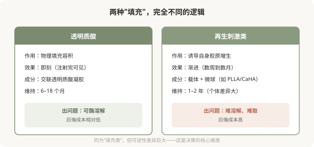

# 再生类材料：刺激自身胶原的“渐进派”

## 三个备选标题

1. 少女针、童颜针、少女精华：再生类材料到底是什么
2. 不是填充而是“诱导”：理解胶原蛋白刺激剂
3. 再生类材料 vs 透明质酸：可逆性是最关键的差别

## 封面介绍（100字以内）

再生类材料（胶原蛋白刺激剂）通过微球等成分刺激自身胶原产生，效果渐进。它与透明质酸的本质区别是：难溶解、难取出，决策需更审慎。

## 正文

先说结论：**再生类材料（常被称作“少女针”“童颜针”等，本质是胶原蛋白刺激剂）的作用机制不是“填充”，而是“诱导”——通过其成分（如微球）刺激身体自身产生胶原蛋白，效果在数周到数月渐进显现。**它与透明质酸的本质区别在于：透明质酸可以酶解，再生类材料一旦注入难以溶解、难以取出。这个差别决定了再生类材料的决策标准应该比透明质酸更严格——它的“后悔成本”更高。

### 再生类材料和透明质酸的本质区别

### 再生类材料的卖点

再生类材料的营销卖点通常是：

- **“自身胶原”“更自然”**：因为是诱导身体产生胶原，理论上触感和自然度更好。
- **“维持更久”**：部分产品宣称维持时间比透明质酸长。
- **“渐进改善”**：不会突然变化，更“低调”。

这些卖点有其合理性，但也要看到代价：**起效慢（不能即刻看到效果）、效果不可完全预测、一旦出问题难处理。**

### 常见的再生类材料类别

（具体产品的国内注册状态会变化，以国家药监局现行信息为准。）

- **聚左旋乳酸（PLLA）类**：通过微球刺激胶原增生，效果渐进，需要数次治疗。
- **羟基磷灰石（CaHA）类**：微球悬浮在凝胶载体中，兼有即时填充和渐进刺激作用。
- **聚己内酯（PCL）类**：类似机制，微球刺激胶原。
- **其他**：市场上还有其他成分的产品，机制各异。

**不同产品的特性、维持时间、结节风险都有差异。**消费者不需要记住成分，但要理解它们都属于“再生刺激”这一类，与透明质酸的可逆性截然不同。

### 再生类材料的风险

- **结节与肉芽肿**：再生类材料特有的风险，可能在数月甚至数年后出现迟发性结节，处理困难。
- **效果不可预测**：胶原增生程度因人而异，可能不足或过度。
- **难以溶解取出**：一旦出现不满意或并发症，没有像透明质酸酶那样的“后悔药”，可能需要手术或长期处理。
- **不均匀、不平整**：注射技术不当可能造成局部过度增生。
- **血管栓塞风险**：再生类材料同样有血管并发症风险，且因不能酶解，后果可能更严重。
- **过敏反应**。
- **远期未知**：部分产品长期数据有限。

### 决策时更审慎的标准

因为可逆性差，再生类材料的决策应该比透明质酸更严格：

- **只选正规产品**：必须有国家药监局注册证，绝不接受来路不明的产品。
- **只选有经验的医生**：再生类材料对注射技术要求高，剂量、层次、配制都影响结果。
- **先理解再决定**：清楚它是渐进、不可溶、可能结节的，接受这些特性再选择。
- **不要作为“第一次注射”**：如果没有注射经验，建议先用透明质酸这类可溶材料试水，理解注射的效果和自己的反应后，再考虑再生类。
- **警惕过度宣传**：对“永久”“维持五年”“自身胶原无风险”等话术保持警惕。

### “少女针”“童颜针”等名称的误导

这些营销名称暗示“年轻”“童颜”，但它们本质上都是胶原蛋白刺激剂，有上述特性和风险。**被名字吸引而不理解机制和风险，是危险的。**理解它“刺激胶原、难溶解、可能结节”的本质，比记住好听的名字更重要。

### 与透明质酸的搭配

有些情况下，医生会联合使用透明质酸和再生类材料——再生材料做渐进改善，透明质酸做即时调整。这种联合需要医生有综合判断力，不是简单叠加。**是否需要联合，由医生根据你的情况建议，而不是“打得越多越好”。**

### 决策前的硬要求

面诊再生类材料，至少做到：确认产品有国家药监局注册证；理解它是渐进、不可溶、可能结节的特性；当面讨论预期效果、起效时间、风险和“出问题怎么办”；选择有再生类材料经验的医生；确认机构有处理结节等并发症的能力。**如果一家机构回避“难溶解”“结节风险”，只强调“自然持久”，它对你这次注射的风险不够诚实。**

> 本文用于健康教育，不能替代面诊和个体化评估；再生类材料属医疗器械，须使用有国家药监局注册证的产品，在正规医疗机构由具备资质的医师注射。

## 参考资料

- U.S. FDA: Dermal fillers—soft tissue fillers（含再生类）
  https://www.fda.gov/medical-devices/aesthetic-cosmetic-devices/dermal-fillers-soft-tissue-fillers
- 国家药品监督管理局：医疗器械注册信息查询
  https://www.nmpa.gov.cn/
