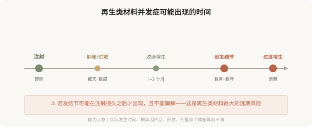

# 再生类材料的远期：结节、增生和“不可撤回”

## 三个备选标题

1. 打完再生针几个月后鼓包：迟发性结节怎么办
2. “维持两年”的代价：再生类材料的远期并发症
3. 为什么再生类材料出问题最难处理

## 封面介绍（100字以内）

再生类材料的并发症可能在数月甚至数年后出现，表现为迟发性结节、过度增生等。由于不能酶解，处理往往复杂漫长，这是它最大的代价。

## 正文

先说结论：**再生类材料（胶原蛋白刺激剂）的并发症可能在注射后数月甚至数年才出现，表现为迟发性结节、肉芽肿、局部过度增生等。**因为这类材料不能像透明质酸那样酶解，一旦出现问题，处理往往复杂、漫长，有时需要手术或长期干预。**这就是“维持久”的代价——它的不可撤回性不仅体现在效果上，更体现在出问题时。**理解远期风险，是选择再生类材料的前提。

### 迟发性结节：再生类材料特有的挑战

透明质酸的结节多与注射技术（过量、过浅）有关，且可用酶解。**再生类材料的结节机制不同——它是身体对微球的免疫反应，可能在材料注入很久之后才出现。**

迟发性结节的特点：

- **时间晚**：注射后数月到数年才出现，不是注射后立刻能发现的问题。
- **机制不同**：与生物膜、免疫反应、材料聚集等有关，不只是“打多了”。
- **处理复杂**：不能酶解，可能需要激素局部注射、抗感染、手术取出，且取出往往不彻底。
- **可能反复**：即使处理，也可能复发。

### 过度增生：另一个远期问题

再生类材料刺激胶原增生，但增生的程度不可完全预测。**有些人可能在某些部位出现过度增生——比预期鼓起、轮廓异常。**因为不能酶解，过度增生的处理也很困难，可能需要等待、激素注射或手术。

### 为什么再生类材料出问题最难处理

对比三类材料的“后悔路径”：

### 降低远期风险的几个原则

- **正规产品**：注册证可查，不接受来路不明。
- **有经验的医生**：再生类材料对配制、注射层次、剂量分布要求高。
- **剂量克制**：再生类材料不宜过度填充，宁可分次。
- **避免高危区域滥用**：某些部位（如唇部、眼周薄皮肤区）的结节风险更高，需医生判断。
- **保留注射记录**：产品、批号、部位、剂量，便于远期出现问题时溯源。

### 出现结节怎么办

如果注射后数月或数年出现结节、硬块、不明增生：

- **尽快联系有并发症处理经验的医生**，不要自行按摩、热敷或反复针挑。
- **带上注射记录**：产品、批号、时间、剂量、操作者。
- **影像评估**：高频超声等可帮助判断材料分布和结节性质。
- **区分性质**：是炎症、感染、过敏、肉芽肿还是过度增生，处理方式不同。
- **分阶段处理**：可能需要抗炎、激素局部注射、手术等综合手段。

**重要：不要在问题未稳定时继续叠加注射“压平”结节——这可能让问题层次更复杂。**

### 决策时该怎么想

面对再生类材料，问自己：

- 我能不能接受“渐进起效、数月才看到效果”？
- 我能不能接受“万一出问题，难溶解、可能要手术”？
- 我有没有先用透明质酸理解注射效果，再决定是否用再生类？
- 这个产品和医生是否正规、可追溯？

**如果对“不可撤回”有任何犹豫，优先选择透明质酸这类可溶材料。**再生类材料适合那些已经理解注射、能接受其特性、并选择正规产品和医生的人——它不是“初学者”的材料。

> 本文用于健康教育，不能替代面诊和个体化评估；再生类材料的远期并发症处理须由具备经验的医师评估。

## 参考资料

- U.S. FDA: Dermal fillers—risks & delayed nodules
  https://www.fda.gov/medical-devices/aesthetic-cosmetic-devices/dermal-fillers-soft-tissue-fillers
- Review: Delayed-onset nodules after dermal fillers
  https://pubmed.ncbi.nlm.nih.gov/31229388/
