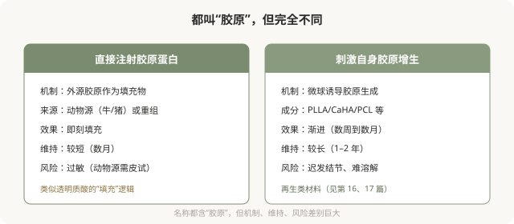

# 胶原蛋白直接填充：另一种“胶原”思路

## 三个备选标题

1. 胶原蛋白针和再生针不是一回事：先分清
2. 直接注射胶原 vs 刺激自身胶原：两条路
3. 重组胶原蛋白注射：新选择还是新风险

## 封面介绍（100字以内）

胶原蛋白类注射分为“直接填充”和“刺激自身增生”两种思路。重组胶原蛋白是近年新方向，但有维持时间和过敏等考量。

## 正文

先说结论：**“胶原蛋白”在注射领域有两种完全不同的思路：一种是直接注射胶原蛋白（动物源或重组）作为填充物，另一种是用再生刺激剂诱导自身产生胶原。**两者机制不同，不可混为一谈。重组胶原蛋白是近年兴起的新方向，宣传“生物相容性好”“自然”，但它有维持时间、过敏风险、远期数据等考量，“新”不等于“更好”或“无风险”。

### 两种“胶原”思路的区别

### 直接注射胶原蛋白的历史与现状

胶原蛋白注射并非新事物。早期的动物源胶原（牛胶原）是最早的填充材料之一，但因维持时间短、过敏风险（需皮试）而逐渐被透明质酸取代。近年重组胶原蛋白（通过生物技术生产的胶原，无需动物来源）兴起，宣传“生物相容性好”“低免疫原性”，重新进入市场。

> 《重组胶原或将成为新的医美价值投资》（2025-11-11，李滨医美之滨）一文将重组胶原定位为“高频、小额、低风险”的底层资产，类似保妥适的崛起逻辑。**这是文章中的观点**，指向市场层面，**当前产品的临床数据、注册状态和市场表现需另行核验。**

### 重组胶原蛋白的考量

- **维持时间**：多数重组胶原蛋白产品的维持时间短于交联透明质酸，可能需要更频繁补打。
- **过敏**：虽宣传低免疫原性，但仍有过敏可能，严重过敏虽罕见但需警惕。
- **远期数据**：作为较新的方向，部分产品的长期安全性和效果数据相对有限。
- **适应证**：不同产品获批的适应证不同，有些限用于特定部位。
- **市场宣传 vs 临床证据**：“重组”“基因工程”等概念是技术亮点，但不等于“比透明质酸更好”。

### 不要被“胶原蛋白”四个字绕晕

“胶原蛋白”在消费者认知里几乎是“好东西”的代名词——皮肤需要胶原、胶原流失是衰老原因。这种认知被营销利用，让人觉得“打胶原蛋白”天然比“打玻尿酸”更高级、更安全。**但注射领域的“胶原蛋白”是医疗器械，它的安全性、有效性、维持时间取决于具体产品的工艺和临床数据，而不是“胶原蛋白”这个名字的寓意。**

### 与其他材料的比较维度

面对胶原蛋白类产品，可以问医生：

- 这是直接填充型还是刺激增生型？
- 来源是动物源还是重组？需不需要皮试？
- 这个产品的国家药监局注册证号？获批适应证是什么？
- 维持时间大概多久？和透明质酸比如何？
- 常见风险是什么？出问题怎么处理？
- 相比透明质酸，它在我的情况下有什么具体优势？

**能讲清这些的医生，是在用医学逻辑帮你选择；含糊其辞只强调“胶原好”的，是在用概念卖货。**

### 一个理性态度

重组胶原蛋白是注射领域的一个发展方向，可能有它的适用场景。但作为消费者：

- 不要因为是“新方向”就认为它更安全或更好。
- 不要因为是“胶原蛋白”就忽略它的医疗器械属性和风险。
- 让医生根据你的情况建议，而不是被营销概念推动。
- 确认产品正规、注册证可查、医生有经验。

**“新”和“好”不是同义词。**每一类材料都有它的特性、优势和代价，理解这些比追逐新概念更能保护你。

> 本文用于健康教育，不能替代面诊和个体化评估；胶原蛋白类注射属医疗器械，须使用有国家药监局注册证的产品，在正规医疗机构由具备资质的医师注射。

## 参考资料

- 国家药品监督管理局：医疗器械注册信息查询
  https://www.nmpa.gov.cn/
- U.S. FDA: Dermal fillers—soft tissue fillers
  https://www.fda.gov/medical-devices/aesthetic-cosmetic-devices/dermal-fillers-soft-tissue-fillers
