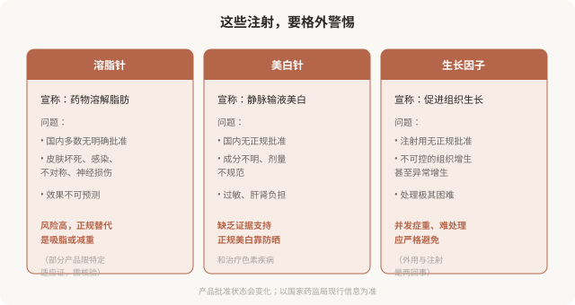

# 溶脂针、美白针等“其他注射”：警惕越界的注射

## 三个备选标题

1. 溶脂针、美白针、生长因子：这些注射为什么风险高
2. “打一针就能瘦/白”的注射：大多经不起推敲
3. 警惕“突破常规”的注射项目：合法性与安全性

## 封面介绍（100字以内）

溶脂针、美白针、生长因子等“其他注射”多数在国内缺乏明确批准或证据不足，风险高、并发症多。对这类项目要保持高度警惕。

## 正文

先说结论：**除了主流的填充、肉毒、再生类材料，市场上还有溶脂针、美白针、生长因子、干细胞等各种“其他注射”项目。**它们的共同问题是：多数在国内缺乏明确批准、临床证据不足、并发症多且处理困难。**对这类“突破常规”的注射，应保持高度警惕——它们的风险收益比，往往远不如正规项目。**不被“新概念”“神奇效果”吸引，是保护自己的重要一环。

### 几类常见的“其他注射”

### 为什么这类项目风险高

**第一，合法性边界模糊。**很多“其他注射”在国内没有作为医疗美容项目的明确批准，或仅限特定适应证（如某些溶脂产品限用于特定情况）。在非适应证范围使用，本身就违规。

**第二，临床证据不足。**它们的效果和安全性往往缺乏高质量临床研究支持，宣传多基于案例和营销，而非循证医学证据。

**第三，并发症重且难处理。**这类注射的并发症——皮肤坏死、不可控增生、感染、神经损伤——往往严重，且因为材料特性或来源不明，处理极其困难。

**第四，常与不明注射物相关。**很多“其他注射”实际使用的是来路不明的混合物，成分和剂量都不清楚，一旦出问题，连“打了什么”都不知道。

### 几个识别危险信号的原则

- **“突破常规”“最新科技”“国际领先”**：很多危险项目用这些词包装。
- **承诺“快速”“永久”“无创”**：正规医疗不会这样宣传。
- **回避产品批号、成分、注册证**：正规产品都能查证。
- **在非医疗机构注射**：美容院、工作室、私人会所、上门注射——这些场所本身就不能开展医疗美容。
- **价格异常低或异常高**：低于市场合理水平可能是假货/水货；虚高可能是包装概念。
- **“熟人介绍”“内部渠道”**：非法注射常通过社交关系传播。

### 已经打了这类注射怎么办

如果已经接受了溶脂针、美白针、生长因子或不明注射物，并出现异常：

- **尽快到正规医疗机构评估**，带上所有能收集的信息（产品名、时间、部位、剂量）。
- **不要因为害怕被评判而隐瞒**——对医生而言，“打了什么”直接决定处理方案。
- **接受影像评估**（如超声），帮助判断材料分布和并发症性质。
- **不要在问题未稳定时继续注射其他材料“补救”**——可能让情况更复杂。

### 一个理性的态度

美容注射的价值，建立在“合法 + 循证 + 可控”之上。任何一项缺失，风险就显著上升。**主流的填充、肉毒、再生类材料，虽然也有风险，但至少有明确的产品、适应证和处理路径。而“其他注射”往往三项都不具备。**对它们保持警惕，不被“新概念”和“神奇效果”吸引，是消费者最重要的自我保护之一。

**一个简单的原则：如果一个注射项目听起来“好得不像真的”，它很可能就不是真的。**

> 本文用于健康教育，不能替代面诊和个体化评估；任何注射须使用有国家药监局注册证的正规产品，在正规医疗机构由具备资质的医师开展。

## 参考资料

- 国家药品监督管理局：医疗器械与药品监管信息
  https://www.nmpa.gov.cn/
- 国家卫生健康委：医疗美容服务管理办法相关文件（以现行版本为准）
  http://www.nhc.gov.cn/
