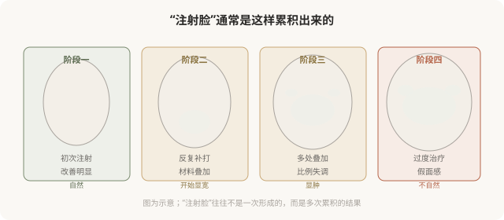
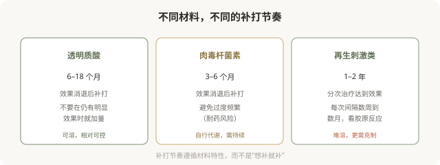

# 注射的节奏：联合、补打和“过度”的边界

## 三个备选标题

1. 注射不是越多越好：理解联合治疗的节奏
2. 什么时候该补打、什么时候该停：注射的时间管理
3. “注射脸”是怎么形成的：过度治疗的红线

## 封面介绍（100字以内）

注射的节奏比单次剂量更影响长期自然感。联合治疗要分清主次，补打要遵循材料特性，“过度”是注射脸的核心成因。

## 正文

先说结论：**注射的节奏——什么时候联合、什么时候补打、什么时候停——比单次剂量更影响长期的自然感。**合理的联合治疗分清主次、循序渐进；补打遵循材料特性和代谢规律；而“过度治疗”是形成“注射脸”“假面感”的核心成因。理解节奏，能让你在长期注射中保持自然，而不是逐渐“不像自己”。

### “注射脸”是怎么形成的

“注射脸”通常不是一次造成的，而是多次“再加一点”“再补一次”累积的结果。每次单看都“还好”，回头看才发现已经不像自己。**这就是为什么注射的节奏管理比单次剂量更重要——它决定你长期走向自然还是走向假面。**

### 联合治疗的合理逻辑

联合不是“什么都打”，而是针对不同问题用不同手段，并分清主次：

- **主次分明**：先解决最突出的问题（如严重的动态纹或明显的容积流失），再看是否需要其他。
- **循序渐进**：一次不要堆叠太多项目和部位，分次观察效果。
- **材料搭配有依据**：肉毒 + 填充、不同型号填充的搭配，要有医学逻辑，不是“套餐”。
- **给效果留观察期**：打完一类后等效果稳定，再决定是否需要其他。

**一个能讲清“为什么联合、先打哪个、为什么”的医生，比一个“全套打包”的医生更值得信任。**

### 补打的节奏

不同材料的补打节奏不同：

### “过度”的红线

什么情况下算“过度”：

- **每次复诊都“再加一点”**：没有明确的停止标准。
- **多处同时大剂量填充**：一次治疗改变过大。
- **不待效果稳定就追加**：在上次材料未稳定时继续叠加。
- **追求“完全无纹”“极致饱满”**：超出自然的范畴。
- **不同的医生、不知道彼此的操作**：重复注射、材料叠加失控。

**“过度”的核心特征是：没有停止标准，只有“再来一点”。**一个负责任的医生会在某个点说“已经够了，建议先停一停”——这恰恰是防止你走向“注射脸”的关键。

### 建立自己的“停止标准”

为避免过度治疗，可以提前给自己设几个标准：

- **效果目标**：达到“改善到自然”就停，不追求“完美”。
- **部位限制**：明确哪些部位不做、哪些做，不随意扩展。
- **频率限制**：遵循材料节奏，不超频。
- **总量意识**：累计剂量有概念，与医生讨论“已经打了多少”。
- **定期“冷静期”**：每隔一段时间停一停，看自己的真实状态。

### 为什么“停止”比“加码”更需要勇气

在注射的语境里，“再加一点”听起来无害，“先停一停”反而让人觉得“亏了”。但长期来看，**会停的人保持自然，不会停的人走向假面。**一个能主动劝你“够了”的医生，比一个永远“再加一支”的机构，更值得长期信任。

### 决策前的认知

理解注射的节奏：

- 联合要分主次，不是堆叠。
- 补打遵循材料节奏，不是想补就补。
- 设立停止标准，不无限“再加一点”。
- 定期冷静评估，看长期走向是否自然。

**注射的艺术，很大程度上是“克制”的艺术。**

> 本文用于健康教育，不能替代面诊和个体化评估；注射须在正规医疗机构由具备资质的医师开展。

## 参考资料

- American Society of Plastic Surgeons: Facial rejuvenation—combination treatments
  https://www.plasticsurgery.org/cosmetic-procedures
- 中华医学会整形外科学分会：注射美容联合治疗相关共识（以现行版本为准）
  https://www.cma.org.cn/
