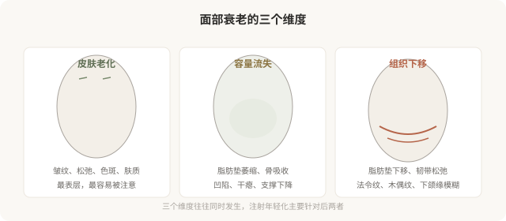
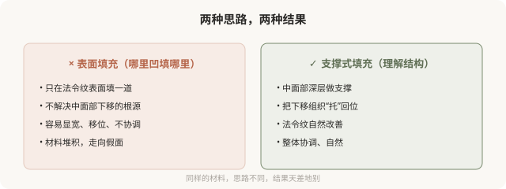

# 面部年轻化的“容量”概念：为什么不是哪里凹填哪里

## 三个备选标题

1. “容量流失”才是衰老的核心：理解面部年轻化的底层逻辑
2. 哪里凹填哪里是错的：容量、支撑和下垂的关系
3. 面部年轻化不是堆填充：容量管理的艺术

## 封面介绍（100字以内）

面部衰老的核心是容量流失和组织下移。年轻化不是“哪里凹填哪里”，而是理解支撑结构，通过深层容量恢复实现自然的提升感。

## 正文

先说结论：**面部衰老的核心不只是“长皱纹”，更根本的是容量流失（脂肪垫萎缩、骨吸收）和组织下移。**所以注射年轻化的核心逻辑不是“哪里凹填哪里”，而是通过恢复深层容量支撑，让下移的组织“回位”。理解“容量”概念，能让你跳出“见凹就填”的误区，走向更自然、更协调的年轻化。

### 衰老不只是“长皱纹”

很多人把衰老理解为“长皱纹”，所以年轻化就是“除皱”。但更根本的变化在更深层：面部的脂肪垫会萎缩、骨骼会发生吸收，导致支撑结构减弱；同时脂肪垫会下移，形成法令纹、木偶纹、下颌缘模糊等“下垂”表现。**皱纹只是表象，容量流失和组织下移才是核心。**

### “容量”概念：支撑重于填充

理解了衰老的核心，就能理解为什么“哪里凹填哪里”是错的。年轻化的逻辑更接近“恢复支撑”，而不是“补洞”：

- **中面部支撑**：苹果肌（颧脂肪垫）萎缩下移，导致法令纹、面中凹陷。处理思路是在中面部深层做支撑性填充，把下垂组织“托起来”，而不是只在法令纹表面填一道。
- **下颌缘清晰度**：下颌缘模糊与容量流失、组织下移有关。通过精准的支撑性填充，可以改善下颌线条。
- **整体协调**：年轻化的目标是恢复年轻时的容量分布，而不是在某个局部堆材料。

### 容量恢复的常见部位

- **颞部（太阳穴）**：颞部凹陷显老，深部支撑性填充可改善。
- **中面部（苹果肌）**：核心支撑区域，改善面中凹陷和法令纹。
- **面颊**：容量流失导致的干瘪。
- **下颌缘**：改善模糊的下颌线条。
- **下颏**：轻度后缩或形态不佳的支撑。

**这些部位的处理往往以“深层支撑”为主，辅以浅层修饰。**剂量分布和层次是关键——这就是为什么同样的材料，有经验的医生打得自然，没经验的打得假。

### “容量”和“过度”的边界

容量恢复不等于“填到饱满”。年轻的脸有自然的容量分布，包括一些本就该有的凹陷和阴影。**过度追求“饱满”会把脸打成气球感——这恰恰是“注射脸”的典型特征。**好的容量管理是“恢复到自然状态”，而不是“填到没有一丝凹陷”。

### 为什么“理解容量”让你成为更好的消费者

理解容量概念，能让你：

- **判断医生的思路**：是“哪里凹填哪里”，还是“理解结构、整体提升”。
- **建立合理预期**：知道年轻化是“恢复协调”，不是“消除一切纹路”。
- **避免过度填充**：理解“饱满”和“自然”的区别。
- **更好地评估效果**：不只看局部纹路，而看整体协调度。

### 决策前的认知

面诊面部年轻化，可以问医生：

- 我的衰老主要是哪个维度（皮肤／容量／下移）？
- 您建议的方案是针对哪个根源？
- 这个部位是深层支撑还是浅层修饰？
- 怎样避免打完“显宽”“显肿”？

**能从“容量”和“结构”角度解释方案的医生，比只说“给你填一下”的医生，更可能给你自然的结果。**

> 本文用于健康教育，不能替代面诊和个体化评估；面部年轻化注射须在正规医疗机构由具备资质的医师开展。

## 参考资料

- American Society of Plastic Surgeons: Facial rejuvenation
  https://www.plasticsurgery.org/cosmetic-procedures
- 中华医学会整形外科学分会：面部年轻化相关共识（以现行版本为准）
  https://www.cma.org.cn/
