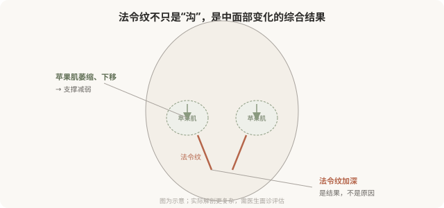

# 中面部和法令纹：为什么“填一道”解决不了

## 三个备选标题

1. 法令纹总填不平？因为根源在中面部不在沟里
2. 苹果肌、法令纹、印第安纹：中面部的整体观
3. “法令纹打个玻尿酸就好”是最常见的误区

## 封面介绍（100字以内）

法令纹的根源常在中面部容量流失和下移，单纯在沟里填充效果有限且易显假。理解中面部整体结构，才能自然改善。

## 正文

先说结论：**法令纹（鼻唇沟）的根源多数在中面部——苹果肌萎缩下移、支撑结构减弱——单纯在沟里“填一道”往往效果有限、容易显假。**自然的改善思路是恢复中面部深层支撑，让下移的组织回位，法令纹作为结果随之改善。把法令纹当成孤立的“沟”来填，是最常见的年轻化误区之一。

### 法令纹的真正成因

法令纹的形成通常涉及多个因素：

- **苹果肌（颧脂肪垫）萎缩和下移**：中面部失去支撑，软组织向下堆积，在鼻唇沟处形成折痕。
- **上颌骨后缩**：骨性支撑不足，加重鼻唇沟。
- **皮肤弹性下降**：松弛的皮肤加重折痕。
- **反复表情**：笑时鼻唇沟加深，长期可能固化。

**核心是中面部的支撑减弱**——所以只在沟里填充，就像在不平的地面上补洞，不解决地面下沉的根源。

### “填沟”思路的问题

只在法令纹表面填充的问题：

- **效果有限**：根源在中面部，沟会随表情重新出现。
- **容易显假**：局部堆积材料，笑时可能鼓包、移位。
- **不自然**：填充的沟与周围组织不协调。
- **需要反复大量填充**：为了“填平”不得不堆很多材料，进一步增加不自然。

### 支撑式思路

更自然的思路是恢复中面部支撑：

- **中面部深层填充**：在苹果肌区域（骨膜上深层）做支撑性填充，把下移的组织托回位。
- **法令纹辅助修饰**：中面部支撑恢复后，法令纹会自然改善，必要时再少量修饰。
- **整体协调**：不只是“消灭沟”，而是恢复中面部的年轻容量分布。

**这种思路用更少的材料，达到更自然的效果——因为它针对根源，而不是表象。**

### 印第安纹：中面部的另一个难题

印第安纹是颧颊部位的斜行沟壑，与颧弓皮肤支持韧带有关。它比法令纹更难处理：

- 单纯填充效果有限、风险高（血管、不平整）。
- 需要医生有经验判断是否适合填充、用何种方式。
- 有时需要联合其他手段。

**不要把印第安纹简单地当成“另一条沟来填”——它的处理逻辑和法令纹、泪沟都不同。**

### 决策前的硬要求

面诊法令纹或中面部，至少做到：选择有中面部注射经验的医生；当面评估是容量问题还是骨性问题、是否伴随皮肤松弛；讨论是“填沟”还是“中面部支撑”思路；理解单纯填沟的局限；理解中面部注射的血管风险（中面部也有重要血管）。**承诺“法令纹打一针就平”的机构，对它的成因不够理解。**

### 一个常见误区

“我法令纹深，打玻尿酸填一下就好。”这句话的问题在于把复杂的结构性问题简化成了“补洞”。**法令纹的处理质量，很能区分一个医生是“理解面部”还是“只会填料”。**选择能解释成因和思路的医生，比选择“便宜填一下”的机构，更能给你自然的结果。

> 本文用于健康教育，不能替代面诊和个体化评估；中面部注射须由熟悉解剖的具备资质医师在正规医疗机构开展。

## 参考资料

- American Society of Plastic Surgeons: Midface & nasolabial fold treatment
  https://www.plasticsurgery.org/cosmetic-procedures/dermal-fillers
- 中华医学会整形外科学分会：中面部年轻化相关共识（以现行版本为准）
  https://www.cma.org.cn/
