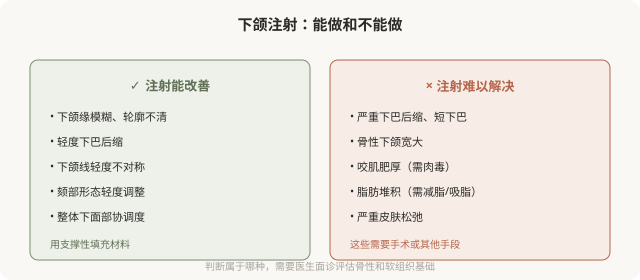

# 下颌线和下颏：轮廓注射的美学

## 三个备选标题

1. 下颌线模糊、下巴后缩：注射能改善到什么程度
2. 垫下巴和塑下颌：注射轮廓的边界和风险
3. 想要“小V脸”先看清：下颌注射的现实

## 封面介绍（100字以内）

下颌线和下颏的注射能改善轮廓模糊和轻度后缩，但效果有限、依赖骨性基础。它不能替代手术，且下颌区域有血管风险。

## 正文

先说结论：**下颌线和下颏的注射可以改善轮廓模糊、下颌缘不清、下巴轻度后缩等问题，但效果受骨性基础限制，不能替代手术。**对于明显的骨性问题（严重后缩、短下巴），注射只能有限改善，手术往往更合适。同时下颌区域有面动脉等重要血管，注射需熟悉解剖。理解注射在轮廓改善上的能力边界，才能建立合理预期。

### 下颌注射能改善什么

### 下颌注射的几个原则

- **支撑性材料**：用高粘弹性、有支撑力的硬型透明质酸，能在骨面或深层形成稳定支撑。
- **深部注射**：下颌缘和颏部常采用骨膜上深层注射，相对安全且支撑稳定。
- **熟悉面动脉解剖**：下颌区域有面动脉及其分支走行，是重要血管风险区。
- **对称与比例**：下颌和颏部的改善要考虑与整体面部的比例，避免“下巴过长”“下颌过方”等不协调。
- **剂量克制**：下颌过度填充会显得“方”“重”，失去自然。

### “垫下巴”的现实

很多人希望通过注射“垫出”明显的下巴。现实是：

- **轻度后缩**：注射能有不错改善，用支撑性材料重塑颏部形态。
- **中度后缩**：注射改善有限，可能需要较大剂量，增加不自然和风险。
- **重度后缩或短下巴**：注射基本无效，假体或截骨手术更合适。

**把注射当成手术的“轻量替代”，在明显骨性问题上往往不划算——效果有限、剂量大、不自然、花费也不低。**对于需要结构性改变的下巴问题，手术（假体或颏成形）往往更合理。

### 下颌线的“清晰”

下颌缘模糊的原因多样：

- **容量流失**：下颌骨吸收、软组织萎缩。
- **组织下移**：皮肤和脂肪垫松弛下垂。
- **脂肪堆积**：颌下脂肪堆积。
- **咬肌因素**：咬肌与下颌线的关系。

注射主要针对容量和组织支撑问题。如果是脂肪堆积为主，吸脂或减脂更合适；如果是严重松弛，提升类项目或手术更有效。**“打一针就有清晰下颌线”的说法，忽略了成因的复杂性。**

### 联合治疗的常见组合

下面部轮廓改善常需联合：

- **肉毒瘦咬肌**：处理肌肉型宽大。
- **填充塑下颌**：处理容量和轮廓。
- **吸脂**：处理脂肪堆积。
- **光电或手术**：处理皮肤松弛。

**联合的依据是成因，不是“都打一遍”。**好的医生会判断你的下面部宽大或轮廓不清主要是哪个因素，针对性处理。

### 风险要点

- **血管栓塞**：下颌区域面动脉及其分支，是相对高危区域。
- **不对称、过度填充**：剂量和位置问题。
- **移位**：材料扩散或层次不当。
- **触感不自然**：材料太浅或型号不对。
- **影响表情**：颏部过度填充影响唇部和表情活动。

### 决策前的硬要求

面诊下颌或颏部注射，至少做到：选择有轮廓注射经验的医生；当面评估是骨性、肌肉、脂肪还是容量问题；讨论预期能改善到什么程度；理解明显骨性问题需要手术；理解下颌血管风险。**承诺“打一针就有完美下颌线/尖下巴”的机构，对它的能力边界不够诚实。**

> 本文用于健康教育，不能替代面诊和个体化评估；下颌区域注射须由熟悉解剖的具备资质医师在正规医疗机构开展。

## 参考资料

- American Society of Plastic Surgeons: Jawline & chin fillers
  https://www.plasticsurgery.org/cosmetic-procedures/dermal-fillers
- 中华医学会整形外科学分会：下面部轮廓注射相关共识（以现行版本为准）
  https://www.cma.org.cn/
