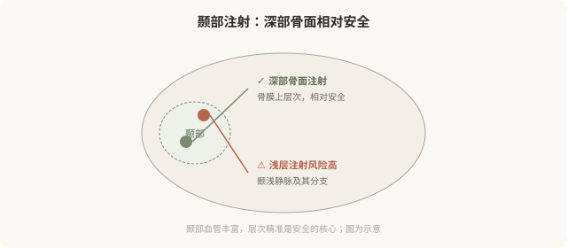

# 太阳穴和额头：颞部注射的安全与美学

## 三个备选标题

1. 太阳穴凹陷显老：注射能改善，但这里有血管
2. 额头和颞部注射：层次比剂量更关键
3. “饱满额头”的边界：颞部注射的现实

## 封面介绍（100字以内）

颞部（太阳穴）和额头凹陷能通过注射改善，但颞部血管丰富，层次精准至关重要。深部骨面支撑相对安全，浅层注射风险高。

## 正文

先说结论：**颞部（太阳穴）和额头的凹陷能通过注射改善，但这个区域血管丰富，层次精准是安全的关键。**颞部注射通常采用深部骨面支撑的方式（相对安全），浅层注射风险高。同时“饱满额头”有美学边界——过度填充会显得不自然。理解颞部注射的安全要点和美学边界，是决策的前提。

### 颞部凹陷的原因和改善

颞部凹陷常见于：

- **年龄性容量流失**：颞部脂肪和肌肉萎缩。
- **消瘦**：体重下降后颞部凹陷明显。
- **骨性基础**：颞部骨骼形态。

凹陷的颞部会让人显得憔悴、显老。**深部支撑性填充能有效改善颞部凹陷**，恢复额头到颞部的平滑过渡。

### 颞部注射的安全要点

颞部解剖有几个关键点：

- **颞浅静脉及其分支**在浅层走行，浅层注射易造成血管问题。
- **颞深血管**在更深层，深部骨面注射可规避。
- **骨膜上层**是相对安全的注射层次，能形成稳定支撑。

所以颞部注射通常采用**深部骨面、支撑性填充**的方式，而不是浅层铺展。这要求操作者熟悉颞部分层解剖。**“颞部随便填填就行”是危险的认知。**

### 额头注射的美学

额头注射要考虑：

- **额头形态**：圆润、自然，过度饱满显得“寿星公”。
- **与眉骨的过渡**：额头到眉骨的衔接要协调。
- **性别差异**：男性额头与女性额头的美学标准不同。
- **动态自然**：额头在表情中要协调。

**过度填充额头是“注射脸”的典型表现之一。**自然的额头有轻微起伏，不是完全饱满的球面。

### 颞部注射的风险

- **血管栓塞**：颞部血管与眼动脉系统有交通，栓塞性并发症虽罕见但严重。
- **血肿**：颞部血管丰富，出血风险存在。
- **不平整、触感异常**：层次和剂量问题。
- **过度填充**：颞部过度饱满显得不自然。
- **不对称**。
- **疼痛**：颞部注射痛感相对明显。

### 谁适合、谁不适合

适合：

- 颞部明显凹陷，影响整体协调。
- 容量流失导致的额头扁平。
- 由有经验的医生在正规机构操作。

不适合：

- 对血管风险完全不能接受者。
- 期望“完全饱满”的过度期待。
- 凝血异常、颞部皮肤感染期。

### 决策前的硬要求

面诊颞部或额头注射，至少做到：选择有颞部注射经验的医生；当面评估凹陷程度和骨性基础；讨论深部注射的层次和安全要点；理解血管风险和“饱满”的美学边界；确认机构备有透明质酸酶（针对透明质酸注射）。**回避颞部血管风险讨论的机构，对它的安全性不够严肃。**

### 一个美学提醒

颞部和额头的“饱满”有度。**自然的年轻不是“所有凹陷都填满”，而是协调的容量分布。**一个好的医生会在颞部克制，保留自然的起伏，而不是追求“完全无凹陷”。

> 本文用于健康教育，不能替代面诊和个体化评估；颞部注射须由熟悉解剖的具备资质医师在正规医疗机构开展。

## 参考资料

- American Society of Plastic Surgeons: Temple & forehead fillers
  https://www.plasticsurgery.org/cosmetic-procedures/dermal-fillers
- 中华医学会整形外科学分会：颞部注射安全相关共识（以现行版本为准）
  https://www.cma.org.cn/
