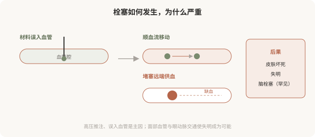
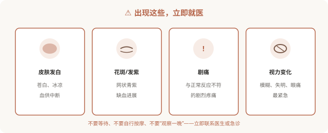

# 血管栓塞：注射最严重的并发症

## 三个备选标题

1. 注射后皮肤发白、视力模糊：血管栓塞的识别
2. 为什么“打针”可能失明：栓塞的解剖与机制
3. 栓塞是按分钟计算的急症：每个人都该知道

## 封面介绍（100字以内）

血管栓塞是注射最严重的并发症，可致皮肤坏死甚至失明。识别早期征象、立即处理，是决定后果的关键。每个接受注射的人都应了解。

## 正文

先说结论：**血管栓塞是美容注射最严重的并发症——填充材料误入血管，可能造成皮肤坏死、失明甚至更严重后果。**它虽然发生率不高，但一旦发生进展迅速、可能不可逆。识别早期征象（皮肤发白、花斑、剧痛、视力变化）并立即处理，是决定后果的关键。**每一个接受或考虑注射的人，都应该了解栓塞的征象和应对——这不是吓唬，而是必要的安全知识。**

### 栓塞是怎么发生的

当填充材料在压力下被注入血管：

- 材料成为栓子，顺血流移动，堵塞远端血管。
- 远端组织缺血，皮肤变色、坏死。
- 在面部高危区域（鼻部、眉间、额头），栓子可能逆流至眼动脉，堵塞视网膜中央动脉，导致失明。
- 极罕见情况下可能影响脑血管。

### 必须立即就医的征象

**出现以下任何一种，立即联系医生或急诊，按分钟计算**：

### 降低栓塞风险的措施（医生端）

- 熟悉面部血管解剖，尤其高危区域。
- 深层、骨面注射，避免在血管密集层操作。
- 少量、慢推，避免高压推注。
- 注射前回抽（虽非绝对保险，但是常规操作）。
- 使用钝针（适当情况下可降低刺破血管概率）。
- 备有透明质酸酶（针对透明质酸）。

### 出现栓塞怎么处理

- **立即联系医生或急诊**，时间非常关键。
- **透明质酸酶**：针对透明质酸栓塞，及时使用可能挽救，但有时机要求。
- **其他措施**：扩血管、抗凝、高压氧等，由专业团队决定。
- **视力变化**：立即眼科急诊，视网膜缺血超过约 90 分钟损伤往往不可逆。

**“等等看”是栓塞最危险的应对。**拿不准是不是栓塞、且症状明显或持续加重时，宁可立即联系医生确认。

### 为什么每个注射者都该知道

你可能会想：“这是医生的事，我了解有什么用？”原因有三：

- **快速识别**：栓塞可能发生在注射后即刻到数小时，你可能先于医生发现异常。
- **争取时间**：栓塞处理有时间窗，早一分钟处理，后果可能完全不同。
- **选择机构**：了解栓塞风险，你才会重视“机构是否备有透明质酸酶、是否有应急流程”。

**对栓塞一无所知的人，最容易在出事时错过黄金处理时间。**这不是制造恐惧，而是必要的安全素养。

### 一个底线认知

栓塞是低概率事件，但对那个出事的人是 100%。所以：

- 选择有资质、有经验、有急救能力的机构和医生。
- 在高危区域（鼻部、眉间、额头）格外审慎。
- 知道征象，知道怎么应对。
- 把“机构备有透明质酸酶”作为硬门槛。

**注射的安全性，很大程度建立在“为最坏情况做好准备”之上。**

> 本文用于健康教育，不能替代急诊处置；出现栓塞征象应立即联系手术医生或就近急诊。

## 参考资料

- American Society of Plastic Surgeons: Vascular occlusion & injectable safety
  https://www.plasticsurgery.org/patient-safety
- U.S. FDA: Dermal fillers—what to do if there is a problem
  https://www.fda.gov/medical-devices/aesthetic-cosmetic-devices/dermal-fillers-soft-tissue-fillers
