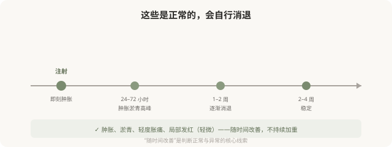
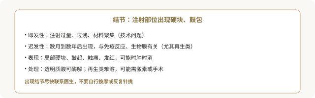
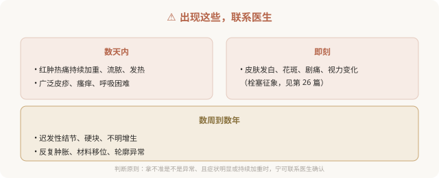

# 注射后结节、过敏和感染：常见并发症识别

## 三个备选标题

1. 打完针鼓包、红肿：是正常反应还是并发症
2. 结节、过敏、感染：注射后该警惕的三类问题
3. 正常反应 vs 异常信号：注射后观察清单

## 封面介绍（100字以内）

注射后肿胀淤青多为正常反应，但结节、过敏、感染需要警惕。分清正常与异常，知道什么情况要联系医生，是术后安全的关键。

## 正文

先说结论：**注射后多数肿胀、淤青、轻度不适是正常愈合反应，会随时间消退。但结节、过敏反应、感染等并发症需要警惕并及时处理。**分清正常反应和异常信号，知道什么情况要立即联系医生，是注射后安全的关键。了解这些，既能避免对正常反应过度焦虑，也能在真正出问题时及时应对。

### 先理解正常的术后反应

正常反应的特征是**随时间改善**。注射后即刻肿胀、数小时到两三天的肿胀淤青高峰、之后逐渐消退——这些都是预期内的。

### 需要警惕的三类并发症

**1. 结节（迟发性或即发性）**

**2. 过敏反应**

- **表现**：局部或广泛的红肿、瘙痒、皮疹；严重过敏（呼吸困难、喉头水肿、血压下降）虽罕见但需立即急诊。
- **常见来源**：透明质酸（罕见）、动物源胶原蛋白（需皮试）、利多卡因等辅料。
- **处理**：轻度抗过敏；严重立即急诊。

**3. 感染**

- **表现**：红肿热痛加重、流脓、发热、淋巴结肿大。
- **原因**：无菌操作不当、术前皮肤消毒不充分、术后污染。
- **处理**：抗感染，严重者可能需要引流或（针对填充）取出材料。
- **预防**：正规无菌操作、术后保持清洁、避免污染。

### 异常信号清单：什么情况要联系医生

### 术后该做的事

- **保留医生/机构的紧急联系方式**。
- **按医嘱护理**：避免剧烈运动、高温（桑拿、热敷）、按摩注射区（尤其肉毒后防扩散）。
- **保留术前术后照片和注射记录**（产品、批号）。
- **按时复诊**，不擅自处理。
- **如实报告症状**，不因担心“打扰”而隐瞒。

### “等等看”的风险

对于过敏、感染、栓塞这类按时间计算的并发症，“等等看”可能错过处理窗口。**判断原则是：拿不准是不是异常、且症状明显或持续加重时，宁可联系医生确认。**好的医生会认真对待术后反馈，而不是嫌你“大惊小怪”。

### 选机构时把“术后应急”算进去

并发症可能在夜间、周末或回家后出现。**选择注射机构时，就应确认它有无术后应急联系方式、能不能处理并发症。**一家“打完就走、术后找不到人”的机构，在并发症发生时无法提供保障。

> 本文用于健康教育，不能替代急诊处置；注射后出现异常信号应立即联系医生。

## 参考资料

- U.S. FDA: Dermal fillers—risks & side effects
  https://www.fda.gov/medical-devices/aesthetic-cosmetic-devices/dermal-fillers-soft-tissue-fillers
- American Society of Plastic Surgeons: Injectable recovery & complications
  https://www.plasticsurgery.org/cosmetic-procedures
