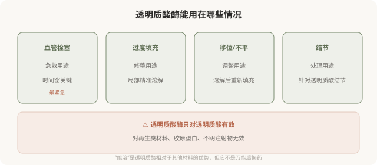

# 透明质酸酶和“后悔药”：能溶不等于零风险

## 三个备选标题

1. 玻尿酸不满意能溶掉：但“溶解”没那么简单
2. 透明质酸酶：能溶、有风险、有边界
3. “反正能溶”不是降低审慎的理由

## 封面介绍（100字以内）

透明质酸酶能溶解透明质酸填充，是重要的应急和修整工具。但它本身有风险，且不能解决所有问题。“能溶”不等于零风险。

## 正文

先说结论：**透明质酸酶能溶解透明质酸类填充材料，是处理过度填充、移位、结节和血管栓塞的重要工具。**但它本身有过敏风险，溶解效果不完全可控，且不能解决所有问题（如栓塞的远期后果、再生类材料、不明注射物）。**“反正能溶”不应成为降低注射审慎的理由——溶解是补救，不是保险。**

### 透明质酸酶的作用

### 透明质酸酶本身的风险

- **过敏反应**：透明质酸酶是蛋白制剂，有过敏可能，严重过敏虽罕见但需警惕。使用前有时需皮试或备有应急。
- **溶解过度**：酶不只溶解你想溶的填充物，也可能影响周围天然透明质酸，造成局部凹陷。
- **效果不完全可控**：溶解程度受剂量、层次、时间影响，可能溶不够或溶太多。
- **不能解决所有问题**：栓塞造成的组织损伤、迟发结节的免疫反应等，酶解只是其中一环。

**所以透明质酸酶的使用本身也需要专业判断，不是“打一针就还原”。**

### “能溶”为什么不能成为降低审慎的理由

有人因为知道透明质酸“能溶”，在注射时放松了审慎——“反正不满意能溶掉”。这个逻辑的问题在于：

- **溶解有风险**：过敏、溶解过度，本身就是一次新的医疗操作。
- **溶解不等于还原**：溶解后可能凹陷、不对称，需要重新评估和修复。
- **栓塞后果可能不可逆**：即使酶解，视网膜缺血超过时间窗仍可能失明。
- **时间和心理成本**：不满意—溶解—再修复的过程，消耗时间和情绪。

**“能溶”降低了透明质酸的后悔成本，但不等于零成本。**把它当成保险而放松注射时的选择标准，是对风险的误读。

### 选机构时把“备酶”算进去

对于透明质酸注射，**机构是否备有透明质酸酶、是否有使用经验、是否有应急流程，是硬性门槛。**一家做透明质酸注射却不备酶的机构，对栓塞和过度填充没有应急准备——这直接决定了出问题时你能不能得到及时处理。

面诊时可以直接问：

- 机构备有透明质酸酶吗？
- 出现栓塞或过度填充，怎么处理？
- 谁来使用酶、有没有经验？

**回避这些问题的机构，在应急能力上是不可靠的。**

### 决策时的认知

理解透明质酸酶的位置：

- 它是重要的补救工具，尤其在栓塞急救中。
- 它本身有风险，使用需要专业判断。
- 它只对透明质酸有效，不能处理其他材料。
- “能溶”降低了透明质酸的后悔成本，但不等于零风险。

**最稳妥的态度是：选择透明质酸这类可溶材料时，把“机构备酶”作为必要条件；同时不因为“能溶”就放松对医生、剂量、材料的选择标准。**

> 本文用于健康教育，不能替代急诊处置和个体化评估；透明质酸酶的使用须由具备资质的医师决定。

## 参考资料

- American Society of Plastic Surgeons: Hyaluronidase & dissolving fillers
  https://www.plasticsurgery.org/patient-safety
- U.S. FDA: Dermal fillers—what to do if there is a problem
  https://www.fda.gov/medical-devices/aesthetic-cosmetic-devices/dermal-fillers-soft-tissue-fillers
