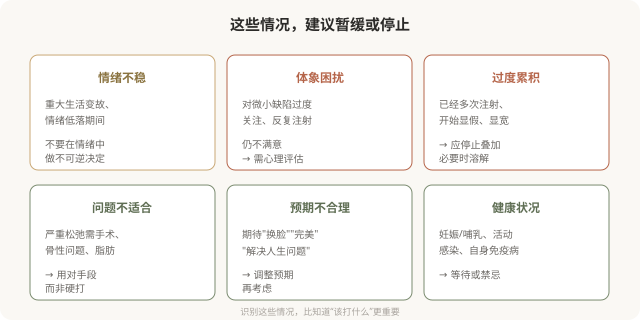

# 何时该停止：注射的边界和“不做”的智慧

## 三个备选标题

1. 有时候，最好的注射决策是“不打”
2. 注射的边界：哪些情况应该停止或暂缓
3. “会停”比“会打”更难：注射的终极智慧

## 封面介绍（100字以内）

注射有明确的边界：心理预期不稳、体象困扰、过度累积、问题不适合注射时，停止或暂缓比继续更明智。“不做”有时是最好的选择。

## 正文

先说结论：**注射有明确的边界——有些情况应该暂缓，有些情况应该停止，有些情况从一开始就不该开始。**心理预期不稳、存在体象障碍倾向、已经过度累积、问题根本不适合注射时，“停止”或“不做”比继续更明智。**能识别这些边界、并愿意说“不”的医生和消费者，比永远“再加一点”的更值得信任。**这是这个系列的收尾，因为“会停”是注射艺术里最难、也最重要的一课。

### 哪些情况应该暂缓或停止

### 体象障碍：需要心理支持而非更多注射

如果发现自己符合以下特征，需要的不是更多注射，而是专业心理评估：

- 对外貌的某个细节过度关注，花费大量时间反复审视。
- 反复注射仍不满意，总觉得“还差一点”。
- 因外貌问题显著影响社交、工作、亲密关系。
- 对他人未注意到的“缺陷”极度困扰。

**体象障碍（body dysmorphic disorder）是一种需要专业治疗的心理状况，注射无法解决其根本困扰，反而可能加重。**这不是道德判断，而是说：在这种情况下，心理支持比注射更有帮助。

### “过度累积”的停止

当你已经多次注射，开始出现以下信号时，应该停止叠加，必要时溶解：

- 脸开始显宽、显肿、显假。
- 别人能看出“做过”。
- 每次照镜子都觉得“还需要调整”。
- 累计剂量已经不小，但仍不满足。

**这时候的智慧不是“再修一修”，而是停下来、必要时溶解部分材料、重新审视。**继续叠加只会让情况更糟。

### “问题不适合”的诚实

有些问题根本不适合注射，用注射硬处理只会效果差、风险高：

- **严重皮肤松弛**：需要手术（拉皮等），注射撑不起松弛。
- **骨性轮廓问题**：需要手术（如下颌角成形），注射只是临时掩盖。
- **脂肪堆积**：需要减脂或吸脂，注射解决不了。
- **静态深纹伴结构改变**：可能需要填充联合其他手段。

**一个好的医生会告诉你“这个问题注射解决不了”，而不是“打一针试试”。**这种诚实，恰恰是专业和负责的体现。

### “会停”的医生最值得信任

在注射领域，**愿意说“不”的医生比永远说“好”的医生更值得信任。**一个对所有诉求都点头、对所有风险都轻描淡写、从不劝阻的医生，并不代表技术好，更可能意味着他对你这次注射（以及你的长期走向）没有真正在意。

一个负责任的医生会在以下时刻说“不”：

- 你的诉求超出注射能力。
- 你已经过度，需要停止而非加码。
- 你的预期不合理，需要调整而非满足。
- 你的状况（心理、健康）不适合注射。

**遇到这样愿意说“不”的医生，请珍惜——他在保护你。**

### 给这个系列的读者

这 30 篇的核心目的，是帮助你建立对美容注射的**现实认知**：

- 注射是医疗操作，不是“轻医美”那么轻。
- 它有效，但也有明确的能力边界和风险。
- 它的安全建立在资质、解剖、材料和知情之上。
- 它的满意与否，很大程度上取决于预期是否合理、节奏是否可控。
- “会停”比“会打”更难，也更重要。

如果你正在考虑注射，希望这套内容能帮你：

- 分清填充、肉毒、再生的不同。
- 学会核实机构和医生的资质。
- 在面诊中提出正确的问题。
- 建立与风险匹配的心理预期。
- 在出现问题时知道该怎么做。
- 识别什么时候应该停止或暂缓。

**最成熟的注射决策，往往不是“打了最贵最好”，而是“在充分了解后，做出了符合自己情况和承受力的选择”——包括有时候，选择不打。**

注射的艺术，归根结底是**克制与理解的艺术**：理解自己的诉求和边界，克制对完美的执念，选择专业的人，在合适的时候做合适的事，并知道何时该停下。这比任何一支材料、任何一项技术都更能保护你的长期美与安全。

> 本文用于健康教育，不能替代面诊、个体化评估和必要的心理支持。

## 参考资料

- American Society of Plastic Surgeons: Patient safety & psychological considerations
  https://www.plasticsurgery.org/patient-safety
- 中华医学会整形外科学分会、精神医学分会：相关诊疗共识（以现行版本为准）
  https://www.cma.org.cn/
