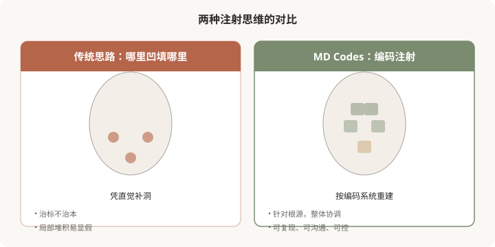
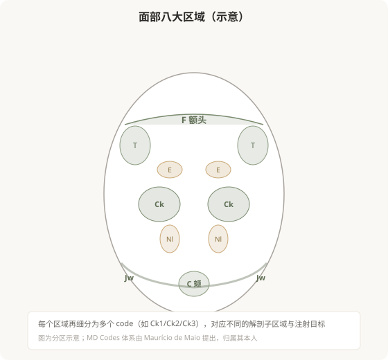

# MD Codes：把面部注射变成一门“有章法”的艺术

## 三个备选标题

1. 为什么好医生打针像“对号入座”：理解 MD Codes
2. 面部有 75 个“小格子”：MD Codes 注射思维入门
3. 从“哪里凹填哪里”到“编码注射”：一次思维的升级

## 封面介绍（100字以内）

MD Codes 把面部细分为带编号的解剖功能单元，每个 code 对应特定层次、材料和技术。它不是营销概念，而是一套让注射更安全、更自然的结构化思维。

## 正文

先说结论：**MD Codes（医学注射点位编码系统）是一套由巴西整形外科医生 Maurício de Maio 提出的面部注射分区方法，它把面部细分为一系列带编号的解剖功能单元（code），每个 code 对应特定的层次、推荐材料、注射技术和美学目标。**它的核心价值不在于“记住编号”，而在于把注射从“哪里凹填哪里”的直觉操作，升级为“先理解结构、再对号入座”的系统思维。这一篇是这个 MD Codes 专题的开篇，先讲清楚它是什么、为什么有用、以及作为消费者为什么要了解。

### 先理解它要解决的问题

传统注射常陷入一个误区：看到哪里凹，就往哪里填。法令纹深就填法令纹，太阳穴凹就填太阳穴，泪沟明显就填泪沟。这种“打地鼠”式的思路有几个问题：

- **只看表象，不看根源**：法令纹深的根源常在中面部下移，只在沟里填是治标不治本。
- **缺乏整体观**：局部填得再多，整体不协调，反而显假。
- **依赖个人经验**：效果好坏高度依赖医生当天的状态和审美，缺乏可复现的章法。

**MD Codes 的思路是把面部拆解为有明确边界和功能的“小单元”，每个单元有它的解剖特点、风险层次和美学作用。**医生根据你的具体情况，决定激活哪些 code、用什么材料、什么层次、多少剂量。这就像从“凭感觉炒菜”变成“按菜谱配菜”——更可控、更可复现、也更安全。

下图是传统思路和 MD Codes 思路的对比：

### MD Codes 不是营销概念

市面上很多“新概念”是营销包装，但 MD Codes 不太一样——它是一套**操作方法论**，有明确的解剖学基础：

- 每个 code 都对应一个**真实存在的解剖区域**（如颧骨前区、鼻唇沟外侧区等）。
- 每个 code 都有**推荐的注射层次**（骨膜上深层、皮下脂肪层等）。
- 每个 code 都有**对应的血管风险等级**。
- 它把面部美学拆解为**可讨论、可沟通**的单元——医生可以告诉你“我建议激活 Ck1 和 Ck2”，而不是含糊地说“给你打打苹果肌”。

**作为消费者，了解 MD Codes 的最大价值是：它给了你一套和医生沟通的“共同语言”。**当医生用 code 解释方案时，你能听懂、能提问、能参与决策，而不是只能点头。

### 编码长什么样

MD Codes 的命名规则是用区域英文缩写 + 数字。常见区域包括：

- **Forehead（F）**：额头
- **Temporal（T）**：颞部（太阳穴）
- **Eyelid / Periorbital（E）**：眼周
- **Cheeks（Ck）**：颊部（苹果肌区域）
- **Nasolabial（Nl）**：鼻唇沟
- **Jawlines（Jw）**：下颌线
- **Chin（C）**：颏部（下巴）
- 以及其他区域

每个区域再细分为多个 code（如 Ck1、Ck2、Ck3 等），对应不同的解剖子区域。后续几篇会分别介绍各区域的 codes。

下图是 MD Codes 的整体分区概览：

### 关于“归属”和“流派”的说明

MD Codes 是 Maurício de Maio 医生及其团队提出的体系，相关培训和认证由其官方机构开展。**本系列介绍的是这套方法的思维逻辑，供消费者理解“编码注射”是怎么回事，不构成对该体系的官方培训或认证。**市面上还有其他面部注射分区方法（如各种解剖分区体系），核心思路相通——都是把面部拆解为可管理的单元。理解这套思维，比记住某个具体编号更重要。

### 为什么它和“注射的艺术”高度契合

这个系列叫“美容注射的艺术”，而 MD Codes 恰恰是把注射变成艺术的工具之一：

- **艺术需要章法**：真正的高手不是乱来，而是深谙规律。
- **艺术强调整体**：编码注射天然强调整体协调，而非局部堆砌。
- **艺术追求自然**：通过理解结构而非堆材料，更容易达到自然。
- **艺术可沟通**：有了共同语言，医生和你的审美才能对齐。

**接下来的 9 篇，会带你逐区认识 MD Codes，理解每个区域的美学目标和风险层次。**不需要记住所有编号——理解“编码注射”的思维，你就已经比大多数消费者更接近注射决策的核心了。

### 一个贯穿这 10 篇的认知

MD Codes 的核心启示是：**好的注射不是“打哪里”，而是“为什么打这里、用什么打、打多深、打多少”。**编码只是表象，背后是对解剖、美学和安全的系统理解。作为消费者，学会用这种思维看待注射方案，能让你从被动接受变成主动参与，从而做出更安全、更自然、更符合自己诉求的选择。

> 本文用于健康教育，不能替代面诊和个体化评估；MD Codes 是一种注射方法论，具体方案须由具备资质的医师根据个体情况制定。

## 参考资料

- de Maio M. MD Codes: A New Approach to Facial Aesthetic Treatment. （相关学术发表，以原文为准）
- American Society of Plastic Surgeons: Facial anatomy & injectable safety
  https://www.plasticsurgery.org/patient-safety
