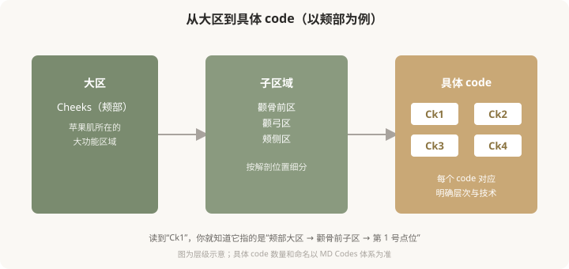
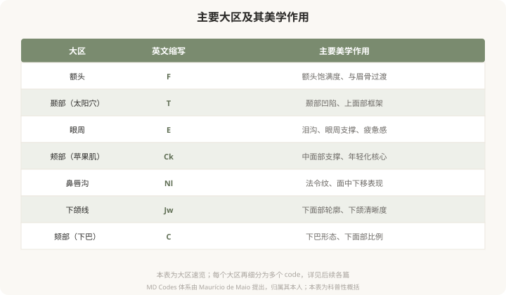

# 面部分区与编码逻辑：理解 MD Codes 的“地图”

## 三个备选标题

1. 面部为什么分成 8 个大区：MD Codes 的组织逻辑
2. 从大区到小格：MD Codes 的层级结构怎么读
3. 一张脸的“邮政编码”：MD Codes 怎么给面部命名

## 封面介绍（100字以内）

MD Codes 把面部组织成 8 个大区，每区再细分为带编号的 code。理解这个层级结构，就能听懂医生说的“Ck1”“Jw2”代表什么。

## 正文

先说结论：**MD Codes 采用“大区—子区—具体 code”的层级结构来组织面部，类似邮政编码的逻辑。**它先按功能和部位把面部分成若干大区（如颊部、下颌、颏部等），每个大区再细分为多个子区域，每个子区域用一个 code 命名（如 Ck1、Ck2、Ck3）。理解这个层级，你就能听懂医生用 code 描述方案时在说什么，也能更好地参与决策。

### 大区—子区—code 的三级结构

### 为什么需要这么多 code

把面部切成这么细，不是为了制造专业壁垒，而是因为**面部的不同“小格子”在解剖、功能、风险上确实差别很大**：

- **层次不同**：有的 code 注射在骨膜上深层，有的在皮下浅层，差几毫米就是两个不同的层次。
- **血管风险不同**：有的 code 血管稀疏相对安全，有的紧贴重要血管，是高危区。
- **美学作用不同**：有的 code 负责“支撑”（如骨面深层的支撑点），有的负责“塑形”，有的负责“细节修饰”。
- **推荐材料不同**：硬型、软型、含麻型，不同 code 适合不同特性的产品。

**编码的价值，就是把“注射到脸颊”这种笼统说法，精确成“注射到 Ck1 的骨膜上深层、用硬型材料、0.4 毫升”。**这种精确化，是安全和效果的基础。

### 主要大区速览

下图列出 MD Codes 涉及的主要大区及其大致美学作用：

### 编码的逻辑：从结构到外观

MD Codes 的命名不是随机的，而是有内在逻辑。大致可以理解为：

- **数字通常反映层次或位置关系**：从深层支撑到浅层修饰，或从中央到外侧。
- **同一大区的 codes 之间有协作关系**：比如处理苹果肌，可能 Ck1 做深层支撑、Ck3 做外侧衔接，几个 code 配合才能达到自然效果。
- **不同大区的 codes 之间也有联动**：比如改善下颌线（Jw）可能需要配合颏部（C）的支撑，整体协调。

**这就是为什么编码注射不是“一个 code 一个 code 孤立地打”，而是像拼图一样组合多个 code 来实现整体目标。**

### 你不需要背，但需要会“听”

作为消费者，你不需要记住所有 code 编号。但理解了这套逻辑后，当医生说“我建议激活你的 Ck1 和 Ck2 做中面部支撑，配合 Jw1 改善下颌线”，你能听懂：

- 他在针对**中面部支撑**和**下颌轮廓**两个目标。
- 每个目标对应**特定的解剖点位**，不是随便打。
- 这是一套**有内在逻辑的组合方案**，可以追问“为什么选这几个”“预期效果如何”。

**这种“听得懂、问得出”的能力，是 MD Codes 给消费者的最大价值。**

### 一个认知升级

从“打苹果肌”到“激活 Ck1/Ck2/Ck3”——表面是术语的变化，实质是思维的升级：从模糊的部位描述，到精确的解剖定位。**这种精确化，让注射从“凭感觉”变成“有依据”，也让你的决策从“听安排”变成“能讨论”。**

> 本文用于健康教育，不能替代面诊和个体化评估；具体 code 与方案须由具备资质的医师根据个体情况制定。

## 参考资料

- de Maio M. MD Codes 相关学术发表（以原文为准）
- 中华医学会整形外科学分会：面部解剖与注射相关共识（以现行版本为准）
  https://www.cma.org.cn/
