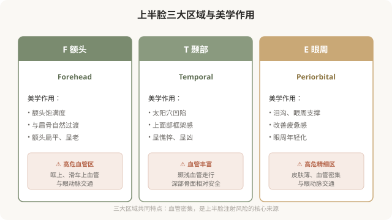
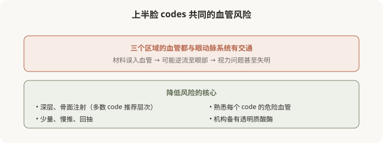

# 上半脸的 Codes：额头、颞部和眼周

## 三个备选标题

1. 额头、太阳穴、眼周的 code：上半脸注射地图
2. F、T、E 开头的编码都在管什么：上半脸解码
3. 从疲惫到精神：上半脸 codes 怎么改变气质

## 封面介绍（100字以内）

上半脸（额头 F、颞部 T、眼周 E）的 codes 负责饱满度、框架感和疲惫感改善。这些区域血管密集，是注射的高风险区，理解 codes 有助于安全决策。

## 正文

先说结论：**上半脸的 MD Codes 涵盖额头（F）、颞部（T）和眼周（E）三大区域，主要解决饱满度、上面部框架感和眼周疲惫感。**这些区域共同的特点是血管密集、皮肤和组织特性差异大，是面部注射的高风险区之一。理解这些 codes 的解剖目标和风险层次，有助于你在面诊时听懂方案、评估安全、提出对的问题。

### 上半脸的整体作用

### F 额头 codes：饱满与过渡

额头 codes（如 F1、F2、F3 等）主要负责额头的饱满度和与眉骨的自然过渡。**额头的美学要点不是“越饱满越好”**——过度填充会形成“寿星公”般的不自然隆起。好的额头注射追求的是平滑、自然的弧度，以及与眉骨、颞部的协调过渡。

额头注射的技术要点：
- 通常采用**深层、骨膜上**注射，相对安全。
- 注意**眶上和滑车上血管**走行，它们与眼动脉系统交通。
- 剂量克制，避免过度饱满。

### T 颞部 codes：上面部框架

颞部 codes（如 T1、T2、T3 等）负责太阳穴区域的凹陷改善。**颞部凹陷会让人显得憔悴、甚至“显凶”**——恢复颞部的饱满能显著改善气质。

颞部注射的技术要点：
- **深部骨面注射**是相对安全的层次（颞深筋膜深层）。
- 浅层注射风险高（颞浅静脉及其分支走行）。
- 颞部血管丰富，熟悉解剖是安全的核心。

### E 眼周 codes：疲惫感的改善

眼周 codes（如 E1、E2 等）针对泪沟、眼周支撑和疲惫感。**眼周是面部最精细、最不宽容的区域**——皮肤薄、稍有差池就透光、结节或不自然。

眼周注射的技术要点：
- 用**柔软、低粘弹性**的小粒径产品。
- **骨膜上深层支撑**为主，浅层修饰要非常少量。
- 眼周血管与眼动脉系统交通，是高危区域之一。
- 剂量极度克制，宁可分次补。

### 上半脸的“气质改变”

上半脸的 codes 组合，往往能改变人整体的“气质印象”：

- 颞部 + 额头改善 → 从“憔悴”到“精神”。
- 眼周支撑改善 → 从“疲惫”到“有神”。
- 整体协调 → 从“显老”到“年轻”。

**这就是为什么 MD Codes 不仅有“解剖目标”，还有“情感目标”——后面会专门讲。**

### 为什么上半脸 codes 风险高

上半脸三个区域，**每一个都涉及与眼动脉系统的交通**：

### 面诊上半脸时该问什么

理解了上半脸 codes，面诊时你可以更具体地问：

- 您建议处理我的哪些 code（如 T1、E1）？为什么是这些？
- 这些 code 推荐的注射层次是深层还是浅层？
- 这个区域的主要血管风险在哪？您怎么规避？
- 机构备有透明质酸酶吗？
- 预期效果是改善饱满度、还是改善疲惫感？

**能讲清 code、层次、风险、目标的医生，比只说“给你打打太阳穴”的医生，更值得托付。**

### 一个认知

上半脸 codes 的核心启示：**这几个区域美学作用大（改善气质明显），但风险也高（血管与眼部交通）。**所以它们的注射对医生经验要求极高——不是不能做，而是必须由懂解剖的医生、在具备急救能力的机构、在你充分知情的前提下做。

> 本文用于健康教育，不能替代面诊和个体化评估；具体 code 与方案须由具备资质的医师根据个体情况制定，上半脸注射属高风险操作。

## 参考资料

- de Maio M. MD Codes 相关学术发表（以原文为准）
- American Society of Plastic Surgeons: Facial anatomy & vascular safety
  https://www.plasticsurgery.org/patient-safety
