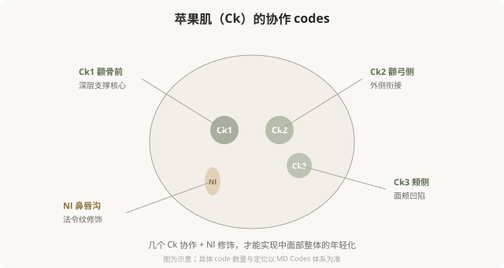

# 中脸的 Codes：苹果肌、中面部和鼻唇沟

## 三个备选标题

1. 苹果肌为什么有 4 个 code：中面部解码
2. Ck 和 Nl：中脸 codes 怎么撑起年轻感
3. 法令纹的根源在中脸：MD Codes 怎么处理

## 封面介绍（100字以内）

中脸 codes（Ck 颊部、Nl 鼻唇沟）是面部年轻化的核心区域。理解 Ck1–Ck4 的不同作用，能明白为什么法令纹要从中面部处理而不是只填沟。

## 正文

先说结论：**中脸的 MD Codes 以颊部（Ck）和鼻唇沟（Nl）为核心，是面部年轻化最关键的区域。**苹果肌（Ck1–Ck4）的支撑决定了中面部的年轻感，而法令纹（Nl）的加深往往源于中面部下移——所以处理法令纹的核心常在中脸支撑，而不是只在沟里填充。理解中脸 codes 的协作逻辑，能让你明白为什么“打苹果肌”和“打法令纹”其实可能是同一件事。

### 中脸的核心：苹果肌支撑

### Ck1：中面面的“地基”

Ck1（颧骨前区）是中面部最核心的深层支撑点。可以把它理解为中脸的“地基”——它位于颧骨前方的骨膜上深层，注射后能托起整个中面部软组织。**Ck1 处理到位，苹果肌复位、法令纹改善、面中凹陷消失，很多表象问题会一并好转。**

Ck1 的技术要点：
- **骨膜上深层注射**，相对安全且支撑稳定。
- 用**高粘弹性、有支撑力**的硬型材料。
- 是中面部剂量的主要承载点。

### Ck2、Ck3：衔接与塑形

- **Ck2（颧弓侧）**：负责苹果肌与外侧的衔接，避免“中间鼓、两侧凹”的不协调。
- **Ck3（颊侧）**：处理面颊侧面的凹陷，让中面部过渡自然。

**这些 code 的协作，体现了 MD Codes 的核心思维——不是孤立地填一个点，而是组合多个点实现整体协调。**只打 Ck1 不打 Ck2，可能出现“苹果肌突兀”；只填法令纹不打 Ck1，可能“沟还在、脸更垮”。

### Nl 鼻唇沟：沟只是表象

Nl codes（鼻唇沟区域）针对法令纹。但如前面部年轻化篇讲过的，**法令纹的根源常在中面部下移**——所以 Nl 的处理往往是 Ck1 支撑后的“辅助修饰”，而不是孤立地“填沟”。

Nl 的技术要点：
- 在 Ck 深层支撑恢复后，**少量、浅层修饰**。
- 注意**面动脉及其分支**走行（鼻唇沟区域是相对高危区）。
- 剂量克制，避免局部堆积显假。

### 中脸 codes 改变的是什么

中脸 codes 组合改善的不仅是局部形态，更是整体“气质”：

- Ck1 支撑 → 中面部“复位”，疲态减轻。
- Ck 协作 → 苹果肌自然饱满，年轻感。
- Nl 修饰 → 法令纹改善，但建立在 Ck 支撑基础上。
- 整体 → 从“疲惫下垂”到“精神饱满”。

**这就是为什么有经验的医生可能告诉你“打法令纹之前要先打苹果肌”——这不是想多卖你一支，而是基于解剖逻辑的正确顺序。**

### 中脸 codes 的风险

### 面诊中脸时该问什么

- 我的法令纹主要是中面部下移引起的，还是其他原因？
- 您建议处理哪些 code（Ck1？Ck2？Nl？）？为什么是这个组合？
- Ck1 是深层支撑吗？用什么型号材料？
- 这个区域的主要血管风险在哪？
- 怎样避免打完“显宽”？

**能从中面部支撑角度解释法令纹方案的医生，比只说“给你填一下沟”的医生，更接近问题的根源。**

### 一个认知升级

很多人把“打法令纹”和“打苹果肌”当成两件独立的事。**MD Codes 的思维告诉你：它们往往是同一件事——中面部支撑恢复了，法令纹作为结果自然改善。**理解这种“根源思维”，能让你避免“只填沟、越填越假”的陷阱。

> 本文用于健康教育，不能替代面诊和个体化评估；具体 code 与方案须由具备资质的医师根据个体情况制定。

## 参考资料

- de Maio M. MD Codes 相关学术发表（以原文为准）
- American Society of Plastic Surgeons: Midface & cheek augmentation
  https://www.plasticsurgery.org/cosmetic-procedures/dermal-fillers
