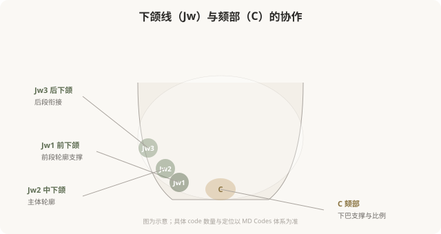
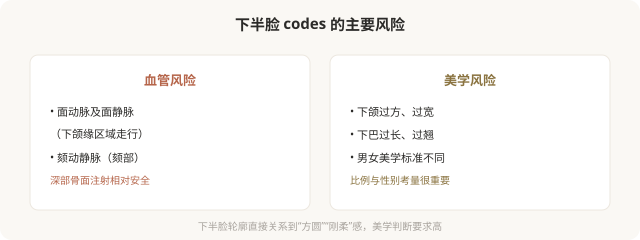

# 下半脸的 Codes：下颌线、下巴和面下轮廓

## 三个备选标题

1. 下颌线为什么需要 3 个 code：下半脸解码
2. Jw 和 C：塑造下面部轮廓的 codes
3. 想要清晰下颌线：MD Codes 怎么做

## 封面介绍（100字以内）

下半脸 codes（Jw 下颌线、C 颏部）负责下面部轮廓和清晰度。理解 Jw1–Jw3 和 C 的作用，能明白轮廓注射为什么是组合而非单点。

## 正文

先说结论：**下半脸的 MD Codes 以下颌线（Jw）和颏部（C）为核心，负责下面部的轮廓、清晰度和比例。**下颌线的重塑通常需要多个 Jw codes 协作（从前到后），配合颏部（C）的支撑，才能形成连贯自然的轮廓——而不是孤立地“垫一个点”。理解下半脸 codes 的协作，能帮你建立对轮廓注射的合理预期，也能识别“打一针就有下颌线”这类过度承诺。

### 下半脸轮廓的整体观

下半脸轮廓不是一条孤立的线，而是一段从耳前到下巴的连续弧线。**这条弧线由多个 code 共同塑造**：

- **Jw1（前下颌）**：靠近下巴的前段，负责下颌线前部的支撑。
- **Jw2（中下颌）**：下颌线主体，是“清晰度”的主要承担者。
- **Jw3（后下颌）**：靠近耳前的后段，负责与上面部的衔接。
- **C（颏部）**：下巴本身，决定颏部形态和下面部比例。

**只有这些 code 协作，才能形成连贯、自然、清晰的轮廓——只打一个点，往往出现“局部突出、整体断裂”的不协调。**

### 下颌线 codes 的作用

下颌线 codes 主要解决：

- **下颌缘模糊**：年龄增长导致的下颌轮廓不清。
- **轮廓下垂感**：组织下移造成的“羊腮”或松弛感。
- **轻度不对称**：左右下颌线不对称的修饰。

**需要注意的是**：下颌线注射针对的是“容量和支撑”问题。如果主要是咬肌肥厚（需要肉毒）、脂肪堆积（需要减脂或吸脂）、严重松弛（需要手术），单纯填充 codes 解决不了——这是 MD Codes 的能力边界。

### 颏部 C：下面部比例的关键

颏部 codes 决定下巴的形态和下面部比例：

- **轻度后缩**的改善。
- **颏部形态**调整（方圆、尖翘）。
- **下庭比例**协调。

但同样要注意：**明显的骨性后缩或短下巴，注射改善有限，假体或手术往往更合适。**把注射当成手术的轻量替代，在明显骨性问题上不划算。

### 下半脸 codes 的风险

### 下半脸的美学特殊性

下半脸的美学有一个重要维度：**性别差异**。

- **女性**：通常追求下颌线清晰、下巴适度尖翘，呈“卵形”或“心形”轮廓。
- **男性**：通常追求下颌角明显、下巴方正，呈“方形”或“梯形”轮廓。

**同样的 codes，在不同性别、不同基础上的处理目标不同。**过度套用某种“网红模板”（如所有女性都打成尖下巴），可能违反个体的解剖基础和性别美学。好的医生会根据你的整体特征调整 codes 组合和剂量。

### 面诊下半脸时该问什么

- 我的下颌线问题主要是容量、肌肉、脂肪还是松弛？
- 您建议处理哪些 code（Jw1？Jw2？C？）？为什么是这个组合？
- 这个组合预期能改善到什么程度？
- 怎样避免打完“显方”或“下巴过长”？
- 我的情况适合注射，还是需要手术或其他手段？

**能分清成因、讲清 code 组合、说明能力边界的医生，比承诺“一针塑形”的医生，更值得托付。**

### 一个认知

下半脸 codes 的核心启示：**轮廓是连续的弧线，不是孤立的点。**想要清晰自然的下颌线，通常需要多个 code 协作；只打一个点，往往达不到协调效果。理解这种“协作思维”，能帮你识别“打一针就有完美下颌线”这类过度承诺——真正的轮廓塑造，需要的是系统方案，不是一支玻尿酸。

> 本文用于健康教育，不能替代面诊和个体化评估；具体 code 与方案须由具备资质的医师根据个体情况制定。

## 参考资料

- de Maio M. MD Codes 相关学术发表（以原文为准）
- American Society of Plastic Surgeons: Jawline & chin contouring
  https://www.plasticsurgery.org/cosmetic-procedures/dermal-fillers
