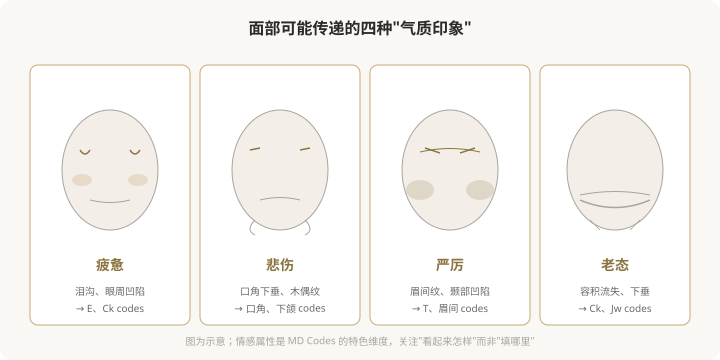

# 情感修饰：MD Codes 如何改变“看起来怎样”

## 三个备选标题

1. 为什么有人总显得“累”或“凶”：情感修饰的注射思路
2. MD Codes 的情感目标：从疲惫到精神、从严厉到柔和
3. 注射改变的不只是形状，还有气质

## 封面介绍（100字以内）

MD Codes 引入“情感属性”概念——某些 codes 的改善能改变人传递的气质印象（疲惫、悲伤、严厉、老态）。理解它能让注射目标更贴近你的真实诉求。

## 正文

先说结论：**MD Codes 除了“解剖目标”，还引入了“情感属性”的概念——即面部某些区域的改变，能改变人传递给他人气质印象，如疲惫、悲伤、严厉、老态。**这种思路的价值在于：它把注射目标从“填某个坑”提升到“改善我看起来怎样”，更贴近消费者的真实诉求。理解情感修饰，能让你和医生的沟通从“打哪里”升级到“我想要什么样的变化”。

### 什么是“情感属性”

MD Codes 的“情感属性”思路认为，面部的某些特征会让人看起来传递特定的气质：

- **疲惫感**：泪沟、眼周凹陷、中面部容积流失。
- **悲伤感**：口角下垂、木偶纹、下面部下移。
- **严厉感**：眉间深纹、颞部凹陷、眉形下垂。
- **老态感**：整体容积流失、组织下垂。

**这些不是“病”，而是面部变化传递给观察者的印象。**情感修饰的目标，就是通过针对性的 codes 改善，让这些负面印象减轻，整体气质更精神、更柔和、更年轻。

### 为什么“情感目标”比“部位目标”更贴近诉求

很多人来面诊时说的是“我想变好看”“我想年轻”，这是情感层面的诉求。但传统注射沟通往往落在“填泪沟”“打法令纹”这样的部位层面——**两者之间有断层**。MD Codes 的情感属性思路，试图把“我想不显累”这种情感诉求，翻译成“处理 E1 和 Ck1”这样的具体方案，弥合这个断层。

下图是情感诉求到 codes 方案的翻译逻辑：

### 情感修饰的边界

情感修饰思路很有价值，但也有边界，需要清醒认识：

- **它不是“性格改变”**：注射不能改变你的真实性格、情绪或处境，只改变“看起来传递的印象”。
- **它不是万能的**：严重的老化、松弛，光靠注射实现不了，可能需要手术。
- **它依赖医生的美学判断**：同样的 codes，不同医生处理出来效果不同。
- **它需要合理预期**：改善“看起来没那么累”是现实的，“看起来年轻 20 岁”通常不现实。

### 情感修饰与“自我接纳”

一个值得思考的点：**“我想不显累”和“我不能接受自己显累”是两回事。**前者是合理的改善诉求，后者可能涉及更深的自我接纳课题。如果你发现自己对某个“负面气质”过度困扰、反复注射仍不满意，可能需要的不只是更多注射，而是审视预期是否合理，必要时寻求心理支持。

### 面诊时如何用“情感语言”沟通

理解情感属性后，你可以这样和医生沟通：

- 不只说“填泪沟”，而是说“我主要想改善看起来很累的感觉”。
- 不只说“打苹果肌”，而是说“我希望中面部看起来更饱满、精神”。
- 询问医生：“您觉得我的脸主要传递什么印象？哪些 codes 能改善？”

**这种沟通方式能让医生更准确理解你的诉求，也能让你判断医生是否真的在“听懂你”。**一个能从情感诉求倒推 codes 方案的医生，通常比只盯着局部填坑的医生，更接近“注射的艺术”。

### 一个认知升级

MD Codes 的情感属性思路，本质上是在说：**好的注射，目标是“你看起来怎样”，而不仅仅是“打了哪里”。**这种从部位思维到情感思维的升级，让注射决策更贴近你的真实需求。下次面诊时，不妨试试用“我想改变的感觉”来描述诉求，而不是直接跳到“我要打哪里”——这可能是你和医生沟通的一次升级。

> 本文用于健康教育，不能替代面诊和个体化评估；情感属性是 MD Codes 的特色维度，具体方案须由具备资质的医师制定。

## 参考资料

- de Maio M. MD Codes & emotional attributes 相关学术发表（以原文为准）
- American Society of Plastic Surgeons: Facial rejuvenation goals
  https://www.plasticsurgery.org/cosmetic-procedures
